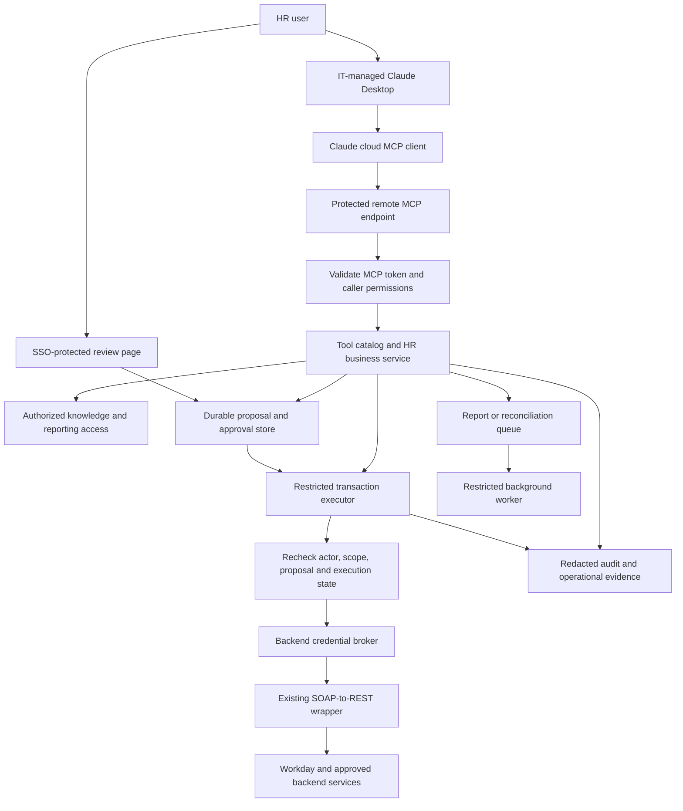
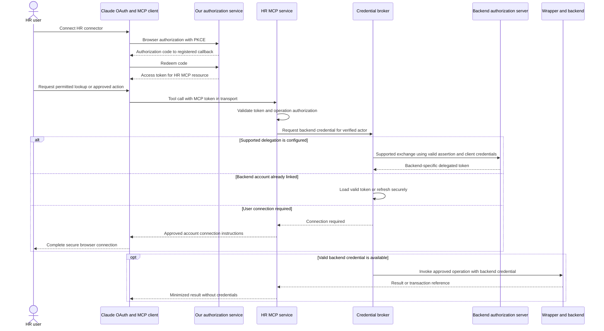
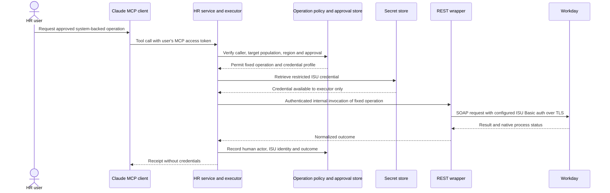
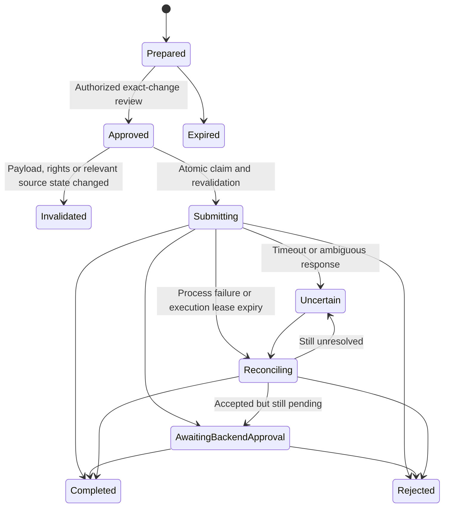
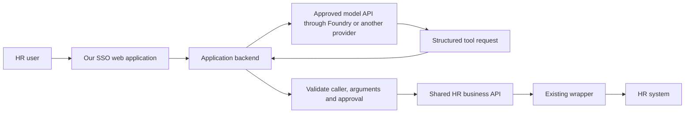

# HR Workspace in Claude Desktop — Implementation Design

**Date:** 24 September 2026  
**Status:** Implementation proposal for review. We have not deployed this design or validated live backend authentication.  
**Scope:** Our HR workspace, integration services, authentication, transaction controls, distribution, and an alternative delivery path if MCP is not approved.

## Contents

- [1. What we are building](#1-what-we-are-building)
- [2. Initial scope and boundaries](#2-initial-scope-and-boundaries)
- [3. Target architecture](#3-target-architecture)
- [4. How we distribute and operate MCP](#4-how-we-distribute-and-operate-mcp)
- [5. Identity and token architecture](#5-identity-and-token-architecture)
- [6. Token and credential sequences](#6-token-and-credential-sequences)
- [7. How tools select the right execution identity](#7-how-tools-select-the-right-execution-identity)
- [8. Forms, approvals, and transaction reliability](#8-forms-approvals-and-transaction-reliability)
- [9. Hosting, storage, and security controls](#9-hosting-storage-and-security-controls)
- [10. If MCP is not approved](#10-if-mcp-is-not-approved)
- [11. Implementation sequence and acceptance gates](#11-implementation-sequence-and-acceptance-gates)
- [12. Decisions we need to close](#12-decisions-we-need-to-close)

## 1. What we are building

We will use Claude Desktop as our entry point for HR research, policy questions, personal and operational lookups, reporting, analysis, and approved transactions. We will also provide links to focused web applications when a form, dashboard, or review screen is more suitable than a conversation.

We will expose approved business capabilities through MCP. We will keep authentication, permission checks, credential selection, transaction approval, and execution in our services. Claude will select tools based on our descriptions and the user's request; it will not decide which credentials or privileges to use.

Our existing SOAP-to-REST wrapper supports user, ISU, and OAuth authentication. We will reuse it rather than build a second transport adapter. We still need to inspect and test its token handling, authorization boundaries, service coverage, error mapping, and retry behavior.

IT will distribute and maintain Claude Desktop. This design covers how we make our HR connector available and how we operate the services behind it. We do not assume a particular corporate identity provider, an existing Azure deployment, or approval to send HR data to any model service.

### Decisions in this proposal

| Area | Our proposed decision |
|---|---|
| Initial interface | Claude Desktop in our approved organization |
| MCP deployment | Centrally hosted remote MCP over HTTPS using a client-supported HTTP transport |
| Integration | Curated business tools → authorized execution → existing REST wrapper → backend services |
| User authentication | OAuth to our MCP resource, with backend-specific delegation or account connection |
| System authentication | Restricted ISU Basic credentials held server-side, selected by operation policy |
| Write approval | Server-recorded approval bound to an exact proposal and authorized reviewer |
| Initial hosting | A small shared Azure application platform; Container Apps if our operating model supports containers, otherwise App Service |
| If MCP is not approved | An SSO-protected web application calling the same business APIs directly |
| Foundry | Optional model access for that custom application; not required to connect Desktop to MCP |
| Copilot Studio | A future agent/channel option; not a dependency for this implementation |

## 2. Initial scope and boundaries

We will start with a small catalog rather than expose every SOAP operation dynamically.

| Capability | First implementation pattern | Required control |
|---|---|---|
| Policy and general HR research | Search approved sources; return sources and effective dates | Source access, freshness, and clear uncertainty |
| Personal lookup | Retrieve the authenticated user's permitted data | Trusted identity-to-worker mapping |
| HR operational lookup | Retrieve a specified worker or population | Role, population, field, and regional authorization |
| Reporting | Submit an authorized report job; retrieve status/results | Approved metrics/data, export permissions, result ownership and expiry |
| Transaction | Prepare → review → submit → reconcile | Exact-change approval, backend permissions, duplicate protection, audit |

Our first test slice will include one policy lookup, one authenticated balance or similar read, one bounded report, and one approved administrative write. We will choose the write after confirming its downstream consequences and recovery path. A contact change is only suitable if the selected field has bounded consequences in our configuration.

We will exclude payroll/banking changes, bulk changes, termination, and automated employment decisions from the initial release. We will not treat employee self-service tests as proof that an HR operator can safely act on another worker.

Workday is our current integration focus. The supplied draft also mentions Client 360; we will add it only after confirming its API, identity mechanism, and selected use cases. We are not assuming that Workday and Client 360 support the same token exchange.

## 3. Target architecture



The boxes represent responsibilities, not a requirement to create a microservice for every box. We can keep the MCP adapter, catalog, read APIs, and proposal handling in one modular application. We will isolate privileged write execution and credentials from general research/reporting workloads.

Our executor will independently validate the human actor and approved proposal. A call from our application core will not be sufficient authority by itself. We will protect service-to-service calls, scope workload identities, restrict ingress, and prevent direct wrapper access from bypassing these controls.

Remote connector calls originate from Claude's cloud infrastructure, including when the user works in Desktop. The laptop's VPN does not make an internal endpoint reachable to that client. We will use an approved reachable ingress path. If that is prohibited, we will evaluate an explicitly approved local-adapter or custom-application path rather than assume a private Desktop connector feature exists. [R1]

The data returned by tools may enter Claude's conversation and processing context. Hosting the wrapper or MCP service in Azure does not move Claude Desktop model processing into Azure or establish regional residency for the complete flow.

## 4. How we distribute and operate MCP

### Remote connector: our default

We will host a stable HTTPS endpoint, protect it with OAuth, and register it in our Claude organization. An authorized organization owner can add a custom web connector using the remote MCP URL. We will configure available roles and tools, then pilot connection and authorization with the selected users. Registration makes the connector available; it does not automatically establish backend permissions. [R1, R2]

Our deployment sequence will be:

1. Deploy a nonproduction MCP endpoint and configure its authorization metadata, issuer, and supported client registration.
2. Register a clearly named test connector in our approved organization.
3. Validate login, token audiences, revocation, denied populations, and personal-account restrictions required by our policy.
4. Deploy the reviewed production artifact to a separate production boundary.
5. Register the production connector and limit its catalog/roles to the pilot scope.
6. Expand access only after acceptance tests, monitoring, and support procedures pass.

We will release tool changes centrally through CI/CD. We will version schemas and policies, stage new operations, test client refresh behavior, and retain immediate server-side write disablement. A tool newly discovered in the wrapper will not become available automatically.

Enterprise connector/tool controls shape what users and Claude can access. Cross-role grants can be additive; we will test actual effective access. Server-side authorization remains required even for a hidden or blocked tool. [R2]

Enterprise-managed connector authorization is a possible usability improvement, but we will confirm support for our IdP and connector before relying on it. Our baseline works with individual browser authorization. We will not promise zero user prompts based on organization registration alone. [R3]

### Local extension: an exception, not our baseline

If remote networking is the obstacle and local MCP is explicitly approved, we can package a local stdio adapter for Desktop. It would call our protected central APIs over an approved device network path. We would distribute reviewed versions through the organizational desktop-extension controls and coordinate installation/update behavior with IT. [R4, R5]

For that design, a native-app browser flow with PKCE and OS-protected token storage can be appropriate. We would never distribute ISU passwords or an embedded confidential-client secret to laptops.

Stdio avoids opening a local listener, but it does not eliminate endpoint compromise or package tampering. A client-managed process still needs packaging, dependency review, updates, and testing of startup/crash behavior. Transaction and approval state must remain durable in the central service, not only in a local process. A daemon is not required for the initial design; if introduced, its lifecycle and transport security need a separate decision.

Local execution changes network origin; tool results may still be sent to Claude. It is not a workaround for a prohibition on sharing the data with the model.

## 5. Identity and token architecture

### We separate three identities

1. **Claude organization identity:** who can use our approved Claude environment.
2. **MCP resource identity:** who is calling our HR MCP service and what it allows.
3. **Backend execution identity:** the delegated user or restricted ISU that Workday or another backend recognizes.

We will correlate these identities where supported, but we will not treat them as interchangeable. Corporate OAuth alone does not prove the conversation belongs to our approved Claude organization. Required client/account/device restrictions must be validated separately.

### What “carry tokens forward” means

We will carry trusted identity context through our services and obtain credentials valid for each destination. We will not forward the same bearer token indiscriminately across systems. MCP authorization requires tokens intended for the MCP resource; accepting or passing through unrelated third-party tokens is not our design. [R6, R7]

| Credential | Intended recipient | Storage/handling |
|---|---|---|
| Claude sign-in/session | Claude | Managed by Claude; not an HR API credential |
| MCP access token | Our MCP resource | Managed by the OAuth client; validated at our endpoint; never included in model-visible inputs/results |
| Downstream user access token | The specified backend API | Obtained by supported delegation or linked account; retained only in protected server storage/cache as required |
| Downstream refresh token | Backend authorization server | Encrypted, access-controlled server-side token store; rotation/revocation handling |
| ISU username/password | Approved backend authentication endpoint | Secret store, least-privilege retrieval, TLS, rotation; never on the desktop or in chat |
| Workload token | Our Azure resources or protected internal API | Separate scoped workload identity; not a substitute for human authorization |

We will key backend token caches by verified principal, tenant, resource and grant/scope as appropriate. We will prevent cross-user reuse, serialize refresh where required, handle rotated/revoked refresh tokens, and never silently substitute a different account.

Tokens are not tool arguments. We will not ask users to paste tokens, passwords, or authorization codes into a conversation. We will exclude tokens and passwords from prompts, URLs, traces, exceptions, and logs. Authorization codes may appear only where the supported OAuth response requires them, such as the registered callback URL; we will scrub them from logs/traces and prevent leakage through referrers or analytics.

### Login to our MCP service

The remote OAuth client discovers our authorization configuration, opens the authorization flow, and receives a resource-specific token after the user authenticates and applicable consent completes. We will use Authorization Code with PKCE and verify discovery, callback registration, and client-registration compatibility with the actual Claude client. We will not assume the latest protocol document guarantees every client feature. [R6]

The browser returns to the registered client callback. If we operate an authorization broker in front of the corporate IdP, that broker has its own IdP callback. These are separate registrations. We will use exact approved redirect URIs and validate state/PKCE; credentials and codes will not be routed through chat.

Our endpoint will validate issuer, audience/resource, expiry, signature or introspection, and required scopes. It will then evaluate current application permissions. OAuth scope is not a complete employee-population policy.

The remote client may have a different OAuth registration model from a public native app. We will not apply the draft's blanket “no client secret” rule to all server-side integrations. Confidential-client secrets or certificates, if required, stay in protected server-side configuration. A local public client must not embed a reusable secret.

### Choosing a backend authentication route

| Route | When we use it | What we must prove |
|---|---|---|
| Entra OBO | The incoming user token and downstream resource support the Entra OBO relationship | Correct middle-tier audience, delegated scopes/consent, trusted client and downstream token acquisition |
| Backend-specific federation/delegation | Our backend explicitly supports that flow | Exact supported exchange, resulting user identity and permissions |
| Linked user OAuth | We need a separate user authorization grant for the backend | Secure connection flow, account linking, refresh and revocation |
| ISU Basic | The approved operation intentionally executes through a service account | Narrow ISU permissions, independent human authorization, approval and audit |

Entra OBO uses a user access token intended for the middle tier to obtain another token for the downstream API. A token issued by an unrelated MCP broker cannot automatically be used as an Entra OBO assertion. Existing SSO does not establish that Workday accepts Entra OBO, and an Entra token is not automatically a Workday token. [R8]

If compatible delegation is unavailable, we will connect the user's Workday account through a supported backend OAuth flow. Our server will bind connection initiation and callback to the authenticated caller, validate state and redirect URI, verify the linked backend identity, and store the resulting credentials securely. We will not link accounts solely from a model-supplied email address. The backend browser callback returns to our connection broker, not to an invented Claude callback.

We will aim to avoid repeated login during normal use, with supported refresh and token caching. Consent, session expiry, revocation, conditional access, or an unconnected backend may require another browser interaction. “Authenticate once forever” is not a requirement we can promise.

## 6. Token and credential sequences

### A. User-delegated operation



When a backend connection is required, that invocation stops without executing the operation. After the browser connection succeeds, a fresh request repeats authorization and obtains the valid backend credential.

The diagram's exchange branch is conditional; it is not a claim that the MCP token itself can be exchanged for every backend. For writes, our executor also checks the approved proposal before invoking the wrapper.

### B. ISU-backed operation



“ISU Basic” describes our configured account/credential mode. We will verify the exact authentication on each leg, including whether the backend expects HTTP Basic or SOAP security-header credentials; we will not infer the wire format from the label.

Credential retrieval may live inside our wrapper if it already implements this securely. We will avoid duplicating secret management. The illustrated internal invocation must preserve integrity of actor, operation, and approval context; callers cannot select arbitrary accounts or endpoints.

## 7. How tools select the right execution identity

We will maintain an operation registry in version-controlled server configuration. Claude sees business descriptions and validated input schemas. Our server resolves the authentication mode.

```yaml
# Illustrative policy, not a production configuration
operation: submit_approved_hr_change
required_permission: hr.change.submit
execution_identity: delegated_user
approval_required: true
backend_operation: approved_service_operation
credential_profile: delegated_workday
```

A different approved operation may specify `execution_identity: isu_basic` and a restricted credential profile. We can route by trusted tenant/region policy where necessary; the model cannot supply a more privileged profile.

We will not expose an `authMode`, username, password, raw token, arbitrary SOAP action, or arbitrary destination URL in the user-facing tool schema. A denied user request will never be retried with ISU credentials as a convenience fallback.

Our initial tools will follow these responsibilities:

| Tool | Responsibility |
|---|---|
| `search_hr_policy` | Search approved sources with scope and effective-date context |
| `get_my_balance` | Derive the worker from the verified caller and return permitted balance data |
| `get_authorized_worker_summary` | Check access to a specified worker and allowed fields |
| `start_hr_report` / `get_hr_report_status` | Run an approved report asynchronously and authorize result retrieval |
| `prepare_hr_change` | Validate a proposed operation and persist its exact contents |
| `submit_approved_hr_change` | Submit only a valid, authorized, unexpired approved proposal |
| `get_hr_change_status` | Return authoritative pending/completed/rejected/uncertain state |

We will use clear descriptions to improve tool selection. Descriptions and prompts do not enforce access or explicit intent. Unauthorized calls must fail even if Claude selects the wrong tool.

## 8. Forms, approvals, and transaction reliability

We will collect required fields through conversation or a supported structured-input surface, then validate them on the server. We will not assume that specification-level elicitation means our deployed Desktop version supports every form behavior. We will verify client capability before using it.

Interactive MCP Apps are a documented option, rather than merely an undefined “extapp” experiment. We can evaluate them for richer forms, but will validate current client support, sandboxing, and data handling. Our first release does not depend on them. [R9, R10]

We will test complete and partial-input schemas deliberately: missing required tool arguments may be rejected before our handler can collect them. We will not depend on an invalid tool call triggering a form. [R15]

Our baseline for writes is an SSO-protected review page showing the worker, operation, current and proposed values, effective date, and native approval implications. A user must be authorized for that proposal, not merely signed in or in possession of its URL.

We will store immutable proposal contents, version, expiry, creator, authorized approver, and execution state. Approval binds to the exact proposal. We will protect the browser session against CSRF and replay, recheck actor permissions and relevant source state, and perform atomic approval/submission transitions. Client tool confirmation and a chat response saying “yes” are not our sole write authorization.



We will preserve native business-process approvals. Submitted is not completed. An unresolved timeout will not trigger blind resubmission. We will use backend idempotency where available, deduplicate at our service, and reconcile source state. An idempotency key alone cannot guarantee exactly-once execution across our database and Workday.

Approvals and status must survive Desktop closure and server restart. Logs alone are not transaction state. Some completed changes require a compensating business process rather than rollback.

A slash command can be a useful entry convention where supported, but we will not treat it as an MCP authorization boundary. If deterministic per-request tool exposure becomes mandatory, we will use an application-controlled execution path. Claude documents Auto, Always available and On demand tool-loading modes; loading is not authorization. We will not rely on an assertion that every enabled tool is always visible or that a prompt can prevent every unwanted invocation. [R16]

## 9. Hosting, storage, and security controls

We will start with a small shared Azure deployment rather than one infrastructure stack per tool. Container Apps is our candidate for containerized APIs/workers; App Service is the alternative for a conventional web/API deployment. Functions fit scheduled or event-driven reconciliation and integration tasks. A modular monolith can run on either hosting platform. [R11]

Our initial logical components are the MCP/business application, approval page and durable store, restricted executor/credential broker, existing wrapper, audit/monitoring, and an optional queue/worker. We can combine compatible components while preserving privilege boundaries. We will use separate production and nonproduction identities/data, and approved regional boundaries where required.

Shared hosting does not imply shared privileges. We will use scoped workload identities, protected secrets, server-side per-record authorization, restricted egress, output minimization, and explicit retention. A shared process is not a sandbox for unreviewed generated code.

For reporting, we will prefer approved analytical datasets and defined metrics for broad analysis. We will authorize jobs and downloads, preserve units and effective dates, and prevent unbounded exports. Knowledge retrieval must filter access before returning content to Claude.

We will audit caller, operation/version, permitted target, policy decision, proposal/approval reference, execution identity type, backend reference, and outcome. We will minimize personal data and redact secrets. We will not indiscriminately retain full HR requests, responses, or conversation contents because they are “audit logs.”

For global use, we will document conversation processing, tool traffic, storage, logs, credentials, backups, support access, and failover separately. No hosting label establishes end-to-end residency. We will test any required restriction on personal Claude accounts, other organizations, unmanaged devices, and off-network paths rather than assuming SSO proves it.

## 10. If MCP is not approved

We will first identify what is actually disallowed, then select an approved architecture. Changing protocol is not a way to bypass a data-access decision.

| Constraint | Our alternative | What changes |
|---|---|---|
| Remote ingress from Claude is disallowed, but MCP/data use is approved | Evaluate a managed local stdio adapter; consider any alternative private route only after verifying explicit Desktop support | Network path and deployment responsibility change; Claude still processes returned content |
| MCP protocol/custom connectors are disallowed, but an approved AI application is permitted | Build an SSO web application using direct REST business APIs and model tool calling | We own the interface, tool-selection loop, sessions, and deployment; native Desktop integration is not retained |
| Only Desktop custom integrations are disallowed | Keep Desktop for approved research; open an authenticated HR app for protected data/actions | Users switch surfaces; app actions do not inherit Desktop authority |
| HR data may not be sent to the selected model service | Use a separately approved model/data boundary or deterministic forms and reports | No connector, tunnel, or wrapper can remove the underlying restriction |
| All AI access to HR data/actions is prohibited | Use deterministic SSO forms, reports, and native HR workflows without model involvement | AI-assisted development remains limited to separately permitted data/use boundaries |
| MCP approval is pending | Build and test the REST business service, policy, forms, and execution first | MCP becomes a thin adapter when approved |

We will not assume the current MCP tunnels feature solves Desktop private networking: its documentation describes research-preview API/Managed Agents use and states that Console-created tunnels are unavailable as claude.ai connectors. We would need separate evidence of support before choosing it for Desktop. [R17]

We have not established an arbitrary direct-REST tool configuration in stock Claude Desktop that replaces custom MCP. Browser automation, extensions, and other connectors would each require their own review; they are not implicit approved substitutes.

### The custom application path



The model proposes a tool call. Our backend validates and executes the allowed business operation. We do not need MCP for this route, and we do not send HR tokens to the model. Deterministic forms can call the same API without any model involvement.

### Where Microsoft Foundry fits

Azure hosts our application and integration services. Microsoft Foundry can provide model deployments/API access for a custom application. It does not by itself provide the Desktop UI, redirect Desktop's model traffic, distribute our Desktop connector, or authorize HR transactions.

Current Microsoft documentation distinguishes Anthropic-hosted and Azure-hosted Claude offerings in Foundry. Model/version availability and lifecycle differ; the Azure-hosted version is documented as GA. We will select a specific eligible model/deployment and validate region, quota, purchasing terms, processing boundaries, and feature support. We will not assume every Foundry Claude endpoint runs entirely in Azure or that an Azure region name guarantees the required processing boundary. [R12, R13]

The current hosting comparison describes Global or available US Data Zone processing for Azure-hosted Claude, rather than automatic confinement to the resource region. It identifies Anthropic as seller, operator, and data processor for both hosting versions, with Marketplace billing. We will verify the exact terms and eligibility; Azure hosting is not a change to the provider contract by itself. [R18]

Foundry Agent Service is optional if we need a managed agent runtime, subject to model/runtime compatibility; a simple application can use model tool calling with our own execution loop. Desktop licensing and model API consumption are separate planning items. Copilot Studio can later consume our REST APIs or MCP service if approved, without making it a prerequisite now.

## 11. Implementation sequence and acceptance gates

| Phase | What we deliver | Exit criteria |
|---|---|---|
| 1. Confirm contracts | Selected operations, source data, worker mapping, credential mode per operation, network/data boundaries | No unresolved identity mechanism for the first slice |
| 2. Build shared service | Versioned business API, operation registry, wrapper adapter, scoped read, audit | Correct authorized results and explicit denial cases |
| 3. Prove identity end to end | MCP OAuth plus one real supported delegated route and one restricted ISU route in test | Correct audiences, actor mapping, revocation, and no privilege fallback |
| 4. Add Desktop | Test connector, tool schemas, role settings, missing-input handling | Successful supported-client login and tool use with no exposed secrets |
| 5. Prove writes and reporting | Durable review, atomic submission, status/reconciliation, authorized report retrieval | Approval integrity, duplicate/timeout safety, and access-controlled outputs |
| 6. Pilot | Trained users, transaction caps, monitoring, support, fallback and stop controls | Accepted outcomes and measured user effort/cost within the agreed scope |
| 7. Expand | More operations and a materially different approved region/use case | Each addition passes its own permissions, data-flow, and recovery tests |

Our release tests will include wrong issuer/audience, expired credentials, role revocation while tokens remain valid, changed worker scope, arbitrary employee IDs, cross-user token-cache access, tampered credential selection, copied approval URLs, replay, stale proposals, concurrent submits, source changes, backend rejection, timeout after commit, malicious source content, and unauthorized report downloads.

We will verify that expiry or failure of a user's backend connection produces a reconnect/denial outcome, never an ISU fallback. For background jobs, we will define whether authorization is rechecked at execution and download; our default is to recheck both and reject revoked access.

We will be able to disable one operation, one region, one caller, or all writes at our service. We will fail closed when required authorization or durable approval/audit evidence is unavailable, while retaining safe status/reconciliation access. We will keep the existing HR interface available for fallback.

### SDLC and deployment

We will use a supported application template, synthetic test data, code review, required checks, dependency/secret/IaC/image scanning as relevant, and targeted authorization/integration tests. AI-generated code follows the same release process as manually written code. Scanners do not establish correct HR policy.

We will promote a reviewed immutable artifact, protect workflow and permission changes, use narrowly scoped deployment identities, and verify that required scans actually ran. Where GitHub Actions deploys to Azure, OIDC federation avoids storing long-lived Azure deployment passwords. Production approval and Azure permissions remain separate requirements. [R14]

The broader pipeline and shared-platform implementation is detailed in our [rapid-development plan](workstreams/02-rapid-development/hr-workspace-app-platform-and-sdlc.md). This document defines the Desktop integration contract; it does not enable CI/CD or provision infrastructure.

## 12. Decisions we need to close

1. Which Claude organization/plan, client versions, connector controls, and network path will we use?
2. Which corporate IdP and authorization server will issue tokens for our MCP resource?
3. Which exact delegated mechanism does the wrapper support for each Workday operation? Does it require a separately linked user grant?
4. Where does the wrapper currently store/refresh credentials, and how does it verify trusted caller context?
5. Which ISU operations are permitted, with what target population and minimum backend privileges?
6. Which operation is our first write, who may approve it, and how do we reconcile ambiguous results?
7. Which initial region, employee population, data classifications, and retention rules are approved?
8. Which hosting, secret-management, logging, CI/CD, and model contracts can we reuse?
9. If MCP is rejected, is the restriction about protocol, network, client, or model data handling?

We will assign a named owner for application code, identity configuration, operation policy, release, and production reconciliation before pilot launch. Apart from the confirmed IT ownership of Desktop, this document does not assign responsibilities to unconfirmed teams or assume their processes.

## Appendix A. How this consolidates the supplied draft

| Draft point | Our implementation position |
|---|---|
| Local per-session stdio as the default | Remote centrally operated MCP is our default; local stdio is an explicitly approved network/deployment alternative |
| OS keychain for tokens | Appropriate for a local native adapter; remote backend grants and ISU credentials belong in protected server storage |
| One SSO login implies downstream OBO | We will prove each resource's supported token flow; separate backend account linking may be necessary |
| No persistent state needed | Writes require durable proposals, approvals, deduplication and reconciliation regardless of Desktop lifetime |
| Stdio removes local risk | It removes the listener, not endpoint compromise, dependency, tampering, or credential risks |
| Elicitation automatically renders forms | We will verify negotiated client support; our baseline review page works independently |
| MCP Apps only an emerging undefined extension | We recognize the documented extension and current Claude interactive connector support; our use still needs testing |
| Slash commands/descriptions control invocation | They may guide UX, but permission checks and approval govern effects; custom-app control is available for stricter gating |
| Audit complete parameters/responses | We will capture necessary correlated evidence with redaction and defined retention |

## Appendix B. Primary references

Sources were checked for this consolidation. Product eligibility, model lifecycle, protocol support and contracts must be revalidated against our actual deployment.

- **R1:** [Claude remote custom connectors and network requirements](https://support.claude.com/en/articles/11175166-get-started-with-custom-connectors-using-remote-mcp)
- **R2:** [Claude Enterprise role and connector permissions](https://support.claude.com/en/articles/13930458-set-up-role-based-permissions-on-enterprise-plans)
- **R3:** [Enterprise-managed connector authorization](https://support.claude.com/en/articles/15537633-authorize-mcp-connectors-for-your-entire-organization)
- **R4:** [Desktop versus web connectors](https://support.claude.com/en/articles/11725091-when-to-use-desktop-and-web-connectors)
- **R5:** [Desktop extension allowlist](https://support.claude.com/en/articles/12592343-enabling-and-using-the-desktop-extension-allowlist)
- **R6:** [MCP authorization specification](https://modelcontextprotocol.io/specification/2026-07-28/basic/authorization)
- **R7:** [MCP authorization security considerations](https://modelcontextprotocol.io/specification/2026-07-28/basic/authorization/security-considerations)
- **R8:** [Microsoft Entra OAuth OBO](https://learn.microsoft.com/en-us/entra/identity-platform/v2-oauth2-on-behalf-of-flow)
- **R9:** [MCP Apps overview](https://apps.extensions.modelcontextprotocol.io/api/documents/overview.html)
- **R10:** [Interactive connectors in Claude](https://support.claude.com/en/articles/13454812-use-interactive-connectors-in-claude)
- **R11:** [Azure application hosting comparison](https://learn.microsoft.com/en-us/azure/container-apps/compare-options)
- **R12:** [Claude models and hosting in Microsoft Foundry](https://learn.microsoft.com/en-us/azure/foundry/foundry-models/concepts/claude-models)
- **R13:** [Deploy and use Claude in Foundry](https://learn.microsoft.com/en-us/azure/ai-foundry/foundry-models/how-to/use-foundry-models-claude)
- **R14:** [GitHub Actions OIDC deployment to Azure](https://docs.github.com/en/actions/how-tos/secure-your-work/security-harden-deployments/oidc-in-azure)

- **R15:** [MCP elicitation and negotiated capabilities](https://modelcontextprotocol.io/specification/2025-11-25/client/elicitation)
- **R16:** [Claude tool access and loading modes](https://support.claude.com/en/articles/13730515-manage-claude-s-tool-access)
- **R17:** [MCP tunnels scope and research-preview limitations](https://platform.claude.com/docs/en/agents-and-tools/mcp-tunnels/overview)
- **R18:** [Foundry Claude hosting comparison](https://learn.microsoft.com/en-us/azure/foundry/foundry-models/concepts/claude-models-hosting-comparison)

## Appendix C. Design validation

We consolidated the supplied design draft and prior research, checked current product documentation, and completed separate reviews of identity, Desktop distribution, architecture, and fallback choices. We corrected token-storage assumptions, OBO prerequisites, client capability claims, authorization-code handling, and recovery of in-flight transactions. All five diagrams passed Mermaid syntax validation; local document links and reference identifiers were checked.

These are document and design checks. We still need to prove the selected client flow, backend delegation, account restrictions, data boundaries, and transaction behavior in a test environment before production use.
