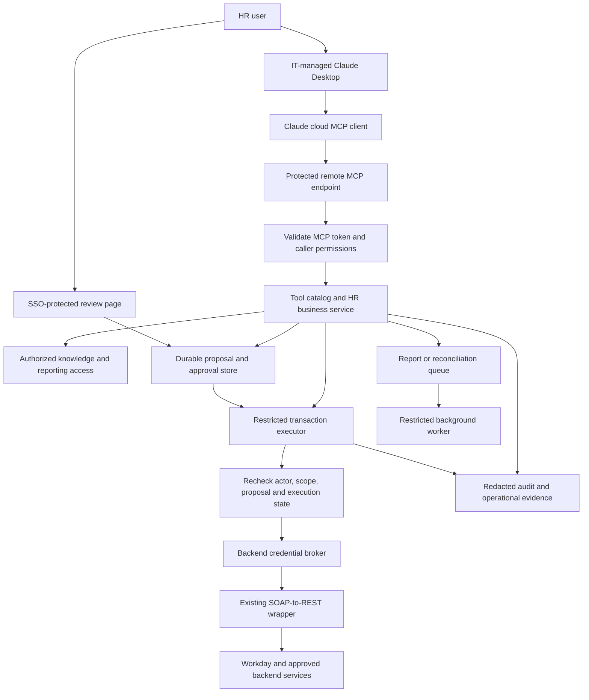
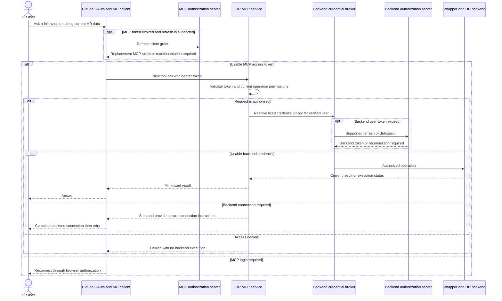
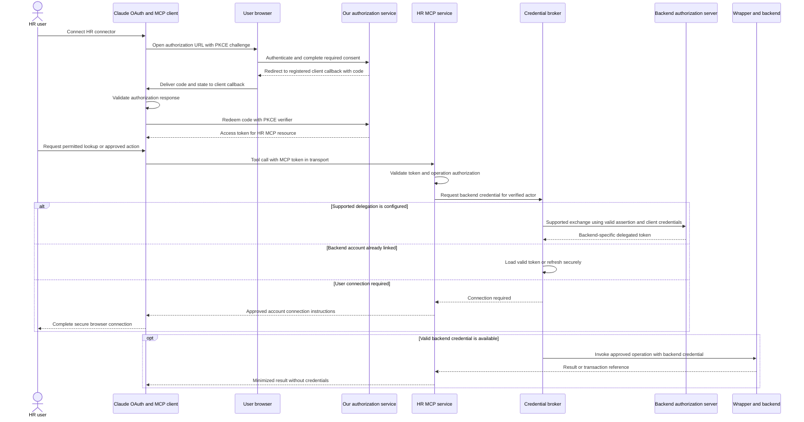
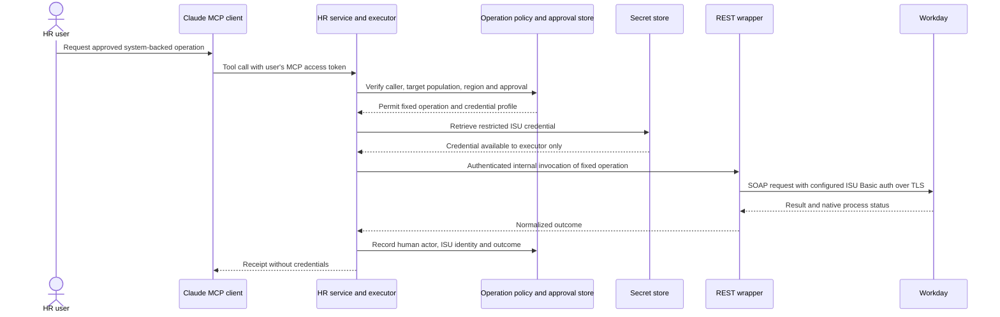
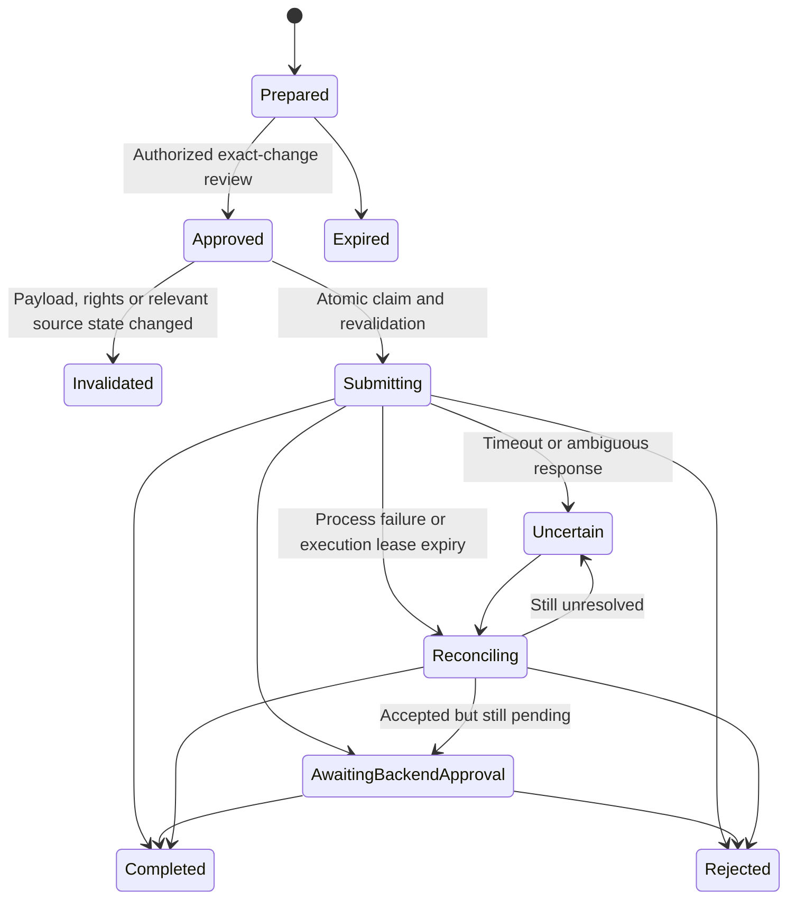
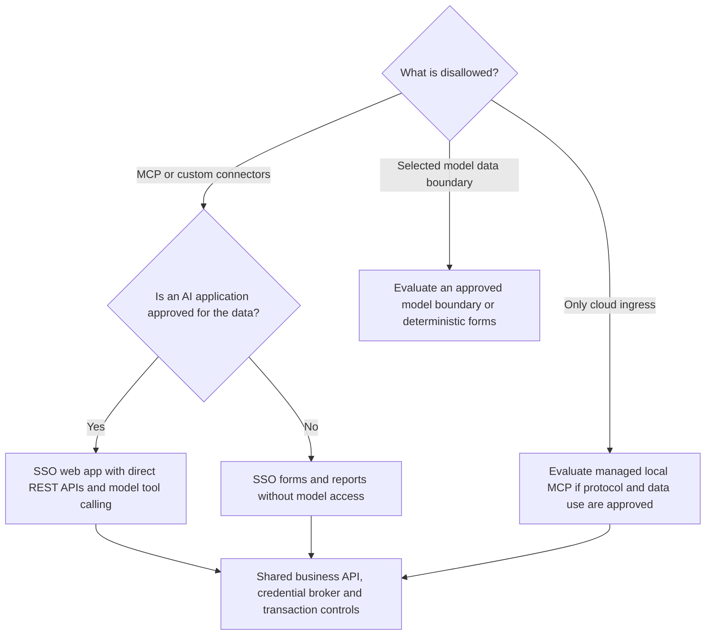
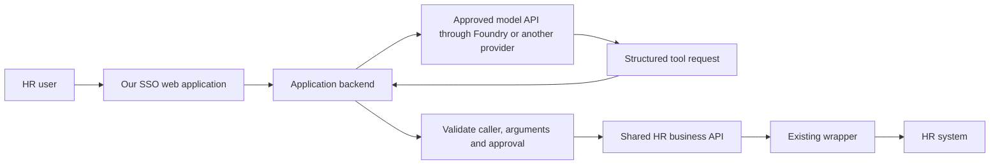

# HR Workspace in Claude Desktop — Proposed Implementation Design

**Date:** 24 September 2026  
**Status:** Design proposal for discussion. Architecture, hosting, authentication routes, scope, and rollout remain subject to review and validation. This document does not record approval to implement or deploy.
**Scope:** Our HR workspace, integration services, authentication, transaction controls, distribution, and an alternative delivery path if MCP is not approved.

## Contents

- [1. Design objective and recommended direction](#1-design-objective-and-recommended-direction)
- [2. What other companies and practitioners are doing](#2-what-other-companies-and-practitioners-are-doing)
- [3. Proposed initial scope and boundaries](#3-proposed-initial-scope-and-boundaries)
- [4. Proposed architecture](#4-proposed-architecture)
- [5. Proposed MCP distribution and operation](#5-proposed-mcp-distribution-and-operation)
- [6. Identity and token architecture](#6-identity-and-token-architecture)
- [7. Token and credential sequences](#7-token-and-credential-sequences)
- [8. How tools select the right execution identity](#8-how-tools-select-the-right-execution-identity)
- [9. Forms, approvals, and transaction reliability](#9-forms-approvals-and-transaction-reliability)
- [10. Hosting, storage, and security controls](#10-hosting-storage-and-security-controls)
- [11. If MCP is not approved](#11-if-mcp-is-not-approved)
- [12. Architecture decisions, contracts, and failure handling](#12-architecture-decisions-contracts-and-failure-handling)
- [13. Proposed implementation sequence and acceptance gates](#13-proposed-implementation-sequence-and-acceptance-gates)
- [14. Decisions we need to close](#14-decisions-we-need-to-close)

## 1. Design objective and recommended direction

This proposal explores Claude Desktop as our entry point for HR research, policy questions, personal and operational lookups, reporting, analysis, and approved transactions. We would also provide links to focused web applications when a form, dashboard, or review screen is more suitable than a conversation.

The recommended integration approach is to expose approved business capabilities through MCP, subject to approval of that protocol and its data flows. We would keep authentication, permission checks, credential selection, transaction approval, and execution in our services. In this design, Claude would select tools based on our descriptions and the user's request; it would not decide which credentials or privileges to use.

Our existing SOAP-to-REST wrapper supports user, ISU, and OAuth authentication. We recommend evaluating it as the integration layer before considering a second transport adapter. We still need to inspect and test its token handling, authorization boundaries, service coverage, error mapping, and retry behavior.

IT ownership of Claude Desktop is part of our stated context. This proposal describes how we could make our HR connector available and operate the services behind it. We do not assume a particular corporate identity provider, an existing Azure deployment, or approval to send HR data to any model service.

Diagrams and component choices are proposed. “Must” identifies a security or correctness requirement if we adopt the design. Hosting, identity routes, scope, and rollout remain open for review.

### Recommendations for review

| Area | Recommendation to evaluate |
|---|---|
| Initial interface | Claude Desktop in our approved organization |
| MCP deployment | Centrally hosted remote MCP over HTTPS using a client-supported HTTP transport |
| Integration | Curated business tools → authorized execution → existing REST wrapper → backend services |
| User authentication | OAuth to our MCP resource, with backend-specific delegation or account connection |
| System authentication | Restricted ISU Basic credentials held server-side, selected by operation policy |
| Write approval | Server-recorded approval bound to an exact proposal and authorized reviewer |
| Initial hosting | A small shared Azure application platform; Container Apps if our operating model supports containers, otherwise App Service |
| If MCP is not approved | An SSO-protected web application calling the same business APIs directly |
| Foundry | Optional model access for that custom application; not required to connect Desktop to MCP |
| Copilot Studio | A future agent/channel option; not a dependency for this implementation |

## 2. What other companies and practitioners are doing

The examples below provide evidence for individual patterns, not a complete production reference for our HR implementation.

### Named organizations and documented patterns

| Organization | What is publicly described | What we take into our design | Evidence boundary and links |
|---|---|---|---|
| **Jamf** | Broad employee use of Claude Enterprise, HR use cases, reusable skills, and employee-built dashboards. Its governance separates ordinary approved use, configured skills/MCP, and custom API applications. | We would support research and reporting alongside transactions, with review proportional to what is being connected or deployed. | Vendor case study; reports 21 implemented HR use cases. Its API layer uses Bedrock, not our proposed Azure deployment. It does not prove our transaction controls. [Case study](https://claude.com/customers/jamf) |
| **Block** | Its goose agent connects employees to data and internal tools, including natural-language analytics, prototypes, and operational actions. | We would separate the employee interface from reusable business capabilities and retain a curated tool catalog. | Vendor case study; the interface is goose, not Claude Desktop. Its public code does not establish end-user delegation to every backend. [Case study](https://claude.com/customers/block), [GitHub](https://github.com/aaif-goose/goose) |
| **Workato** | Claude/MCP is used across connected business systems; its Workday End User template lists time-off submission, cancellation, and manager approval/rejection. | We would evaluate tools as complete business operations, including the executing identity and native process outcome. | A case study and documented product template are different evidence types. Self-service and manager actions do not establish arbitrary HR-administrator access. [Case study](https://claude.com/customers/workato), [Workday tool documentation](https://docs.workato.com/en/mcp/prebuilt-mcps/workday-end-user-mcp-server) |
| **Microsoft** | Its Employee Self-Service rollout guidance describes a configured enterprise agent, while public Workday samples show concrete lookup and time-off topic/template patterns. | We would reuse the pattern of explicit inputs, configured service calls, and backend permissions. We would keep Copilot Studio as a future channel rather than a current prerequisite. | Internal rollout guidance is not proof that every listed third-party integration was deployed internally. Samples require the ESS runtime and tenant configuration; they are not standalone Desktop tools. [Deployment account](https://www.microsoft.com/insidetrack/blog/deploying-the-employee-self-service-agent-our-blueprint-for-enterprise-scale-success/), [Workday samples](https://github.com/microsoft/CopilotStudioSamples/tree/main/EmployeeSelfServiceAgent/Workday) |
| **Workday** | AI Conversation Bridge separates messaging channels, orchestration, MCP, and Workday integration. | We would preserve the same interface/backend separation so we can change the front end without rewriting business rules. | Official-organization reference repository; its included MCP server returns mock Workday data. Production requires a real integration. It is not evidence of a completed Claude Desktop deployment. [GitHub](https://github.com/Workday/ai-conversation-bridge), [architecture](https://github.com/Workday/ai-conversation-bridge/blob/main/docs/architecture.md) |
| **CData** | Its public Workday MCP server connects Claude Desktop to Workday through a JDBC driver. | We can inspect how source metadata and access are packaged, while comparing commercial value against our existing wrapper. | The public server explicitly provides read-only access. Commercial products and driver licensing are separate; this sample does not demonstrate governed HR writes. [GitHub](https://github.com/CDataSoftware/workday-mcp-server-by-cdata) |

**Current Microsoft configuration matters:** the newer [simplified Workday setup](https://learn.microsoft.com/en-us/microsoft-365/copilot/employee-self-service/workday-simplified-setup) documents OAuthUser and Dataverse connections, distinct from the legacy ISU/RaaS route. It warns that an absent REST base URL can cause fallback to the legacy route. We would verify the actual credential path in any evaluation rather than infer it from a connector name. The proposed design explicitly prohibits automatic privilege-expanding fallback. The [ESS developer kit](https://github.com/microsoft/Employee-Self-Service-Agent-Developer-Kit) is another implementation reference, not a drop-in Desktop integration.

### Repositories and concrete implementation examples to inspect

The following references add concrete transaction and authentication examples to the repositories linked above.

| Reference | What we should inspect | What we should not copy without validation |
|---|---|---|
| [Microsoft vacation-balance sample](https://github.com/microsoft/CopilotStudioSamples/tree/main/EmployeeSelfServiceAgent/Workday/EmployeeScenarios/EmployeeGetVacationBalance) | `topic.yaml`, authenticated employee-context binding, `authType=User`, the versioned SOAP request, and response extraction | Assumptions about shared execution, repeated-value alignment, display formatting, or supported tenant permissions |
| [Microsoft request-time-off sample](https://github.com/microsoft/CopilotStudioSamples/tree/main/EmployeeSelfServiceAgent/Workday/EmployeeScenarios/WorkdayEmployeeRequestTimeOff) | Structured input, tenant-specific time-off types, common execution, and success/error handling | A sample form submission as proof of our immutable approval or duplicate-prevention requirements |
| [Workday CLI by favalos](https://github.com/favalos/workday_cli) | Browser OAuth and the separation of business commands from Workday API calls | Community-maintained code as a supported Workday security/approval implementation |

Before adopting sample code, we should pin its version, review licensing, dependencies and credential handling, and test with synthetic data.

### Practitioner evidence

A [Workday practitioner demonstration](https://www.reddit.com/r/workday/comments/1torbgo/claude_code_skills_for_workday/) describes using Claude Code with Workday commands for reference data, positions, and hire requests, and links to the CLI above. The author notes that approval steps were disabled for the demonstration. We would use this as evidence that conversational orchestration is practical, not as a transaction-control design. Claude Code is also a different client from Desktop.

## 3. Proposed initial scope and boundaries

We would start with a small catalog rather than expose every SOAP operation dynamically.

| Capability | First implementation pattern | Required control |
|---|---|---|
| Policy and general HR research | Search approved sources; return sources and effective dates | Source access, freshness, and clear uncertainty |
| Personal lookup | Retrieve the authenticated user's permitted data | Trusted identity-to-worker mapping |
| HR operational lookup | Retrieve a specified worker or population | Role, population, field, and regional authorization |
| Reporting | Submit an authorized report job; retrieve status/results | Approved metrics/data, export permissions, result ownership and expiry |
| Transaction | Prepare → review → submit → reconcile | Exact-change approval, backend permissions, duplicate protection, audit |

A proposed first test slice would include one policy lookup, one authenticated balance or similar read, one bounded report, and one approved administrative write. We would choose the write after confirming its downstream consequences and recovery path. A contact change is only suitable if the selected field has bounded consequences in our configuration.

We recommend excluding payroll/banking changes, bulk changes, termination, and automated employment decisions from the initial release. We would not treat employee self-service tests as proof that an HR operator can safely act on another worker.

Workday is the proposed first backend. Additional systems would need their own operation and identity assessment.

## 4. Proposed architecture



The boxes represent responsibilities, not a requirement to create a microservice for every box. We can keep the MCP adapter, catalog, read APIs, and proposal handling in one modular application. We would isolate privileged write execution and credentials from general research/reporting workloads.

The proposed executor would independently validate the human actor and approved proposal. A call from our application core would not be sufficient authority by itself. We would protect service-to-service calls, scope workload identities, restrict ingress, and prevent direct wrapper access from bypassing these controls.

Remote connector calls originate from Claude's cloud infrastructure, including when the user works in Desktop. The laptop's VPN does not make an internal endpoint reachable to that client. We would use an approved reachable ingress path. If that is prohibited, we would evaluate an explicitly approved local-adapter or custom-application path rather than assume a private Desktop connector feature exists. [R1](https://support.claude.com/en/articles/11175166-get-started-with-custom-connectors-using-remote-mcp)

The data returned by tools may enter Claude's conversation and processing context. Hosting the wrapper or MCP service in Azure does not move Claude Desktop model processing into Azure or establish regional residency for the complete flow.

## 5. Proposed MCP distribution and operation

### Recommended starting point: remote connector

We would host a stable HTTPS endpoint, protect it with OAuth, and register it in our Claude organization. An authorized organization owner can add a custom web connector using the remote MCP URL. We would configure available roles and tools, then pilot connection and authorization with the selected users. Registration makes the connector available; it does not automatically establish backend permissions. [R1](https://support.claude.com/en/articles/11175166-get-started-with-custom-connectors-using-remote-mcp), [R2](https://support.claude.com/en/articles/13930458-set-up-role-based-permissions-on-enterprise-plans)

If the remote MCP approach is accepted, the proposed deployment sequence is:

1. Deploy a nonproduction MCP endpoint and configure its authorization metadata, issuer, and supported client registration.
2. Register a clearly named test connector in our approved organization.
3. Validate login, token audiences, revocation, denied populations, and personal-account restrictions required by our policy.
4. Deploy the reviewed production artifact to a separate production boundary.
5. Register the production connector and limit its catalog/roles to the pilot scope.
6. Expand access only after acceptance tests, monitoring, and support procedures pass.

We would release tool changes centrally through CI/CD. We would version schemas and policies, stage new operations, test client refresh behavior, and retain immediate server-side write disablement. A tool newly discovered in the wrapper would not become available automatically.

Enterprise connector/tool controls shape what users and Claude can access. Cross-role grants can be additive; we would test actual effective access. Server-side authorization remains required even for a hidden or blocked tool. [R2](https://support.claude.com/en/articles/13930458-set-up-role-based-permissions-on-enterprise-plans)

Enterprise-managed connector authorization is a possible usability improvement, but we would confirm support for our IdP and connector before relying on it. The proposed baseline uses individual browser authorization, subject to client compatibility testing. We would not promise zero user prompts based on organization registration alone. [R3](https://support.claude.com/en/articles/15537633-authorize-mcp-connectors-for-your-entire-organization)

### Alternative: managed local adapter

If remote networking is the obstacle and local MCP is explicitly approved, we can package a local stdio adapter for Desktop. It would call our protected central APIs over an approved device network path. We would distribute reviewed versions through the organizational desktop-extension controls and coordinate installation/update behavior with IT. [R4](https://support.claude.com/en/articles/11725091-when-to-use-desktop-and-web-connectors), [R5](https://support.claude.com/en/articles/12592343-enabling-and-using-the-desktop-extension-allowlist)

For that design, a native-app browser flow with PKCE and OS-protected token storage can be appropriate. We would never distribute ISU passwords or an embedded confidential-client secret to laptops.

Stdio avoids opening a local listener, but it does not eliminate endpoint compromise or package tampering. A client-managed process still needs packaging, dependency review, updates, and testing of startup/crash behavior. Transaction and approval state must remain durable in the central service, not only in a local process.

Local execution changes network origin; tool results may still be sent to Claude. It is not a workaround for a prohibition on sharing the data with the model.

## 6. Identity and token architecture

### Identity separation in the proposed design

1. **Claude organization identity:** who can use our approved Claude environment.
2. **MCP resource identity:** who is calling our HR MCP service and what it allows.
3. **Backend execution identity:** the delegated user or restricted ISU that Workday or another backend recognizes.

We would correlate these identities where supported, but we would not treat them as interchangeable. Corporate OAuth alone does not prove the conversation belongs to our approved Claude organization. Required client/account/device restrictions must be validated separately.

### What “carry tokens forward” means

We would carry trusted identity context through our services and obtain credentials valid for each destination. We would not forward the same bearer token indiscriminately across systems. MCP authorization requires tokens intended for the MCP resource; accepting or passing through unrelated third-party tokens is not our design. [R6](https://modelcontextprotocol.io/specification/2026-07-28/basic/authorization), [R7](https://modelcontextprotocol.io/specification/2026-07-28/basic/authorization/security-considerations)

| Credential | Intended recipient | Storage/handling |
|---|---|---|
| Claude sign-in/session | Claude | Managed by Claude; not an HR API credential |
| MCP access token | Our MCP resource | Managed by the OAuth client; validated at our endpoint; never included in model-visible inputs/results |
| Downstream user access token | The specified backend API | Obtained by supported delegation or linked account; retained only in protected server storage/cache as required |
| Downstream refresh token | Backend authorization server | Encrypted, access-controlled server-side token store; rotation/revocation handling |
| ISU username/password | Approved backend authentication endpoint | Secret store, least-privilege retrieval, TLS, rotation; never on the desktop or in chat |
| Workload token | Our Azure resources or protected internal API | Separate scoped workload identity; not a substitute for human authorization |

We would key backend token caches by verified principal, tenant, resource and grant/scope as appropriate. We would prevent cross-user reuse, serialize refresh where required, handle rotated/revoked refresh tokens, and never silently substitute a different account.

Tokens are not tool arguments. We would not ask users to paste tokens, passwords, or authorization codes into a conversation. We would exclude tokens and passwords from prompts, URLs, traces, exceptions, and logs. Authorization codes may appear only where the supported OAuth response requires them, such as the registered callback URL; we would scrub them from logs/traces and prevent leakage through referrers or analytics.

### Login to our MCP service

The remote OAuth client discovers our authorization configuration, opens the authorization flow, and receives a resource-specific token after the user authenticates and applicable consent completes. We would use Authorization Code with PKCE and verify discovery, callback registration, and client-registration compatibility with the actual Claude client. We would not assume the latest protocol document guarantees every client feature. [R6](https://modelcontextprotocol.io/specification/2026-07-28/basic/authorization)

The browser returns to the registered client callback. If we operate an authorization broker in front of the corporate IdP, that broker has its own IdP callback. These are separate registrations. We would use exact approved redirect URIs and validate state/PKCE; credentials and codes would not be routed through chat.

The proposed endpoint would validate issuer, audience/resource, expiry, signature or introspection, and required scopes. It would then evaluate current application permissions. OAuth scope is not a complete employee-population policy.

The remote client may have a different OAuth registration model from a public native app. Confidential-client secrets or certificates, if required, stay in protected server-side configuration. A local public client must not embed a reusable secret.

### Choosing a backend authentication route

| Candidate route | When it would apply | What we must prove |
|---|---|---|
| Entra OBO | The incoming user token and downstream resource support the Entra OBO relationship | Correct middle-tier audience, delegated scopes/consent, trusted client and downstream token acquisition |
| Backend-specific federation/delegation | Our backend explicitly supports that flow | Exact supported exchange, resulting user identity and permissions |
| Linked user OAuth | We need a separate user authorization grant for the backend | Secure connection flow, account linking, refresh and revocation |
| ISU Basic | The approved operation intentionally executes through a service account | Narrow ISU permissions, independent human authorization, approval and audit |

Entra OBO uses a user access token intended for the middle tier to obtain another token for the downstream API. A token issued by an unrelated MCP broker cannot automatically be used as an Entra OBO assertion. Existing SSO does not establish that Workday accepts Entra OBO, and an Entra token is not automatically a Workday token. [R8](https://learn.microsoft.com/en-us/entra/identity-platform/v2-oauth2-on-behalf-of-flow)

If compatible delegation is unavailable, we would connect the user's Workday account through a supported backend OAuth flow. Our server would bind connection initiation and callback to the authenticated caller, validate state and redirect URI, verify the linked backend identity, and store the resulting credentials securely. We would not link accounts solely from a model-supplied email address. The backend browser callback returns to our connection broker, rather than the Claude client callback.

We would aim to avoid repeated login during normal use, with supported refresh and token caching. Consent, session expiry, revocation, conditional access, or an unconnected backend may require another browser interaction.

### Follow-up questions, refresh, and returning later

The proposed experience is to connect once and continue asking questions while the relevant grants remain valid. Each tool call is still authenticated and authorized. Conversation history, an MCP session ID, and a previous successful answer do not grant access to a later request.

| Situation | Proposed handling | Browser interaction |
|---|---|---|
| Follow-up question needs no protected data | Claude can answer from permitted conversation context; no backend request is needed | None |
| Follow-up needs current HR data | The OAuth client attaches its valid MCP access token to the new request; our service checks current access and resolves the operation's backend credential | None while credentials remain usable |
| MCP access token expires | The Claude OAuth client obtains a replacement using its refresh grant, if issued and supported; our MCP resource service does not hold or refresh that client grant | Only if refresh is unavailable, rejected, or additional authentication is required |
| Backend user token expires | Our credential broker refreshes the linked backend grant or uses the configured supported delegation flow | Only if backend reconnection or additional authentication is required |
| User returns in a new conversation or after restarting Desktop | The client may reuse a retained connector grant; our backend grant is associated with the verified user, not a chat ID | Depends on actual client persistence, grant lifetime, and policy; test this explicitly |
| Access is revoked or the user disconnects | Deny new execution and apply the relevant disconnect/revocation policy | Reauthentication cannot override denied permissions |

The MCP access token belongs in the HTTP authorization header on every protected request. If an MCP refresh token is issued, custody stays with the OAuth client, separate from the backend refresh tokens held by our broker. The exact Claude retention, reconnect, and return-to-app experience is a client acceptance test, not storage behavior we control. [MCP authorization](https://modelcontextprotocol.io/specification/2026-07-28/basic/authorization)

A connector disconnect, a backend-account unlink, and an IdP logout are distinct events. The design needs explicit handling for each; we should not assume one automatically revokes the others. Cached HR content in a conversation also does not disappear merely because a backend grant is revoked. This is a separate retention and access consideration.



The refresh branches represent conditional flows, not a promise that all grants are renewable. If a write was already submitted before a connection failure, the next action is status reconciliation—not automatic replay of the write.

## 7. Token and credential sequences

### A. User-delegated operation



The first redirect terminates at the callback registered for the Claude OAuth client. It is not necessarily a local Desktop URL. The client exchanges the code through the token endpoint; tokens are not passed through the conversation. We need to verify how the supported client returns the user to Desktop and whether the user must retry the original request.

When a backend connection is required, that invocation stops without executing the operation. After the browser connection succeeds, a fresh request repeats authorization and obtains the valid backend credential.

The diagram's exchange branch is conditional; it is not a claim that the MCP token itself can be exchanged for every backend. For writes, our executor also checks the approved proposal before invoking the wrapper.

### B. ISU-backed operation



“ISU Basic” describes our configured account/credential mode. We would verify the exact authentication on each leg, including whether the backend expects HTTP Basic or SOAP security-header credentials; we would not infer the wire format from the label.

Credential retrieval may live inside our wrapper if it already implements this securely. We would avoid duplicating secret management. The illustrated internal invocation must preserve integrity of actor, operation, and approval context; callers cannot select arbitrary accounts or endpoints.

## 8. How tools select the right execution identity

We would maintain an operation registry in version-controlled server configuration. Claude sees business descriptions and validated input schemas. Our server resolves the authentication mode.

```yaml
# Illustrative policy, not a production configuration
operation: submit_approved_hr_change
required_permission: hr.change.submit
execution_identity: delegated_user
approval_required: true
backend_operation: approved_service_operation
credential_profile: delegated_workday
```

A different approved operation may specify `execution_identity: isu_basic` and a restricted credential profile. We can route by trusted tenant/region policy where necessary; the model cannot supply a more privileged profile.

We would not expose an `authMode`, username, password, raw token, arbitrary SOAP action, or arbitrary destination URL in the user-facing tool schema. A denied user request must never be retried with ISU credentials as a convenience fallback.

The proposed initial tools would follow these responsibilities:

| Tool | Responsibility |
|---|---|
| `search_hr_policy` | Search approved sources with scope and effective-date context |
| `get_my_balance` | Derive the worker from the verified caller and return permitted balance data |
| `get_authorized_worker_summary` | Check access to a specified worker and allowed fields |
| `start_hr_report` / `get_hr_report_status` | Run an approved report asynchronously and authorize result retrieval |
| `prepare_hr_change` | Validate a proposed operation and persist its exact contents |
| `submit_approved_hr_change` | Submit only a valid, authorized, unexpired approved proposal |
| `get_hr_change_status` | Return authoritative pending/completed/rejected/uncertain state |

We would use clear descriptions to improve tool selection. Descriptions and prompts do not enforce access or explicit intent. Unauthorized calls must fail even if Claude selects the wrong tool.

## 9. Forms, approvals, and transaction reliability

We would collect required fields through conversation or a supported structured-input surface, then validate them on the server. We would not assume that specification-level elicitation means our deployed Desktop version supports every form behavior. We would verify client capability before using it.

Interactive MCP Apps are an option for richer forms. Their use would require validation of client support, sandboxing, and data handling. The proposed first release would not depend on them. [R9](https://apps.extensions.modelcontextprotocol.io/api/documents/overview.html), [R10](https://support.claude.com/en/articles/13454812-use-interactive-connectors-in-claude)

We would test complete and partial-input schemas deliberately: missing required tool arguments may be rejected before our handler can collect them. We would not depend on an invalid tool call triggering a form. [R15](https://modelcontextprotocol.io/specification/2025-11-25/client/elicitation)

The recommended baseline for writes is an SSO-protected review page showing the worker, operation, current and proposed values, effective date, and native approval implications. A user must be authorized for that proposal, not merely signed in or in possession of its URL.

We would store immutable proposal contents, version, expiry, creator, authorized approver, and execution state. Approval binds to the exact proposal. We would protect the browser session against CSRF and replay, recheck actor permissions and relevant source state, and perform atomic approval/submission transitions. Client tool confirmation and a chat response saying “yes” are not our sole write authorization.



We would preserve native business-process approvals. Submitted is not completed. An unresolved timeout must not trigger blind resubmission. We would use backend idempotency where available, deduplicate at our service, and reconcile source state. An idempotency key alone cannot guarantee exactly-once execution across our database and Workday.

Approvals and status must survive Desktop closure and server restart. Logs alone are not transaction state. Some completed changes require a compensating business process rather than rollback.

A slash command can be a useful entry convention where supported, but we would not treat it as an MCP authorization boundary. If deterministic per-request tool exposure becomes mandatory, we would use an application-controlled execution path. Claude documents Auto, Always available and On demand tool-loading modes; loading is not authorization. [R16](https://support.claude.com/en/articles/13730515-manage-claude-s-tool-access)

## 10. Hosting, storage, and security controls

We would start with a small shared Azure deployment rather than one infrastructure stack per tool. Container Apps is a candidate for containerized APIs/workers; App Service is the alternative for a conventional web/API deployment. Functions fit scheduled or event-driven reconciliation and integration tasks. A modular monolith can run on either hosting platform. [R11](https://learn.microsoft.com/en-us/azure/container-apps/compare-options)

The proposed logical components are the MCP/business application, approval page and durable store, restricted executor/credential broker, existing wrapper, audit/monitoring, and an optional queue/worker. We can combine compatible components while preserving privilege boundaries. We would use separate production and nonproduction identities/data, and approved regional boundaries where required.

Shared hosting does not imply shared privileges. We would use scoped workload identities, protected secrets, server-side per-record authorization, restricted egress, output minimization, and explicit retention. A shared process is not a sandbox for unreviewed generated code.

For reporting, we would prefer approved analytical datasets and defined metrics for broad analysis. We would authorize jobs and downloads, preserve units and effective dates, and prevent unbounded exports. Knowledge retrieval must filter access before returning content to Claude.

We would audit caller, operation/version, permitted target, policy decision, proposal/approval reference, execution identity type, backend reference, and outcome. We would minimize personal data and redact secrets. Audit retention should exclude unnecessary HR payloads and conversation content.

For global use, we would document conversation processing, tool traffic, storage, logs, credentials, backups, support access, and failover separately. No hosting label establishes end-to-end residency. We would test any required restriction on personal Claude accounts, other organizations, unmanaged devices, and off-network paths rather than assuming SSO proves it.

## 11. If MCP is not approved

We would first identify what is actually disallowed, then select an approved architecture. Changing protocol is not a way to bypass a data-access decision.

| Constraint | Our alternative | What changes |
|---|---|---|
| Remote ingress from Claude is disallowed, but MCP/data use is approved | Evaluate a managed local stdio adapter; consider any alternative private route only after verifying explicit Desktop support | Network path and deployment responsibility change; Claude still processes returned content |
| MCP protocol/custom connectors are disallowed, but an approved AI application is permitted | Build an SSO web application using direct REST business APIs and model tool calling | We own the interface, tool-selection loop, sessions, and deployment; native Desktop integration is not retained |
| Only Desktop custom integrations are disallowed | Keep Desktop for approved research; open an authenticated HR app for protected data/actions | Users switch surfaces; app actions do not inherit Desktop authority |
| HR data may not be sent to the selected model service | Use a separately approved model/data boundary or deterministic forms and reports | No connector, tunnel, or wrapper can remove the underlying restriction |
| All AI access to HR data/actions is prohibited | Use deterministic SSO forms, reports, and native HR workflows without model involvement | AI-assisted development remains limited to separately permitted data/use boundaries |
| MCP approval is pending | Build and test the REST business service, policy, forms, and execution first | MCP becomes a thin adapter when approved |

We would not assume the current MCP tunnels feature solves Desktop private networking: its documentation describes research-preview API/Managed Agents use and states that Console-created tunnels are unavailable as claude.ai connectors. We would need separate evidence of support before choosing it for Desktop. [R17](https://platform.claude.com/docs/en/agents-and-tools/mcp-tunnels/overview)

We have not established an arbitrary direct-REST tool configuration in stock Claude Desktop that replaces custom MCP. Browser automation, extensions, and other connectors would each require their own review; they are not implicit approved substitutes.

### Choosing an alternative



### The custom application path



The model proposes a tool call. Our backend validates and executes the allowed business operation. We do not need MCP for this route, and we do not send HR tokens to the model. Deterministic forms can call the same API without any model involvement.

For the custom web app, the browser would redirect to our IdP and back to the app's registered callback. A server-side application session with a Secure, HttpOnly cookie would keep subsequent questions signed in, subject to session and access policy. Backend tokens would remain in the server-side broker. Each API request would still require authorization; cookie-authenticated state changes also need CSRF protection. Foundry would receive model requests, not HR credentials. This route replaces the conversational interface and MCP transport while reusing the proposed business controls.

### Where Microsoft Foundry fits

In the Azure option, Azure would host our application and integration services. Microsoft Foundry can provide model deployments/API access for a custom application. It does not by itself provide the Desktop UI, redirect Desktop's model traffic, distribute our Desktop connector, or authorize HR transactions.

Current Microsoft documentation distinguishes Anthropic-hosted and Azure-hosted Claude offerings in Foundry. Model/version availability and lifecycle differ; the Azure-hosted version is documented as GA. We would select a specific eligible model/deployment and validate region, quota, purchasing terms, processing boundaries, and feature support. We would not assume every Foundry Claude endpoint runs entirely in Azure or that an Azure region name guarantees the required processing boundary. [R12](https://learn.microsoft.com/en-us/azure/foundry/foundry-models/concepts/claude-models), [R13](https://learn.microsoft.com/en-us/azure/ai-foundry/foundry-models/how-to/use-foundry-models-claude)

The current hosting comparison describes Global or available US Data Zone processing for Azure-hosted Claude, rather than automatic confinement to the resource region. It identifies Anthropic as seller, operator, and data processor for both hosting versions, with Marketplace billing. We would verify the exact terms and eligibility; Azure hosting is not a change to the provider contract by itself. [R18](https://learn.microsoft.com/en-us/azure/foundry/foundry-models/concepts/claude-models-hosting-comparison)

Foundry Agent Service is optional if we need a managed agent runtime, subject to model/runtime compatibility; a simple application can use model tool calling with our own execution loop. Desktop licensing and model API consumption are separate planning items. Copilot Studio can later consume our REST APIs or MCP service if approved, without making it a prerequisite now.

## 12. Architecture decisions, contracts, and failure handling

### Candidate architecture decisions

The following table records the rationale and tradeoffs for review. Accepted choices should become architecture decisions with named owners.

| Proposed choice | Rationale | Cost or limitation to assess | Alternative or reconsideration trigger |
|---|---|---|---|
| Remote MCP by default | Central rollout, credential custody, policy and incident controls | Cloud-origin connectivity and model data flow require approval | Our network or data constraints prohibit this path |
| Reuse the REST wrapper | Preserve existing SOAP coverage and authentication investment | We inherit its correctness and maintenance dependencies | Its operation coverage or identity behavior fails the pilot |
| Shared business API behind client adapters | Reuse controls from Desktop, review pages, reporting and future channels | We own contracts and integration tests | A proven native/vendor operation removes meaningful custom work |
| Modular core plus isolated privileged execution | Keep initial operations manageable while constraining write credentials | Core modules still share releases/process failure; separation adds a service boundary | Scaling, ownership, privilege or regional needs justify further separation |
| Server-held exact-change approval | Protect execution from model ambiguity and payload changes | Additional review interaction and durable state | A tested inline surface provides equivalent binding and identity evidence |
| Per-operation credential policy | Avoid model-controlled privilege selection | Each operation needs explicit mapping and review | Backend capabilities change; never because a user request was denied |
| Minimal backend access and outputs | Limit unnecessary disclosure and blast radius | Some broad exploratory questions need a separate approved report | A measured use case justifies additional fields or scope |

These proposed choices are intended to remain reversible at the interface and hosting layers. Backend actor semantics, recorded approvals, and audit integrity are constraints that every replacement must preserve.

### Required properties if this design is adopted

We would treat the following as release-blocking properties:

- Every protected call has a verified caller and an operation-specific authorization decision.
- A model-supplied employee ID, role, country, or credential profile never establishes authority.
- Every write matches one authorized, unexpired proposal and passes current permission checks.
- A user-delegation failure never expands access by switching to ISU.
- A successful conversation is not counted as a successful transaction without backend evidence.
- An ambiguous commit is reconciled before any new submission is permitted.
- An export is authorized at generation and retrieval; a file link does not replace access control.
- A disabled operation remains disabled regardless of cached client tool definitions.

### Business API and MCP contracts

We would keep transport and business contracts separate. MCP translates a tool call into our business operation; it does not become the only place where policy is enforced. The proposed web app fallback would call the same business service.

| Contract element | Required content |
|---|---|
| Operation definition | Stable name/version, owner, backend mapping, schemas, supported scope, credential mode, approval and retry classification |
| Request context | Verified actor, tenant/environment, correlation ID, authorized target, policy version; injected by trusted middleware rather than accepted from the model |
| Proposal record | Immutable payload and version/hash, target, actor, relevant source-state snapshot/version, expiry, approval state and approved credential policy |
| Execution record | Proposal reference, execution ID, deduplication identity, attempt state/lease, backend reference, timestamps and reconciliation outcome |
| Tool result | Explicit outcome, correlation/reference IDs, minimal business data, effective/as-of date and freshness where relevant |
| Error result | Stable error code and safe next action; no tokens, raw SOAP fault dumps, stack traces, or fabricated completion |

Proposed business error categories include `AUTHENTICATION_REQUIRED`, `BACKEND_CONNECTION_REQUIRED`, `ACCESS_DENIED`, `VALIDATION_FAILED`, `APPROVAL_REQUIRED`, `PROPOSAL_STALE`, `RATE_LIMITED`, and `OUTCOME_UNKNOWN`. These are our application codes, not claims about standard MCP methods. We would use protocol-appropriate authentication errors for the MCP boundary and structured business results for authorized calls that fail business processing.

The caller may supply a request identifier for correlation, but it cannot make a duplicate safe simply by generating a new identifier. We would bind submission deduplication to the approved proposal and intended operation. Where backend deduplication is unavailable, the operation contract must state the reconciliation method and when manual resolution is necessary.

Source-state revalidation is not atomic with a remote write. Each write contract must identify supported backend conditional-write/version checks. If the backend cannot enforce them, we must document the concurrent-edit limitation, assess whether the operation is safe to enable, and define detection and recovery. A local execution lease prevents competing local submissions; it cannot lock out another HR application.

We would version tool schemas, backend mappings and policy together. A material change to meaning, credential mode or approval behavior invalidates affected outstanding proposals or requires an explicit compatible migration. We would not execute an old approval under newly expanded privileges.

### Failure and recovery matrix

| Failure | Required behavior | Recovery evidence |
|---|---|---|
| MCP access token invalid | Reject before dispatch | New valid login; no backend call occurred |
| Backend grant expired/revoked | Refresh only if supported; otherwise request reconnection | Verified grant for the same intended user and resource |
| Permission revoked after preparation | Reject submission even if the proposal was previously approved | Current policy decision and invalidated proposal |
| Source record changed | Reject or require a new proposal where the change affects the approved outcome | New before/after values reviewed by the authorized approver |
| Backend returns permission denial | Return denial; do not change account or widen scope | Corrected legitimate permissions or a different approved business process |
| Backend throttles a read | Apply bounded retry/backoff within the request budget | No uncontrolled retry loop or cross-user starvation |
| Backend throttles or times out on a write | Follow operation-specific retry rules; use unknown/reconciliation state where acceptance is ambiguous | Backend lookup/reference or manual adjudication before resubmit |
| Executor crashes after backend acceptance | Recover durable in-flight state; reconcile before retry | Backend status and recovered execution record |
| Audit/proposal store unavailable | Stop new writes requiring that evidence | Store recovery and durable correlation restored |
| Regional destination unavailable | Fail closed rather than silently cross an unapproved boundary | Approved failover or controlled service restoration |
| Model is unavailable or produces invalid arguments | Return a clear failure; preserve pending transactions | Status/review or existing HR interface remains usable where independent of the model |

We would distinguish synchronous request deadlines from transaction lifetime. A client disconnect does not cancel an accepted backend business process. Cancellation, if supported, is a separately authorized operation with its own outcome.

### Capacity, service objectives, and operational readiness

Availability and throughput targets remain open until we measure demand and dependencies. Before production, we would record expected active users, peak requests, report sizes, backend quotas, target lookup latency, acceptable report completion time, maximum reconciliation age, recovery objectives, and support coverage.

Load testing should cover peak concurrency, slow backend responses, token refresh contention, report generation, and concurrent submissions. We would use per-user and per-operation limits, bounded queues, deadlines and circuit breaking to protect shared capacity. Long-running reports must not occupy interactive request slots indefinitely.

We would measure platform and business outcomes separately: API latency/error rates, dependency health, denied requests, token refresh failures, duplicate suppression, unresolved executions, authorized report delivery, and confirmed transaction completion. Metrics must not use employee IDs or sensitive values as high-cardinality labels.

A recommended pilot readiness gate is that we can identify the deployed version, disable writes, reconcile uncertain outcomes, restore durable state, rotate/revoke credentials, and route users to the fallback. An operation without authoritative status lookup needs a manual reconciliation runbook before enablement.

## 13. Proposed implementation sequence and acceptance gates

| Proposed phase | Candidate deliverables | Proposed exit criteria |
|---|---|---|
| 1. Confirm contracts | Selected operations, source data, worker mapping, credential mode per operation, network/data boundaries | No unresolved identity mechanism for the first slice |
| 2. Build shared service | Versioned business API, operation registry, wrapper adapter, scoped read, audit | Correct authorized results and explicit denial cases |
| 3. Prove identity end to end | MCP OAuth plus one real supported delegated route and one restricted ISU route in test | Correct audiences, actor mapping, revocation, and no privilege fallback |
| 4. Add Desktop | Test connector, tool schemas, role settings, missing-input handling | Successful supported-client login and tool use with no exposed secrets |
| 5. Prove writes and reporting | Durable review, atomic submission, status/reconciliation, authorized report retrieval | Approval integrity, duplicate/timeout safety, and access-controlled outputs |
| 6. Pilot | Trained users, transaction caps, monitoring, support, fallback and stop controls | Accepted outcomes and measured user effort/cost within the agreed scope |
| 7. Expand | More operations and a materially different approved region/use case | Each addition passes its own permissions, data-flow, and recovery tests |

The proposed release tests would include wrong issuer/audience, expired credentials, role revocation while tokens remain valid, changed worker scope, arbitrary employee IDs, cross-user token-cache access, tampered credential selection, copied approval URLs, replay, stale proposals, concurrent submits, source changes, backend rejection, timeout after commit, malicious source content, and unauthorized report downloads.

We would verify that expiry or failure of a user's backend connection produces a reconnect/denial outcome, never an ISU fallback. For background jobs, we would define whether authorization is rechecked at execution and download; the recommendation is to recheck both and reject revoked access.

We would be able to disable one operation, one region, one caller, or all writes at our service. We would fail closed when required authorization or durable approval/audit evidence is unavailable, while retaining safe status/reconciliation access. We would keep the existing HR interface available for fallback.

### SDLC and deployment

We would use a supported application template, synthetic test data, code review, required checks, dependency/secret/IaC/image scanning as relevant, and targeted authorization/integration tests. Under this proposal, AI-generated code would follow the same release process as manually written code. Scanners do not establish correct HR policy.

We would promote a reviewed immutable artifact, protect workflow and permission changes, use narrowly scoped deployment identities, and verify that required scans actually ran. Where GitHub Actions deploys to Azure, OIDC federation avoids storing long-lived Azure deployment passwords. Production approval and Azure permissions remain separate requirements. [R14](https://docs.github.com/en/actions/how-tos/secure-your-work/security-harden-deployments/oidc-in-azure)

The broader pipeline and shared-platform implementation is detailed in our [rapid-development plan](workstreams/02-rapid-development/hr-workspace-app-platform-and-sdlc.md).

## 14. Decisions we need to close

1. Which Claude organization/plan, client versions, connector controls, and network path will we use?
2. Which corporate IdP and authorization server will issue tokens for our MCP resource?
3. Which exact delegated mechanism does the wrapper support for each Workday operation? Does it require a separately linked user grant?
4. Where does the wrapper currently store/refresh credentials, and how does it verify trusted caller context?
5. Which ISU operations are permitted, with what target population and minimum backend privileges?
6. Which operation is our first write, who may approve it, and how do we reconcile ambiguous results?
7. Which initial region, employee population, data classifications, and retention rules are approved?
8. Which hosting, secret-management, logging, CI/CD, and model contracts can we reuse?
9. If MCP is rejected, is the restriction about protocol, network, client, or model data handling?

Implementation would require a named owner for application code, identity configuration, operation policy, release, and production reconciliation before pilot launch. Owners beyond IT’s Desktop responsibility remain to be agreed.

## References

Product documentation was checked on the document date. Client behavior, backend delegation, regional processing and transaction recovery still require testing in our environment.

- **R1:** [Claude remote custom connectors and network requirements](https://support.claude.com/en/articles/11175166-get-started-with-custom-connectors-using-remote-mcp)
- **R2:** [Claude Enterprise role and connector permissions](https://support.claude.com/en/articles/13930458-set-up-role-based-permissions-on-enterprise-plans)
- **R3:** [Enterprise-managed connector authorization](https://support.claude.com/en/articles/15537633-authorize-mcp-connectors-for-your-entire-organization)
- **R4:** [Desktop versus web connectors](https://support.claude.com/en/articles/11725091-when-to-use-desktop-and-web-connectors)
- **R5:** [Desktop extension allowlist](https://support.claude.com/en/articles/12592343-enabling-and-using-the-desktop-extension-allowlist)
- **R6:** [MCP authorization specification](https://modelcontextprotocol.io/specification/2026-07-28/basic/authorization)
- **R7:** [MCP authorization security considerations](https://modelcontextprotocol.io/specification/2026-07-28/basic/authorization/security-considerations)
- **R8:** [Microsoft Entra OAuth OBO](https://learn.microsoft.com/en-us/entra/identity-platform/v2-oauth2-on-behalf-of-flow)
- **R9:** [MCP Apps overview](https://apps.extensions.modelcontextprotocol.io/api/documents/overview.html)
- **R10:** [Interactive connectors in Claude](https://support.claude.com/en/articles/13454812-use-interactive-connectors-in-claude)
- **R11:** [Azure application hosting comparison](https://learn.microsoft.com/en-us/azure/container-apps/compare-options)
- **R12:** [Claude models and hosting in Microsoft Foundry](https://learn.microsoft.com/en-us/azure/foundry/foundry-models/concepts/claude-models)
- **R13:** [Deploy and use Claude in Foundry](https://learn.microsoft.com/en-us/azure/ai-foundry/foundry-models/how-to/use-foundry-models-claude)
- **R14:** [GitHub Actions OIDC deployment to Azure](https://docs.github.com/en/actions/how-tos/secure-your-work/security-harden-deployments/oidc-in-azure)

- **R15:** [MCP elicitation and negotiated capabilities](https://modelcontextprotocol.io/specification/2025-11-25/client/elicitation)
- **R16:** [Claude tool access and loading modes](https://support.claude.com/en/articles/13730515-manage-claude-s-tool-access)
- **R17:** [MCP tunnels scope and research-preview limitations](https://platform.claude.com/docs/en/agents-and-tools/mcp-tunnels/overview)
- **R18:** [Foundry Claude hosting comparison](https://learn.microsoft.com/en-us/azure/foundry/foundry-models/concepts/claude-models-hosting-comparison)
