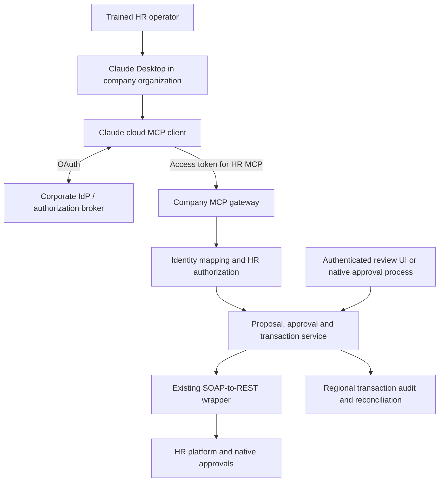

# Claude Desktop for Global HR Transactions

> **Scope update — 23 September 2026:** Claude is the proposed entry point for broader HR research, reporting, analysis, transactions, and apps. Copilot Studio is a future agent option rather than an immediate comparison gate. Read the [HR workspace, application platform, and SDLC plan](../../02-rapid-development/hr-workspace-app-platform-and-sdlc.md) for the current wider direction. This document retains the detailed transaction/vendor research.

## Research, architecture options, governance, and pilot plan

**Research date:** 22 September 2026  
**Evidence rechecked and revised:** 23 September 2026  
**Audience:** HR leadership, HR technology, enterprise architecture, identity, security, privacy, and regional operations  
**Status:** Decision and pilot proposal; not a production implementation specification

**Architecture companion:** [End-to-end diagrams, OAuth enforcement, and secure distribution](hr-architecture-and-enforcement.md). It explains each deployment approach and includes six Mermaid diagrams. Read Sections 7 and 8 here for the policy decisions, then use the companion for implementation boundaries and acceptance tests.

### Contents

1. [Executive recommendation](#1-executive-recommendation)
2. [Company and community evidence](#2-what-other-companies-and-practitioners-are-doing)
3. [Where to start in HR](#3-where-to-start-in-hr)
4. [Value of the SOAP-to-REST wrapper](#4-how-the-soap-to-rest-wrapper-makes-this-easier)
5. [Architecture approaches](#5-approaches-apis-tools-mcp-skills-and-integration-platforms)
6. [Transaction architecture](#6-reference-architecture-and-transaction-execution)
7. [Authentication and authorization](#7-authentication-and-authorization)
8. [Distribution and global deployment](#8-distribution-and-global-deployment)
9. [Governance and operating model](#9-governance-and-operating-model)
10. [Delivery phases and acceptance criteria](#10-delivery-plan-and-decision-gates)
11. [Decisions before development](#11-decisions-required-before-rapid-development)
12. [Build, buy, and platform candidates](#12-build-buy-and-platform-candidates)
13. [Standalone recommendation](#13-standalone-recommendation)
14. [Evidence register](#appendix-a-evidence-register-and-source-links)

## 1. Executive recommendation

Evaluate Claude Desktop as an alternative interface for trained HR operations users to perform a defined set of transactions. Keep authorization, validation, transaction state, audit evidence, and business-process approvals in company-controlled services and the HR system of record.

The recommended starting architecture is:

**Claude Desktop → organization-managed remote MCP connector → company HR transaction service → existing SOAP-to-REST wrapper → HR platform.**

The existing wrapper is a meaningful accelerator. It can make otherwise complex SOAP services accessible through a consistent HTTP interface, reducing repeated integration work. Add curated business operations above it so that an HR user can request an outcome without knowing SOAP schemas, service names, or technical identifiers.

Start with a small HR operations cohort, a narrow organizational scope, and a few transactions. Expand by approved operation and jurisdiction, rather than granting broad access to every dynamically exposed endpoint.

The public research establishes that organizations and practitioners are building conversational interfaces that execute enterprise actions. It does not establish a broadly proven, complete replacement of an HR application with Claude Desktop. Vendor case studies, product announcements, inspectable repositories, and anonymous practitioner reports are separated in this document.

### Decisions proposed

| Decision | Proposed position | Condition or unresolved dependency |
|---|---|---|
| Initial user population | Trained HR operations specialists | Identify process owner, regional sponsor, and support owner |
| Primary interface | Claude Desktop in a managed Enterprise organization | Enterprise is the planning baseline for custom-role controls; confirm geography, data handling, and actual entitlements |
| Integration interface | Remote MCP exposing curated HR tools | Confirm network reachability and identity integration |
| Transaction execution | Company-owned service using the existing wrapper | Assess wrapper behavior, backend permissions, and transaction semantics |
| Authentication baseline | Per-user OAuth to MCP; separate backend authentication | HR platform and corporate identity provider are not yet specified |
| Global rollout | Shared platform with regional policy and release gates | Each country/entity must pass its own data and process review |
| AskHR replacement | Incremental capability replacement | Inventory current AskHR functionality before retiring components |

### Scope and assumptions

The confirmed starting asset is the user's SOAP-to-REST wrapper, described as able to dynamically expose SOAP services as REST endpoints. Its implementation, supported authentication methods, observability, and transaction guarantees have not been inspected. Proposed enhancements below are requirements to assess, not claims about existing features.

The current AskHR implementation was not available in the local checkout examined during research. This is therefore an architecture and operating-model plan, not a verified mapping of AskHR source code. The HR platform, identity provider, operating countries, transaction volumes, and contracts remain open inputs.

An **identity provider (IdP)** is the corporate service that authenticates employees, such as Okta or Microsoft Entra ID. **MCP** means Model Context Protocol. Where this document discusses an integration platform, it means an enterprise service for connecting applications and running managed integrations.

The intended scope is **human-directed HR administration**. Automated decisions about hiring, dismissal, compensation, promotion, or employee suitability are outside the initial proposal. Administrative submission of an already-authorized decision is a separate use case that still needs explicit controls.

## 2. What other companies and practitioners are doing

### 2.1 Named organizations and official vendor evidence

| Organization | Publicly described activity | Evidence and limitations | Relevance to this proposal |
|---|---|---|---|
| **Workato** | Anthropic reports customers using Claude/MCP for HR PTO approvals, onboarding, and employee lookups. It reports over 800 customer-created MCP servers in eight months across business functions. | Vendor case study; the count is not 800 HR or verified production deployments. [Workato case study][S01] | Supports governed, business-oriented tools. |
| **.monks** | Its CIO describes existing Workato use for sales, onboarding, and IT, and says Enterprise MCP can make those processes accessible to AI. | Named quotation; does not establish a completed HR Desktop deployment. [Workato case study][S01] | Existing integration investments can be reused. |
| **Nasdaq** | An enterprise solutions executive endorses governed enterprise access through MCP in the Workato case study. | Named endorsement, not a disclosed HR deployment or transaction outcome. [Workato case study][S01] | Evidence of enterprise interest; not an implementation benchmark. |
| **PwC** | A May 2026 announcement describes a client HR transformation with a prototype in one week, a full application in under two months, and thousands of daily transactions. | Vendor/partner announcement. It does not establish whether Claude initiates transactions at runtime or was primarily used to build the application. The client and detailed architecture are undisclosed. [PwC announcement][S02] | Evidence of application-delivery potential, not proof of conversational HR execution. Its timings are not this project's estimate. |
| **Oracle NetSuite** | The Claude connector listing identifies Oracle NetSuite as its maker and lists record-creation and record-update tools. | Official product capability listing, not evidence of a specific customer deployment. [NetSuite connector][S03] | Direct precedent for enterprise write operations being exposed inside Claude. |
| **Workday** | Announced Agent-Ready Tools over MCP with security, delegation, business-process, and audit integration. | The 2 June 2026 release states early access through Extend Professional and projected general availability in H2 2026. This research does not confirm current tenant availability or licensing. [Workday announcement][S04] | A vendor-native option to assess alongside the custom wrapper, especially where native delegation is stronger. |
| **Workday** | Publishes AI Conversation Bridge, a reference architecture connecting messaging platforms through orchestration and MCP to Workday. | Official-organization GitHub repository; included Workday tools use mock data and production requires a full integration. [Reference architecture][S05] | Supports separating the conversational front end from the system of record. |

The Workday announcement also includes comments from **Accenture** about reusable process knowledge and from **Waste Connections** about anticipated developer benefits. These are partner/customer perspectives on the announced tools, not proof of completed HR transaction deployments. [Workday announcement][S04]

Workato, .monks, and Nasdaq appear in the same case study; those rows are not three independently documented HR deployments.

Workday's separate architecture article explicitly describes Claude access through tools scoped to the end user's identity, with Workday retaining rules, approvals, and audit. It labels Agent-Ready Tools as Early Availability. This strengthens the vendor-native comparison but does not establish general availability or the company's entitlement. [Workday architecture article][S30]

### 2.2 Reddit, GitHub, and community examples

| Example | What was demonstrated or reported | Evidence quality and lesson |
|---|---|---|
| Workday CLI and Claude Code | A May 2026 practitioner post describes resolving reference data, creating positions, and submitting hire requests. The companion CLI documents browser OAuth. | Public report plus inspectable code. Uses Claude Code, not Desktop; the author says approval steps were disabled for the demo and normal business-process approvals otherwise apply. [Reddit][S06], [GitHub][S07] |
| SAP Business One and Claude Desktop | A practitioner reports MCP tools that update purchase orders and create draft invoices, with a separate service verifying and posting final invoices. | Anonymous, unverified operational claim. Useful precedent for purpose-built tools and controlled posting. [Reddit discussion][S08] |
| Oracle Fusion HCM MCP | An unofficial published package describes schema discovery, HR lookup workflows, gated mutation tools, and Desktop setup. | Maintainer-described capabilities, not independently verified production behavior or an Oracle-supported product. Its GitHub repository was unavailable during final review. [PyPI release][S09] |
| SAP business-process skills | A May 2026 community article describes and links a demonstration using Claude, MCP, and OData to create a purchase order from supplier information. | Author-described demonstration, not a production case study or a demo reproduced in this research. Indexed content was available; direct retrieval was unreliable. [SAP Community][S10] |
| Workday self-service through Claude | A Reddit poster says their company wants Claude as an entry point for Workday actions such as time-off requests. | Unverified affiliation and evidence of demand, not a completed implementation. Licensing statements in the discussion should not guide procurement. [Reddit discussion][S11] |

**Research conclusion:** there is enough evidence to justify a controlled pilot. There is not enough public evidence to assume that enterprise HR authorization, global deployment, or complete AskHR replacement are solved by installing a connector.

## 3. Where to start in HR

### 3.1 Choose operations by consequences, not apparent simplicity

A small field change can have payroll, tax, access, benefits, or reporting consequences. A work-location change, for example, is not inherently low risk. The HR process owner must classify each operation for the specific country and system configuration.

Score candidate operations on frequency, current handling time, input ambiguity, sensitivity, downstream effects, reversibility, approval requirements, and API readiness. Favor repeated tasks with clear identifiers and observable outcomes.

| Stage | Candidate operation | Controls and reason for inclusion |
|---|---|---|
| First: bounded reads | Find a worker within the operator's authorized population; retrieve selected employment fields; look up valid locations/job profiles; check transaction status | Establish identity, record-level access, disambiguation, and useful tool responses. Read access still exposes personal data. |
| First write | Create an HR service request or a draft administrative change, if supported | Provides a meaningful write with a reviewable artifact and limited downstream effect. Avoid unnecessary sensitive free text. |
| First committed update | One approved, reversible administrative field, such as a business contact field after dependency review | Proves prepare/review/commit, duplicate handling, and read-back verification. Choose the field only after confirming integration side effects. |
| Approval-based pilot | Submit a position or other administrative request into the existing HR approval process | Proves handoff to business-process approvals; submission must not be reported as completion. |
| Later expansion | Manager, organization, location, and absence-related changes | Often involve entitlement changes, jurisdiction rules, or sensitive information; review separately. |
| Deferred | Bank details, payroll amounts, benefits elections, termination, mass changes, and employment decisions | Higher consequences and more complex approval, recovery, and policy requirements. |

### 3.2 Proposed first pilot

Use a planning cohort of roughly **10–20 HR operators**, adjusted to the company's scale and support capacity. This is a proposal, not an evidence-based minimum. Select one process team and a tightly bounded entity/country scope. Before global expansion, test a second jurisdiction with materially different language, date, and approval requirements.

The first tool catalog should cover worker lookup, reference-data lookup, proposal preparation, proposal status, submission of approved proposals, and backend transaction status. Six clear operations are more useful than hundreds of unexplained service methods.

Example user journey:

1. An operator requests an approved business contact change for a specific worker.
2. Claude uses authorized lookup tools to resolve identity. Ambiguous matches require selection; names alone do not authorize a target.
3. The server validates the proposed value, target population, effective date, and operation permissions.
4. The operator reviews a structured before/after view.
5. A trusted approval action binds consent to that exact proposal.
6. The server executes and returns a transaction receipt. If the HR platform has further approval steps, the receipt says so.
7. The operator can query progress without resubmitting the change.

### 3.3 Define what AskHR replacement means

Inventory AskHR's actual capabilities before migration. Candidate areas to examine include authentication, policy knowledge, employee lookup, transactions, case management, approvals, notifications, localization, accessibility, analytics, and support escalation. This list is a discovery checklist, not a claim that AskHR currently implements all of them.

For each capability, decide whether to retain it, expose it through a tool, replace it with a Claude feature, or defer it. Existing reliable backend logic should normally be reused. Retire an AskHR capability only after its replacement has passed functional, regional, accessibility, and operational checks and has a fallback path.

## 4. How the SOAP-to-REST wrapper makes this easier

### 4.1 The flexibility it provides

The wrapper can separate legacy protocol details from modern clients. A business operation can be reused by an MCP server, a custom HR application, an integration platform, or a conventional API consumer. This reduces dependence on any one conversational product.

| Opportunity | Practical benefit | What must be verified or added |
|---|---|---|
| Dynamic service exposure | Faster access to existing SOAP capabilities without hand-building each transport adapter | Supported operations, WSDL versions, authentication modes, and licensing |
| Consistent REST contracts | Easier schema validation, testing, API management, and tool generation | Stable OpenAPI/JSON schemas, error contracts, pagination, and versioning |
| Shared integration code | One mapping implementation can serve Desktop and other interfaces | Separate transport adapters from business authorization and execution logic |
| Generated tool scaffolding | Generate candidate input schemas and adapter code from service metadata | Human-reviewed names, semantics, permissions, examples, and risk classification |
| Regional reuse | Common operations with country-specific mappings and policies | Explicit differences in required fields, code lists, effective dates, and approval paths |
| Central operational controls | Consistent logging, throttling, credential handling, and tracing | These are proposed capabilities, not confirmed properties of the existing wrapper |

The wrapper does not automatically supply user delegation, idempotency, rollback, authorization, or business meaning. REST exposure also does not make a SOAP operation atomic or safe to retry.

### 4.2 Generate broadly; publish selectively

Recommended publication pipeline:

```text
SOAP metadata / WSDL
        ↓
REST contract and adapter generation
        ↓
Candidate business-tool definition
        ↓
HR semantics + access policy + regional rules + execution safeguards
        ↓
Contract tests and adversarial transaction tests
        ↓
Approved, versioned tool catalog
```

Do not expose a production tool such as `execute_any_soap_service(service, method, payload)` to HR users. Its flexibility makes authorization, change review, and operational testing too broad. Keep such discovery capabilities restricted to development or an explicitly controlled administrative environment.

Prefer tools such as `prepare_business_contact_change`, `submit_approved_proposal`, and `get_transaction_status`. The server should choose the permitted backend endpoint from a fixed mapping; it should not accept arbitrary endpoint URLs or credentials from the model.

### 4.3 SOAP-specific assessment

Before selecting a first operation, verify omitted fields versus explicit nulls, identifier formats, enumeration mapping, effective-dated updates, SOAP faults returned inside HTTP success responses, attachments, concurrency behavior, and asynchronous business-process responses. Determine whether the backend supports a client reference or idempotency identifier.

Use stable error categories such as validation failure, permission denied, stale proposal, awaiting approval, and execution outcome unknown. Return concise business information to Claude; keep raw envelopes and unnecessary personal fields out of model context and routine logs. For documents, use authorized file references and controlled transfer paths rather than embedding large base64 payloads in prompts.

## 5. Approaches: APIs, tools, MCP, skills, and integration platforms

These concepts occupy different layers. They are not mutually exclusive alternatives.

| Concept | Role in this design |
|---|---|
| SOAP/REST API | Interface to a system capability; REST is the wrapper's transport contract |
| Model tool / function calling | A named operation with structured arguments that the model can request; application code performs the execution |
| MCP | A protocol for exposing tools and other capabilities to compatible clients, including Claude connectors |
| Skill or process instructions | Guidance on how to perform a task; useful for terminology and sequence, but not an authorization boundary |
| MCP App | An interactive view associated with tools, useful for record selection and transaction review |
| Workflow engine | Durable execution of long-running or multi-system processes, with explicit state and approvals |

Claude's API tool-use documentation separates model requests from application execution. MCP Apps provide an optional interactive UI layer. [Tool use][S12], [MCP Apps][S13]

### 5.1 Deployment options

| Approach | Strengths | Main obligations or limits | Recommended use |
|---|---|---|---|
| **A. Remote MCP + Claude Desktop** | Central updates; ready-made conversational interface; reusable tools | Remote connectivity, connector OAuth, Claude product constraints, and company-owned transaction controls | Default pilot |
| **B. Local Desktop extension + internal service** | Calls can originate from a managed device with corporate network access | Per-device installation, updates, authentication, and support; local transport does not prevent model-bound data from reaching cloud processing | Alternative where remote connectivity is unsuitable |
| **C. Custom HR application + model API tools** | Full control of UI, authentication, approval capture, orchestration, and chosen deployment configuration | Company builds and maintains the application, tool loop, and user experience | Regions or processes whose requirements exceed Desktop's supported controls |
| **D. Integration platform exposing MCP** | Can reuse existing connectors, workflow execution, and operational governance | Licensing, dependency on platform behavior, and assessment of per-user permissions | Attractive if an approved enterprise integration platform already exists |
| **E. HR vendor-native tools/MCP** | Potentially preserves native business semantics, delegation, and audit | Coverage, current availability, entitlements, and client compatibility need verification | Compare against custom tools for each operation |
| **F. CLI or browser automation** | Useful for technical prototypes or gaps without usable APIs | More device/session management; browser automation is sensitive to UI changes and harder to reconcile | Exception path, not the default HR operations interface |

A REST endpoint does not become a Claude Desktop connector merely by existing. The proposed Desktop path adds MCP. A custom application using model APIs can implement direct tool handlers against the same REST services without requiring MCP internally.

Local Desktop MCP is a distinct client path; current remote-connector documentation says it is unavailable through claude.ai and Cowork. Validate each intended client surface instead of assuming one local extension covers every Claude experience. [Client-path limitations][S14]

Recommended long-term design: keep business execution independent of the client. Expose the same controlled service through MCP for Desktop and conventional APIs for other approved applications. Evaluate native vendor tools first where they offer equivalent functionality and stronger native controls. [Claude connector setup][S14], [Desktop extensions][S15], [Workday announcement][S04]

## 6. Reference architecture and transaction execution



This diagram describes the remote connector option. A local extension changes the network path; it does not remove the need for the transaction service or model-data review.

### 6.1 Prepare, approve, execute, reconcile

| State | Server responsibility |
|---|---|
| Prepared | Validate the actor, target, fields, regional rules, and current source values; store the exact proposed change |
| Awaiting approval | Present the proposal and collect required approvals through a trusted path |
| Approved | Bind approval to actor/approver, proposal version, payload digest, expiry, and required separation of duties |
| Submitted | Recheck entitlements and source version; submit with duplicate protection; capture backend reference |
| Awaiting HR approval | Track the native business process without claiming the change is complete |
| Completed / rejected / failed | Record the authoritative outcome and any follow-up required |
| Outcome unknown | Reconcile with the backend; do not blindly retry an operation that may have committed |

Changing a proposal after approval invalidates that approval. An expired approval or revoked entitlement prevents submission. A model argument such as `approved: true` is never sufficient evidence of a human action.

For a pilot, an authenticated company review page is a straightforward approval surface. An MCP App can later provide an in-conversation review experience, but approval requests must still be validated server-side. Keep native HR approvals intact. [Interactive connectors][S16]

The review page must authenticate and authorize the approver independently; opening a proposal link is not approval. A submission tool reads the stored approval and cannot create it from model-supplied assertions. Atomically reserve submission against the approved proposal to prevent simultaneous calls from consuming the same approval twice. Reauthentication or MFA improves identity assurance but does not approve particular transaction values.

### 6.2 Reliability and audit contract

Persist a transaction identifier and idempotency decision before execution. If the backend lacks idempotency support, serialize conflicting requests where necessary, record submission attempts, and reconcile uncertain outcomes using backend references or supported queries. Do not promise exactly-once execution across a legacy system without demonstrating it.

The receipt should include the proposal ID, initiating actor, target record reference, operation, effective date, status, backend transaction ID, and next action. Store detailed before/after evidence in an access-controlled audit store where necessary; do not copy full employee records into every log. Model output is a user explanation, not the authoritative execution record.

## 7. Authentication and authorization

### 7.1 Three separate identity relationships

| Relationship | Purpose | Key distinction |
|---|---|---|
| Employee → Claude organization | Company access to Claude through its configured identity controls | Does not itself grant access to HR records |
| Claude → HR MCP server | OAuth authorization to use this resource for an authenticated person | The server must derive identity from validated credentials, not prompt text |
| Transaction service → HR platform | Native delegated identity or a controlled integration identity | Determines which backend permissions and audit identity actually apply |

Use stable subject identifiers and an authoritative identity-to-HR mapping. Distinguish the operator from the employee whose record is being changed. An operator may legitimately act on another employee, but only within assigned population and field permissions.

### 7.2 Standard browser redirect flow

1. The user connects the HR connector in Claude.
2. The MCP resource identifies its authorization server through protected-resource metadata.
3. Claude initiates the authorization-code flow; the browser opens the configured authorization service and corporate login.
4. The identity provider applies the relevant authentication policies. The authorization service grants only approved scopes.
5. The browser returns to Claude's registered callback with a code, not an HR password.
6. Claude exchanges the code using PKCE and obtains an access token intended for the HR MCP resource.
7. The gateway validates the credential on requests and applies action/record-level authorization.

Use OAuth/OIDC discovery compatible with MCP, exact redirect registration, HTTPS, audience validation, short token lifetimes, protected refresh-token storage, and revocation handling. These are protocol and implementation concerns, distinct from HR transaction approval. [MCP authorization][S17], [MCP security requirements][S18]

There are two issuer designs. In a direct design, the corporate authorization server issues the access token for HR MCP. In a brokered design, a broker authenticates through corporate SSO and issues its own HR-MCP access token. The resource server validates the configured issuer's token; the corporate sign-in assertion is not interchangeable with it. The companion's OAuth sequence diagram separates these roles.

Claude supports a pre-registered OAuth client through connector advanced settings. Google's current official Claude integration guide documents `https://claude.ai/api/mcp/auth_callback` for the remote path. Validate the actual supported callback during tenant setup; do not copy localhost callback instructions from a CLI tutorial into this cloud connector configuration. [Claude setup][S14], [Google integration guide][S19]

Start with an existing identity/authorization product rather than implementing a new OAuth server. If the corporate IdP cannot directly meet MCP discovery, resource, and client-registration requirements, use a compatible broker that federates to it. Current MCP guidance supports pre-registration and Client ID Metadata Documents; older dynamic-registration tutorials should be checked against the implemented specification and Claude's actual compatibility. [Client registration][S20]

### 7.3 Backend identity choices

| Backend method | Assessment | Required proof before production |
|---|---|---|
| Delegated user OAuth | Preferred where the exact HR API supports it | Token is for the backend audience; permissions and business-process audit reflect the intended actor |
| Documented delegation/impersonation | Potentially suitable | Official support for the relevant operation, constraints, and initiating/delegated identity in audit |
| Restricted integration account | Feasible for bounded operations | Gateway enforces each human's target/field permissions; account is scoped; audit preserves the real initiator |
| User passwords or shared admin credentials in prompts/configuration | Excluded from this design | Replace with supported server-side credential handling |

An MCP token must not simply be passed through to an upstream API. Obtain a distinct backend token or use the backend's supported credential mechanism. Do not assume that OAuth for a platform's REST APIs automatically applies to every SOAP operation. Verify the exact service, API version, tenant configuration, and account type. [MCP security requirements][S18]

For integration accounts, prefer separation by environment and meaningful privilege boundary. Store credentials in an approved secret manager, rotate them, and prevent the wrapper from being called through an ungoverned bypass path. All privileged transaction entry points must enforce equivalent authorization.

### 7.4 Enterprise-managed connector authorization

Claude's dedicated documentation describes Enterprise-managed authorization on Team and Enterprise, with Okta supported at launch. Custom MCP providers can implement it. It uses the enterprise identity relationship to reduce separate connector authorization steps; it does not automatically delegate identity into SOAP. Some general documentation has lagged the dedicated page, so confirm tenant support and integration requirements with the vendor. [Managed authorization][S21]

The MCP extension describes two exchanges: the enterprise identity provider issues an identity assertion authorization grant (ID-JAG) from the authenticated identity, and Claude exchanges that ID-JAG at the MCP authorization server for an MCP access token. This is an optional alternative to the baseline browser flow, not a prerequisite for the pilot. [Enterprise authorization extension][S22]

### 7.5 Permission design

Combine role-based access with attributes such as legal entity, country, worker population, relationship to the target, operation, field, sensitivity, and effective date. OAuth scopes express broad capabilities; they do not replace these HR rules.

Recheck permissions when executing, not just when connecting or preparing. Account offboarding, regional transfers, and temporary HR assignments must invalidate inappropriate access. Claude organization permissions provide another control layer; the gateway remains authoritative for the transaction.

### 7.6 Mandatory enforcement contract

OAuth is optional in MCP generally; it is mandatory for protected HTTP operations in this proposed HR deployment. A login button alone is insufficient. Every protected request must pass token validation before HR processing. Missing, expired, or invalid credentials receive HTTP 401; insufficient scope receives HTTP 403. Public discovery metadata exposes no employee data. [MCP authorization][S17]

Validate the issuer, audience, and token validity using the issuer's supported mechanism, then bind the request to the verified subject. Validate JWT signatures and applicable claims or use supported opaque-token validation. Do not treat session identifiers, a public client ID, or caller-supplied identity headers as proof of authorization. Keep tokens out of model context and routine logs.

The transaction service independently authorizes the target, fields, current entitlements, and approval state. There must be no anonymous, shared-key, debug, or direct-wrapper route that bypasses the equivalent controls. Define and test a revocation propagation target; otherwise an otherwise valid token may outlive a role change. Revocation blocks new submissions but cannot cancel a change already accepted by the HR backend.

## 8. Distribution and global deployment

### 8.1 Central rollout

For the default option, deploy Claude Desktop through device management, register the company connector centrally, and grant only the pilot group access. Maintain separate nonproduction and production endpoints, identities, credentials, and visible environment labels.

Use Enterprise as the planning baseline for custom-role segregation. If the company uses Team, validate its available controls and enforce the pilot population at the gateway; do not assume identical group/tool administration.

Claude documents organization-level connector controls, Enterprise roles with connector/tool access, and managed Desktop configuration. Configure approved write tools to require approval and block unused capabilities. Role grants can combine, so evaluate effective permissions rather than assuming a restrictive role overrides another permissive one. [Connector controls][S23], [Enterprise roles][S24], [Desktop configuration][S25]

Connector role restrictions apply to members assigned Custom roles; verify each pilot user's effective assignment. Role changes can take up to 15 minutes to propagate, so emergency revocation must also be enforced immediately at the company gateway. [Enterprise roles][S24]

Restrict managed Desktop login to the company organization using the documented `forceLoginOrgUUID` policy. Corporate OAuth alone may still authenticate an employee connecting from a personal Claude account. An MCP access token does not inherently prove the user's Claude organization. [Desktop policies][S25]

Verified-domain connector restrictions cover a documented set of connectors, not automatically the custom HR MCP. The documented control can allow connection when the identity check cannot be evaluated and does not disconnect existing connections. It cannot serve as an assumed company-only boundary for this design. [Verified-domain restrictions][S31]

Network Tenant Restrictions are another option: an enforced proxy adds the allowed-organization header to covered Claude traffic. This requires the documented TLS-inspection configuration and only controls traffic on the enforced path. It does not attest a Claude organization to the HR gateway; source IPs do not identify a tenant either. Demonstrate the complete company-only access design or treat that requirement as unresolved before production. [Network tenant restrictions][S32]

Keep HR write tools disabled in Research: current connector guidance warns that Research can invoke tools without further approval. Validate normal chat, Cowork, and scheduled execution separately. The transaction service must enforce bound approval regardless of client mode. [Connector mode guidance][S14]

Remote custom connector calls originate from Anthropic infrastructure, including when used from Desktop. A laptop VPN does not make an internal service reachable by that remote client. Publish only the authenticated gateway through an approved network path; keep wrapper and SOAP services private. Where this is unsuitable, evaluate the local-extension option and its device lifecycle costs. [Remote connector networking][S14], [Desktop extensions][S15]

### 8.2 Global architecture

A shared tool catalog can coexist with regional execution services, credential stores, approval configurations, and audit stores. The gateway should derive the permitted region from authoritative policy and target data. A model-supplied country or endpoint cannot override that policy.

| Global concern | Design response |
|---|---|
| Different countries and legal entities | Enable operations by approved country/entity and employee population |
| Languages and names | Test multilingual requests, transliterations, duplicate names, and local terminology; use stable record IDs |
| Dates and time zones | Separate date-only business effective dates from timestamps; display unambiguous dates and the relevant business time zone |
| Currencies and numeric formats | Use explicit currency codes and validated numeric schemas where applicable |
| Regional HR processes | Keep country-specific field rules, calendars, and approval chains in maintained configuration |
| Follow-the-sun operations | Assign support ownership, regional handovers, and incident escalation coverage |
| Cross-border access | Evaluate operator location, employee location, entity, hosting, and vendor processing together |
| Restricted availability | Confirm Claude availability, contracting eligibility, and approved access in every intended country |
| Accessibility | Test review, error, and approval flows with the organization's accessibility requirements |

### 8.3 Data location is a separate workstream

Inventory at least five locations: model inference, conversation/project storage, MCP/gateway processing, downstream HR storage, and telemetry/audit/backups. Regional hosting of the gateway does not prove regional containment of information returned to Claude.

Anthropic's commercial privacy page describes global routing by default, subject to agreement or instructions, and states US storage in that product guidance. Its Enterprise documentation provides a US-only inference setting for usage-based Enterprise plans and explicitly distinguishes inference from storage and connector processing. Do not infer an EU-only Desktop configuration from API features. Obtain product- and contract-specific confirmation. [Commercial processing locations][S26], [Enterprise inference control][S27]

The API has separate geographic configuration documentation. A custom application may offer a more suitable configuration for some regional requirements, but model, feature, provider, processing, storage, and support access must all be checked. API deployment is not an automatic data-residency guarantee. [API data residency][S28]

For Enterprise chat, the documented minimum configurable retention is 30 days, measured from last activity. Project retention always governs chats inside projects; projects are retained indefinitely by default even when a shorter standalone-chat period is configured. Configure both deliberately, especially for long-lived HR projects. Do not assume API zero-retention arrangements apply to Desktop chat. [Enterprise retention][S29]

Privacy and regional counsel should determine applicable assessment, transfer, employee-notice, consultation, and retention obligations for the actual jurisdictions and use cases. This plan does not claim that any architecture alone satisfies local law.

### 8.4 Distribution responsibilities by approach

| Approach | Safe distribution and update requirements |
|---|---|
| Remote MCP | Centrally register the connector; restrict access; protect domain/OAuth configuration; stage server releases and retain immediate write disablement |
| Local extension | Review and publish the company package through the organizational allowlist; manage installation, versions, recovery, and local token storage; verify artifacts before publication |
| Custom application | Distribute a company SSO-protected web application; keep model and backend secrets server-side; protect browser sessions and direct API routes |
| Integration platform | Promote approved recipes and connection configurations; identify credential ownership; verify per-user permissions, retry behavior, regional runtime, and audit exports |
| Vendor-native connector | Approve the connector and vendor-side permissions; verify exact operation coverage, actor identity, approvals, revocation, and authoritative audit |

Enabling the Desktop extension allowlist removes existing extensions and blocks manual package installation, so stage that policy change. It does not prevent users from modifying local files after installation. Custom updates use the same manifest name with an incremented version; organizational availability should not be confused with forced installation. [Extension allowlist][S33]

For executable extensions, require reviewed dependencies, reproducible/versioned artifacts, hash inventory, protected signing keys, staged updates, and a recovery release. MCPB provides signing and verification commands, but automatic signer enforcement by Desktop has not been established here. Treat verification as a company release control and test runtime limitations separately. [MCPB CLI][S34]

Local stdio MCP does not use the HTTP OAuth discovery handshake. A local extension calling the protected HR API needs its own supported token acquisition, such as a native-app browser flow with PKCE and protected local storage. A custom web application instead owns its authenticated session and executes model-requested tools in its backend. The companion diagrams explain these paths in detail.

## 9. Governance and operating model

### 9.1 Ownership

| Owner | Accountability |
|---|---|
| Global HR process owner | Business meaning, permitted use, acceptance criteria, and process exceptions |
| Regional HR owner | Local eligibility, fields, approvals, language, and rollout acceptance |
| HR technology/product owner | Catalog roadmap, AskHR transition, support experience, and benefits tracking |
| Identity team | Authentication, account linking, entitlements, revocation, and delegation design |
| Security and privacy | Threat review, data handling, vendor configuration, and incident controls |
| Integration/platform team | Wrapper, gateway, transaction service, credentials, reliability, and release process |
| Operations/service desk | Monitoring, reconciliation, user support, incident response, and fallback |

### 9.2 Tool registration and release

Every production tool needs an owner, business purpose, supported regions, input/output schemas, data classification, entitlement policy, backend mapping, approval requirements, retry behavior, audit fields, test evidence, and rollback or recovery procedure.

Version the tool contract and policy. Review changes to schemas, prompts/skills, endpoint mappings, and approval rules. A newly discovered SOAP operation does not become automatically available in production. Disable an individual tool, country, identity, or all writes independently during an incident.

Maintain a representative regression set for each supported operation and language. Re-run it when models, client behavior, tool contracts, HR service versions, or policies change. Record the client/model information available to the integration, while recognizing that a managed Desktop product may not provide the same version control as a custom application.

### 9.3 Controls proportional to the action

| Tier | Example | Proposed treatment |
|---|---|---|
| Restricted read | Selected employee details | Population/field authorization, output minimization, and access audit |
| Reversible administration | Approved business contact update | Bound proposal review, duplicate protection, and verified receipt |
| Material process change | Position/organization request | Native approval process, stronger review, and separation of duties as defined by HR |
| Sensitive or bulk operation | Payroll, banking, termination, mass updates | Exclude initially; separate design and approval before enablement |

Treat documents, retrieved records, and free-text fields as untrusted content. Instructions embedded in them cannot change permitted tools, recipients, scopes, or execution policy. Restrict tool responses to necessary fields and avoid exposing unrelated connectors in the HR working context. Test prompt injection and data-exfiltration attempts against the actual configuration.

Keep training and access certification practical: record selection, effective dates, review of before/after values, sensitive data handling, pending versus completed status, uncertain outcomes, and escalation. Training is not a substitute for server-enforced controls.

### 9.4 Audit, monitoring, and incidents

Correlate the authenticated operator, tool/version, policy decision, proposal, approval, backend reference, and outcome. Record rejected attempts as well as successes. Redact secrets and minimize personal data in operational telemetry. Set access and retention separately for business evidence, security events, and conversation content.

Monitor unauthorized attempts, unexpected volume, duplicate requests, unresolved outcomes, stale proposals, permission changes, and regional routing errors. Define a response that can stop writes while retaining status/reconciliation access, notify process owners, inspect backend outcomes, and recover affected records through approved procedures.

If the audit or authorization dependency fails, privileged writes should fail closed. For backend uncertainty, reconciliation takes priority over rapid retry. Support teams need a fallback to the existing HR interface and clear ownership for correcting completed transactions; not every HR change has a technical rollback.

## 10. Delivery plan and decision gates

Timings below are sequencing guidance, not a commitment. Identity, procurement, backend access, and regional reviews can dominate the schedule. Rapid development should begin with a bounded vertical slice once the first operation's contract is agreed.

Use synthetic records and a test tenant for the initial phases. Introduce real employee data only after the relevant regional data-flow decision and access approvals. Before the production pilot, set per-user daily and total transaction caps, assign named monitoring coverage, and document stop conditions. An unauthorized write, an unapproved data-routing event, or an unexplained mismatch between approved and executed changes should suspend affected writes pending investigation. These are proposed company controls, not vendor defaults.

| Phase | Main work | Deliverables and exit gate |
|---|---|---|
| **0. Discovery and scope** | Inventory AskHR, wrapper capabilities, HR services, IdP, countries, and baseline handling times | Selected operations, owners, data-flow inventory, preliminary vendor-native comparison, and explicit exclusions |
| **1. Identity and read access** | Build nonproduction MCP; establish OAuth and actor mapping; enforce scoped reads | Successful login/revocation tests, record-level denial tests, and approved network path |
| **2. First end-to-end write** | Implement prepare/review/submit/status and audit; retain native approvals | Correct execution, duplicate prevention, stale-data rejection, timeout reconciliation, and auditable human approval |
| **3. Controlled HR pilot** | Train cohort; enable bounded production operations; monitor with support coverage | Process-owner acceptance, measured benefits, no unresolved critical control failures, and working fallback |
| **4. Regional validation** | Add a materially different jurisdiction/language and its rules | Regional acceptance of data flows, permissions, effective dates, approvals, and support model |
| **5. Expand or change approach** | Compare Desktop with custom UI/native tools using pilot evidence | Approved expansion, architecture change, or stop decision; AskHR retirement only by proven capability |

### 10.1 Required pilot scenarios

Test authorized and unauthorized workers, field-level restrictions, ambiguous names, multiple languages, invalid dates, country-specific required fields, expired sessions, revoked HR roles, changed source records, modified proposals after approval, duplicate submission, backend timeout after commit, native approval rejection, and malicious instructions in retrieved content.

Include negative tests that directly call the gateway outside Claude. The same permission and approval constraints must hold. Verify that direct access to the wrapper cannot bypass them.

Test personal-account connection attempts and emergency revocation while an existing connector token is still valid. Confirm that disabling a user, tool, region, or all writes takes effect at the gateway without waiting for token expiry or client policy propagation. Include model/client/policy changes in regression testing.

Also test wrong-issuer, wrong-audience, insufficient-scope, development-to-production, and unintended cross-region credentials. Repeat prohibited-access attempts from personal and other-company Claude organizations, managed and unmanaged devices, and off-network browsers. Identify the control that rejects each case; do not credit a managed-device or proxy policy outside its coverage.

Test that Research and other enabled modes cannot execute an unapproved change. For extensions, verify release signatures, manual-install restrictions, local tampering limits, interrupted updates, and recovery. For integration platforms, compare two operators with different permissions to detect shared-credential privilege expansion. For vendor-native paths, inspect the HR system's initiating actor, approval process, and final record. Regional failover must preserve the approved data-routing constraints.

### 10.2 Measures and release criteria

| Measure | What to compare or require |
|---|---|
| Task completion | Correct intended outcome, confirmed by backend state rather than conversational confidence |
| Operator effort | Median and tail handling time, clarification count, and manual correction rate versus today's process |
| Authorization | All defined denial cases rejected; zero observed unauthorized writes in the release test set |
| Approval integrity | Executed payload matches the approved proposal; altered/expired proposals are rejected |
| Retry behavior | Duplicate and timeout scenarios do not cause uncontrolled resubmission |
| Audit coverage | Every attempted write has correlated identity, policy, proposal, and outcome evidence |
| Regional quality | Supported languages, date semantics, permissions, and local approvals pass agreed scenarios |
| Operating cost | Licenses, model usage, integration runtime, support, exceptions, and regional overhead per completed task |

Passing a test set is evidence for the tested scope, not proof of zero production risk. Expand only when the process owner and operational owners accept the observed results and remaining limitations.

## 11. Decisions required before rapid development

1. Which HR platforms, SOAP services, and tenant versions are in scope?
2. Which IdP is used, and can the relevant backend operations run under delegated user permissions?
3. What authentication, schemas, logging, retry, and credential features does the wrapper already provide?
4. Which three operations offer the best combination of value, bounded consequences, and API readiness?
5. Which countries/entities, languages, employee populations, and HR roles join the pilot?
6. What Claude plan, contract, processing/storage terms, and device controls are available?
7. Where will users review transactions, and how will approval bind to the exact payload?
8. Which native vendor tools or existing integration-platform licenses could avoid duplicating work?
9. Who owns production reconciliation, support, correction, and emergency disablement?
10. What measurable results justify replacing each AskHR capability?

The subsequent development plan should specify one complete operation, its authenticated identity path, schemas, permission rules, review surface, backend mapping, audit contract, and acceptance tests. That is the smallest useful foundation for fast implementation and repeatable expansion.

## 12. Build, buy, and platform candidates

The separate [build-versus-buy comparison](hr-build-buy-vendor-options.md) evaluates CData Workday MCP, Copilot Studio, Workato, Workday-native tools, Boomi, MuleSoft, and Azure API Management. It includes product distinctions, authentication, operation coverage, public commercial signals, two diagrams, and a common proof-of-capability exercise.

### What the additional research changes

| Candidate | Role in the decision | Key qualification |
|---|---|---|
| CData | Buy Workday connectivity, metadata, MCP hosting, and product-specific administration | Public GitHub sample is read-only; commercial products differ. Current SKU and exact HR writes need demonstration. [CData repository][S35] |
| Copilot Studio | Alternative agent platform and distribution through Microsoft channels | Can reuse company MCP or a REST connector. User sign-in and tool-connection identity are separate decisions. [Microsoft tool authentication][S36] |
| Workato | Buy managed integration and HR tools | Concrete time-off write tools exist, but self-service coverage does not establish arbitrary HR-administrator coverage. [Workday template][S37] |
| Workday-native | Use source-system tools and native process semantics | Early Availability and tenant entitlement remain gates. [Native tools][S30] |
| Boomi / MuleSoft | Reuse an existing integration platform | Compare specific products and production status, not umbrella brand claims; see the detailed comparison |
| Azure API Management | Hybrid route over the existing REST wrapper | Selected operations can become MCP tools; HR policy and transaction handling still need a service behind them. [REST-to-MCP][S38] |

### Recommended comparison

First compare Claude Desktop and Copilot Studio against the **same controlled transaction service** to isolate the interface decision. Separately compare commercial connectivity with the owned wrapper using the same HR outcome and control tests. A native vendor path may replace the wrapper for an operation; assess its evidence rather than forcing it through an unnecessary adapter.

Prioritize CData and Workato demonstrations, with Workday-native tools in parallel if available. Include Boomi or MuleSoft where existing enterprise adoption reduces incremental cost. The wrapper means the company does not have to buy another adapter just to make SOAP accessible; the purchase must remove meaningful identity, governance, coverage, or maintenance work.

No option should be selected solely because it can query Workday or complete an employee self-service demo. Require a trained HR operator to perform the selected transaction against another employee within an authorized population, and prove a second operator is denied when appropriate. The existing approval, duplicate-prevention, audit, and regional gates remain unchanged.

## 13. Standalone recommendation

Read the [recommendation and decision plan](hr-recommendation-and-decision-plan.md) for the preferred architecture, build-versus-buy position, first HR use case, identity and distribution gates, global rollout, and findings that would change the recommendation. It proposes a company-controlled transaction service over the existing wrapper, a Claude Desktop evaluation, and a Copilot Studio comparison against the same operation.

## Appendix A. Evidence register and source links

Initial research was conducted on 22 September 2026; consequential claims and added sources were rechecked on 23 September. Product pages can change; revalidate availability, entitlements, callbacks, and data handling during implementation. Announcements indicate what was stated at publication, not that projected features have since shipped. Community examples are evidence of experimentation unless explicitly supported by stronger evidence.

| ID | Source | Evidence type |
|---|---|---|
| S01 | [Workato customer case study][S01] | Vendor-published case study, including .monks and Nasdaq quotations |
| S02 | [PwC expanded partnership, 14 May 2026][S02] | Vendor/partner announcement |
| S03 | [Oracle NetSuite connector][S03] | Official product capability listing |
| S04 | [Workday developer and Agent-Ready Tools announcement, 2 June 2026][S04] | Vendor announcement with availability caveats |
| S05 | [Workday AI Conversation Bridge][S05] | Official-organization reference repository using mock tools |
| S06 | [Workday skills practitioner discussion][S06] | Reddit practitioner report |
| S07 | [Workday CLI][S07] | Unofficial implementation repository |
| S08 | [SAP Business One discussion][S08] | Anonymous community operational claims |
| S09 | [Oracle Fusion HCM MCP package, version 0.1.1][S09] | Unofficial package release and maintainer documentation |
| S10 | [SAP business-process skills article][S10] | Community demonstration; indexed content |
| S11 | [Workday self-service through Claude discussion][S11] | Community question showing demand |
| S12 | [Claude API tool use][S12] | Official developer documentation |
| S13 | [MCP Apps overview][S13] | Official protocol-extension documentation |
| S14 | [Claude remote custom connector setup][S14] | Official product documentation |
| S15 | [Enterprise Desktop extensions][S15] | Official product documentation |
| S16 | [Interactive connectors][S16] | Official product documentation |
| S17 | [MCP authorization specification][S17] | Protocol specification |
| S18 | [MCP authorization security requirements][S18] | Protocol specification |
| S19 | [Google's Claude MCP configuration guide][S19] | Official provider integration instructions |
| S20 | [MCP authorization and client registration source][S20] | Official specification source; verify client compatibility |
| S21 | [Claude Enterprise-managed authorization][S21] | Official product documentation |
| S22 | [Enterprise-managed authorization extension][S22] | Protocol-extension documentation |
| S23 | [Claude connector controls][S23] | Official product documentation |
| S24 | [Enterprise role-based permissions][S24] | Official product documentation |
| S25 | [Enterprise Desktop configuration][S25] | Official product documentation |
| S26 | [Commercial processing locations][S26] | Official privacy guidance |
| S27 | [Enterprise US-only inference][S27] | Official product documentation |
| S28 | [API data residency][S28] | Official developer documentation |
| S29 | [Enterprise chat/project retention][S29] | Official product documentation |
| S30 | [Workday architecture and Agent-Ready Tools][S30] | Official vendor explanation; Early Availability label |
| S31 | [Verified-domain connector restrictions][S31] | Official product documentation and coverage limitations |
| S32 | [Network tenant restrictions][S32] | Official product documentation and network boundary |
| S33 | [Desktop extension allowlist][S33] | Official product documentation and limitations |
| S34 | [MCPB signing and verification CLI][S34] | Official package-tooling documentation |
| S35 | [CData Workday MCP sample][S35] | Official vendor repository; read-only sample |
| S36 | [Copilot Studio tool authentication][S36] | Official user-versus-author connection documentation |
| S37 | [Workato Workday End User MCP][S37] | Official tool catalog and connection requirements |
| S38 | [Azure API Management REST-to-MCP][S38] | Official gateway documentation |

## Appendix B. Second review record

Three subagents reviewed the document again on 23 September 2026: company evidence and factual claims; OAuth and transaction enforcement; and global distribution controls. The resulting revisions clarify mandatory server-side OAuth checks, personal-account enforcement limits, Research-mode behavior, local package distribution, direct versus brokered authorization, and approval integrity. A separate architecture companion now shows the deployment and authentication flows.

This was a document and source review, not a penetration test, an implementation test, or a legal determination. Product availability, the company's HR API behavior, and its actual identity/network configuration remain implementation gates.

[S01]: https://claude.com/customers/workato
[S02]: https://www.anthropic.com/news/pwc-expanded-partnership
[S03]: https://claude.com/connectors/oracle-netsuite
[S04]: https://newsroom.workday.com/2026-06-02-Workday-Launches-New-Tools-for-Developers-to-Build,-Connect,-and-Verify-AI-Agents-For-HR,-Finance,-and-IT
[S05]: https://github.com/Workday/ai-conversation-bridge
[S06]: https://www.reddit.com/r/workday/comments/1torbgo/claude_code_skills_for_workday/
[S07]: https://github.com/favalos/workday_cli
[S08]: https://www.reddit.com/r/SAPBusinessOne/comments/1tbyh7c/sap_b1_and_ai_anyone_actually_got_this_working_in/
[S09]: https://pypi.org/project/fusion-hcm-mcp-server/0.1.1/
[S10]: https://community.sap.com/t5/technology-blog-posts-by-members/ai-agent-skills-and-their-impact-on-sap-business-processes/ba-p/14392056
[S11]: https://www.reddit.com/r/workday/comments/1u26908/selfservice_deployment_agents_accessible_via/
[S12]: https://platform.claude.com/docs/en/agents-and-tools/tool-use/overview
[S13]: https://apps.extensions.modelcontextprotocol.io/api/documents/overview.html
[S14]: https://support.claude.com/en/articles/11175166-get-started-with-custom-connectors-using-remote-mcp
[S15]: https://support.claude.com/en/articles/12702546-deploying-enterprise-grade-mcp-servers-with-desktop-extensions
[S16]: https://support.claude.com/en/articles/13454812-use-interactive-connectors-in-claude
[S17]: https://modelcontextprotocol.io/specification/2026-07-28/basic/authorization
[S18]: https://modelcontextprotocol.io/specification/2026-07-28/basic/authorization/security-considerations
[S19]: https://developers.google.com/workspace/guides/configure-mcp-servers
[S20]: https://github.com/modelcontextprotocol/modelcontextprotocol/blob/main/docs/specification/2026-07-28/basic/authorization/client-registration.mdx
[S21]: https://support.claude.com/en/articles/15537633-authorize-mcp-connectors-for-your-entire-organization
[S22]: https://modelcontextprotocol.io/extensions/auth/enterprise-managed-authorization
[S23]: https://support.claude.com/en/articles/11176164-use-connectors-to-extend-claude-s-capabilities
[S24]: https://support.claude.com/en/articles/13930458-set-up-role-based-permissions-on-enterprise-plans
[S25]: https://support.claude.com/en/articles/12622667-enterprise-configuration-for-claude-desktop
[S26]: https://privacy.claude.com/en/articles/7996890-where-are-your-servers-located-do-you-host-your-models-on-eu-servers
[S27]: https://support.claude.com/en/articles/15422948-enable-us-only-inference-for-your-organization
[S28]: https://platform.claude.com/docs/en/manage-claude/data-residency
[S29]: https://support.claude.com/en/articles/10440198-configure-custom-data-retention-controls-for-enterprise-plans
[S30]: https://blog.workday.com/en-us/workday-agentic-era-paths-build.html
[S31]: https://support.claude.com/en/articles/15402193-restrict-verified-domain-connectors-to-your-enterprise
[S32]: https://support.claude.com/en/articles/13198485-enforce-network-level-access-control-with-tenant-restrictions
[S33]: https://support.claude.com/en/articles/12592343-enabling-and-using-the-desktop-extension-allowlist
[S34]: https://github.com/modelcontextprotocol/mcpb/blob/main/CLI.md
[S35]: https://github.com/CDataSoftware/workday-mcp-server-by-cdata
[S36]: https://learn.microsoft.com/en-us/microsoft-copilot-studio/configure-enduser-authentication
[S37]: https://docs.workato.com/en/mcp/prebuilt-mcps/workday-end-user-mcp-server
[S38]: https://learn.microsoft.com/en-us/azure/api-management/export-rest-mcp-server
