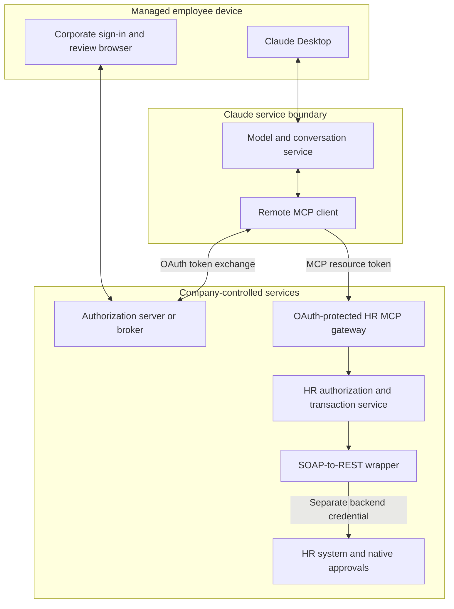
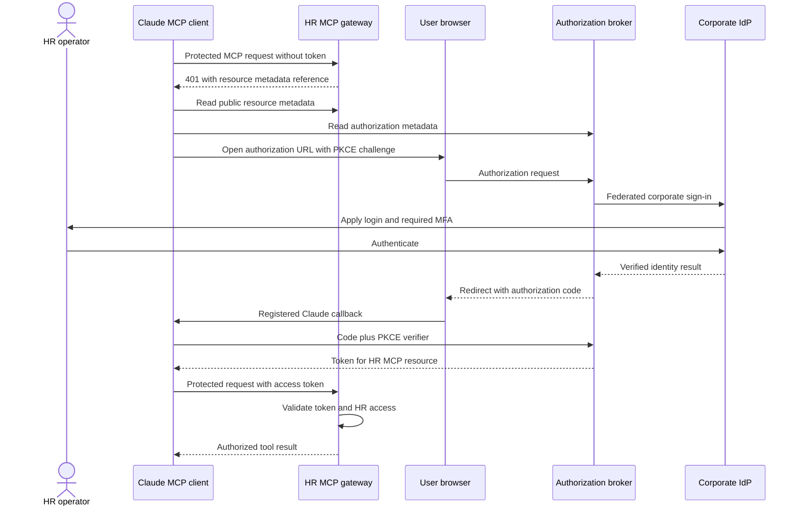
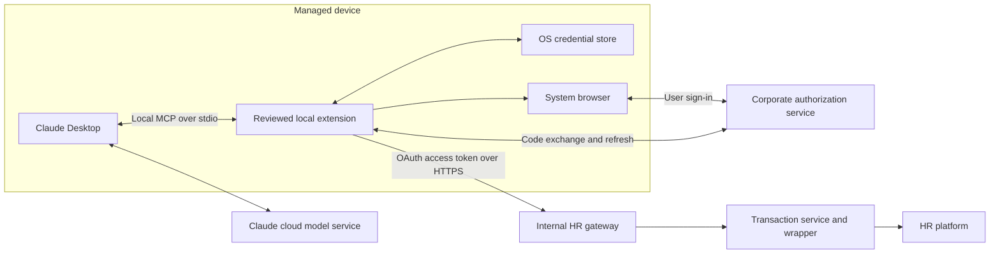
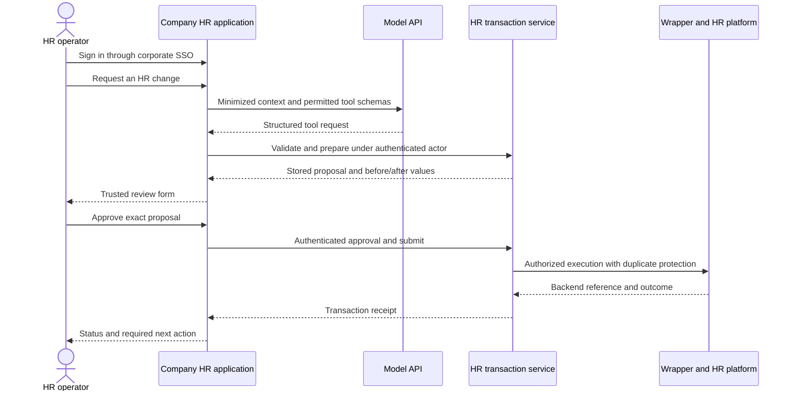
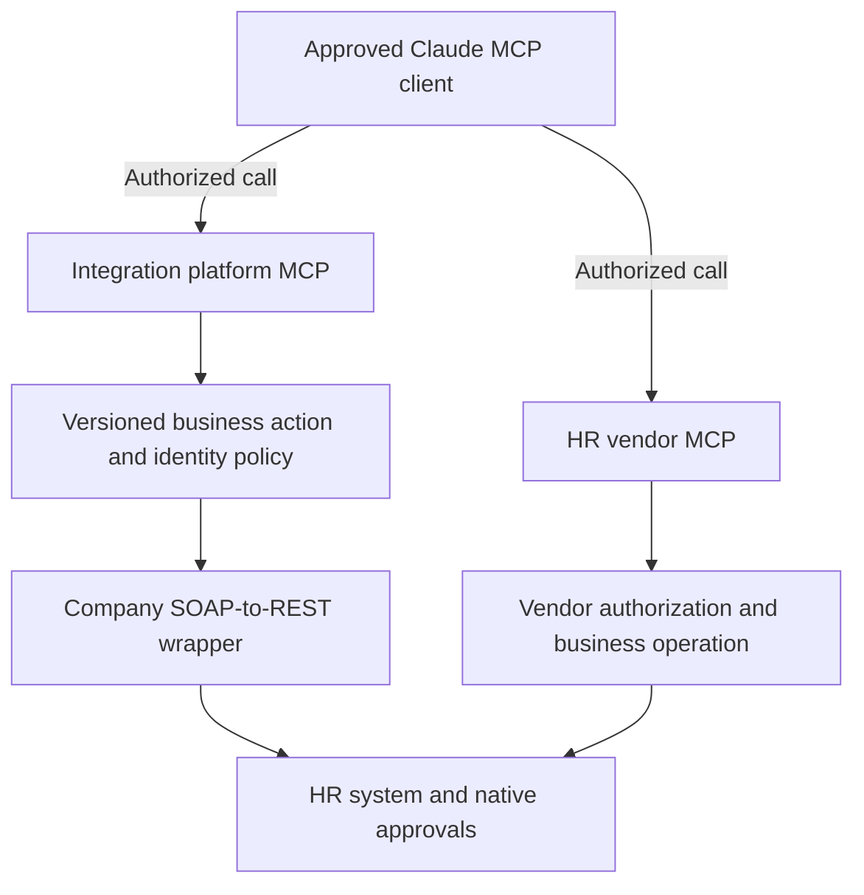
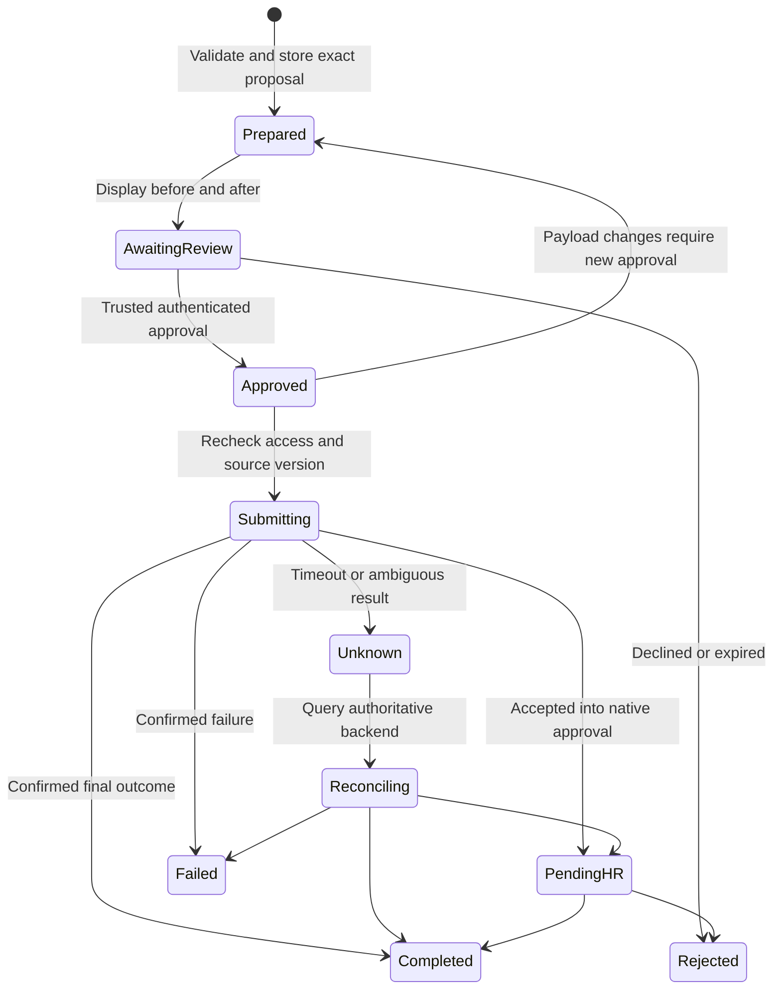

# Global HR Transactions: Architecture and Enforcement Guide

**Reviewed:** 23 September 2026  
**Companion to:** [Research and pilot plan](claude-desktop-global-hr-plan.md)  
**Purpose:** Show how the approaches work, where OAuth is enforced, and how to distribute them safely.

The diagrams describe proposed designs, not a deployed system or guarantees supplied automatically by Claude. The company must implement and test the controls. The HR platform and corporate identity provider are still unspecified.

## 1. Architecture decision in plain language

Use **remote MCP** when a managed Claude interface meets the company's access and data-handling requirements. Use a **local extension** when device-origin network access is necessary and device software can be managed. Use a **custom application with model API tools** when the company needs stronger control of the user session, approval interface, or deployment configuration. An **integration platform** can implement much of the execution layer, and **vendor-native tools** may replace custom integrations where their coverage and entitlements fit.

These choices can share the SOAP-to-REST wrapper. MCP is the interface Claude uses to discover and request business tools; the wrapper remains an integration component. Adding MCP does not replace backend authorization.

| Approach | Who calls the HR service? | Where user credentials are handled | What gets distributed? |
|---|---|---|---|
| Remote MCP | Claude's cloud MCP client calls the company gateway | Connector OAuth tokens in the client infrastructure; separate backend credentials in company services | Managed Desktop settings and an organization connector entry |
| Local extension | Company extension on the device calls the gateway | Extension's approved local credential store; backend secrets remain on the server | Reviewed extension package, configuration, and managed updates |
| Custom application + API tools | Company application validates and executes tool requests | Company application session and server-side credential stores | Company web application and access assignments |
| Integration platform | Platform executes an approved recipe or business action | Platform connection vault and approved identity mapping | Connector access, versioned recipes, and connection policies |
| Vendor-native MCP | Vendor tool service executes under its documented identity model | Vendor's supported authorization flow | Approved vendor connector and vendor-side access assignments |

For the remote/local distinction, see [Claude remote connectors][R1] and [Desktop extensions][R2]. For custom application execution, see [API tool use][R3].

## 2. Remote MCP: default candidate

### Diagram A — trust and execution boundaries

Only the gateway and required authorization endpoints need approved reachability from the remote client. Keep the wrapper private. If TLS terminates at an edge proxy, block direct origin access and authenticate the edge-to-service connection; an internal-looking header is not evidence of identity.

Remote calls originate from Anthropic infrastructure even when the operator uses Desktop. Device VPN connectivity does not carry those calls. Conversely, the browser's corporate login can be subject to its own identity policies. These are different network paths. [Remote connector documentation][R1]

### Diagram B — browser authorization, with a separate broker

The authorization broker may be unnecessary if the corporate identity platform can directly supply the required resource authorization and discovery. The diagram deliberately separates the identity provider, token issuer, and resource server. They may share a product, but their responsibilities remain distinct. Use a mature authorization implementation. [MCP authorization][R4]

The OAuth redirect authorizes access to the resource. It does not approve a particular HR change. Access and refresh tokens must remain in credential-handling components and must not appear in tool descriptions, arguments, results, prompts, or routine logs.

## 3. Enforcing OAuth, not merely offering a login button

The proposed policy is that every HR-bearing MCP operation requires a valid access token. Public discovery metadata and minimal health endpoints can remain unauthenticated if they contain no HR data or sensitive configuration. There must be no alternate shared-key, anonymous, or debug path into privileged tools.

| Enforcement point | Required behavior in the proposed implementation |
|---|---|
| Authorization service | Allow only approved identity sources and grants; validate redirect and PKCE requirements; enforce pilot membership and intended scopes |
| MCP HTTP entry point | Reject absent, expired, invalid, or wrong-audience access tokens before HR processing |
| Token validator | Validate issuer and audience; for JWTs validate signature, permitted algorithms, and applicable time claims; for opaque tokens use the issuer's supported validation/introspection |
| Identity mapping | Resolve stable subject and trusted tenant context; do not accept a user ID, email, or role claimed in the prompt |
| Tool dispatch | Authorize the operation and schema; independently enforce all call paths even when tools are hidden from discovery |
| Record/field access | Authorize target population, legal entity, country, fields, and effective date |
| Commit | Recheck live entitlements, proposal integrity, approval, expiry, and duplicate state |
| Wrapper entry | Accept only authorized service identities and permitted mappings; block bypass routes |
| Backend | Use a distinct backend credential and preserve native controls where supported |

Invalid credentials should produce an HTTP 401 response; valid authentication without required privileges should be denied with the appropriate authorization response, commonly 403. Keep error messages from revealing records the caller cannot access. MCP's discovery and authorization rules must be implemented consistently with the supported client version. [Authorization][R4], [security requirements][R5]

OAuth identifies and authorizes a subject; it does not prove the request came from the intended Claude company workspace. A public OAuth client ID is not a secret or a device attestation. Accept client identity claims only with the semantics guaranteed by the issuer. Never trust a caller-supplied `X-User`, `X-Tenant`, or model-provided organization value.

Immediate revocation requires an explicit live policy or revocation mechanism with a defined propagation bound. A signed access token can remain cryptographically valid after a role change. Test that the gateway can deny new submissions while tokens and client sessions are still live. Revocation cannot undo a transaction already accepted by the backend; reconcile and correct that separately.

## 4. Safely distributing the remote option

Treat distribution as three workstreams: **approved access to Claude**, **approved access to the connector**, and **authorization at the HR gateway**.

1. Assign company accounts and the pilot group through the approved identity lifecycle. Configure Enterprise roles and centrally approved tools.
2. Use managed Desktop policies to restrict organization login and disable unneeded local extensions or other execution surfaces. Verify effective policy on each supported OS.
3. Publish the connector through organization administration. Protect its URL/domain and OAuth registration from unauthorized changes.
4. Apply the authorization and transaction checks in Section 3 even when the caller is outside Claude or uses a manually constructed request.
5. Stage connector/server releases with synthetic records; monitor authentication failures and transaction results; retain a rollback and a server-side write-disable switch.

Managed Desktop policy only covers managed Desktop installations. Network tenant restrictions only cover traffic traversing the configured control point. Verified-domain connector restrictions have connector-specific coverage; do not assume they protect a custom HR MCP server. None is a substitute for resource authorization. [Desktop configuration][R6], [verified-domain connector restrictions][R7], [network tenant restrictions][R8]

Keep HR writes disabled in Research. Its documented tool behavior can omit further approval prompts, so test normal chat, Cowork, and scheduled modes independently. Bound server-side approval remains required regardless of the mode. [Connector mode guidance][R1]

If company-workspace-only use is mandatory, make a tested enforcement design a release gate. Verify supported vendor controls against the actual custom connector and test personal accounts, personal devices, web access, and off-network access. If the chosen path cannot enforce that requirement, change the architecture or limit the rollout; do not infer assurance from successful corporate OAuth alone.

## 5. Local extension: device-origin access

### Diagram C — separate local and remote authentication

The extension is a local MCP adapter and a client of the protected company service. It can use the device's approved network route. Tool results returned to Claude may still enter cloud model processing; local execution does not imply local-only data handling.

MCP's HTTP OAuth discovery flow does not automatically protect the local stdio connection. The proposed extension implements a separate supported native-app authorization flow for its remote gateway calls. Use the system browser and authorization code with PKCE, a supported registered redirect mechanism, and protected local token storage. Do not embed a reusable confidential-client secret in a package distributed to users. [MCP transport scope][R4], [OAuth for native apps][R9]

Recommended packaging controls are company requirements to validate against actual platform support: review source and dependencies; pin production dependencies; record artifact hashes; sign packages where supported; scan releases; distribute through the approved organizational channel; restrict unapproved packages; roll out updates in rings; and test uninstall/revocation. Avoid downloads of arbitrary latest executable code at launch.

Claude documents enterprise Desktop-extension distribution, but the exact signing, version enforcement, and rollback mechanisms need implementation-specific verification. Local MCP has different client-surface availability; test the intended Desktop/Cowork configuration before choosing it. [Desktop extensions][R2], [remote connector distinctions][R1]

The organizational extension allowlist blocks manual package installation but does not prevent modification of installed local files. Enabling it removes existing extensions; plan that transition. Publish custom updates with the same manifest name and a new version. MCPB supports signing and verification, but this does not establish automatic signer enforcement by Desktop. Verify release artifacts in the company pipeline and test endpoint/runtime limitations separately. [Allowlist behavior][R14], [MCPB tooling][R15]

## 6. Custom HR application with API tool calling

### Diagram D — the application controls execution

The model API requests a tool call; company code decides whether and how to execute it. MCP is optional between this application and the service. The same business contracts can be exposed through ordinary REST adapters and MCP adapters. [API tool use][R3]

Use corporate OIDC for application sign-in and the service's supported access-token/delegation model for downstream calls. In a server-rendered or backend-for-frontend design, keep tokens and the model API credential server-side; protect browser sessions with appropriate cookie, CSRF, and session controls. A model API key identifies the application's API usage, not the HR operator.

This option provides a deterministic review surface and clearer control of application sessions. It also requires operating a product: availability, accessibility, localization, security, support, and release management. Regional API settings need their own verification; an API application does not automatically meet residency requirements. [API data residency][R10]

## 7. Integration platform and vendor-native approaches

### Diagram E — alternative execution providers

These are two alternatives, not instructions to submit the same transaction through both paths.

For an integration platform, determine whether a tool uses the initiating user's connection or a shared service connection. A successful user login to the platform does not prove backend user delegation. Inspect recipe versions, connection ownership, record-level authorization, audit exports, retry rules, regional hosting, and approval behavior. Workato's case study supports this category; it does not prove these properties for the company's configuration. [Workato example][R11]

For a vendor-native connector, verify actual enabled operations, licensing, identity propagation, and whether the native approval process is retained. A native connector may bypass the company wrapper and gateway entirely. In that case, company policy must be enforceable in the vendor controls or in an approved intermediary; the company cannot claim gateway controls cover calls that never traverse it. Workday's announced tools are an option to assess, with availability and tenant access still to confirm. [Workday announcement][R12]

Distribute only approved connectors and platform environments. Promote recipes/tools through development, test, and production. Export enough authoritative execution evidence for support and audit, and test revocation of both connector authorization and underlying connections.

## 8. Human approval and transaction state

### Diagram F — approval is a separate authority

This is a conceptual state model. Concurrency and approval transitions must be atomic in implementation. A stale source record or revoked permission blocks submission rather than silently modifying an approved proposal. Unknown outcomes remain in reconciliation if no authoritative result is available; the diagram does not promise resolution.

An approval page must authenticate the reviewer and authorize access to the proposal; possession of a link or proposal ID is insufficient. Bind the action to the immutable proposal version, payload digest, actor, approver, expiry, and allowed operation. Protect browser actions against CSRF and replay. Do not expose a model-callable operation that can manufacture the approval record. A model may request submission only after the service verifies that the necessary human approval already exists.

For an MCP App, displaying a button does not by itself establish a trustworthy approval channel. Validate the identity and approval mechanism independently. If the host/app path cannot provide the required assurance, use an authenticated company review page or the HR platform's native approval. [MCP Apps][R13]

## 9. Release acceptance matrix

| Test | Expected evidence |
|---|---|
| No token / invalid issuer / wrong audience / expired token | Protected call rejected before HR data access |
| Valid token, wrong employee population or field | Request denied despite successful login |
| Request outside Claude | Same resource authorization and proposal rules apply |
| Claimed employee/tenant in tool arguments | Claims cannot override validated identity or routing |
| Personal account or off-network connection | Documented outcome matches the company-only access requirement; unsupported assurance blocks release |
| Removed user with live token | New submissions denied within the defined revocation bound |
| Direct wrapper or origin call | Blocked unless the caller satisfies the approved service path and policy |
| Altered/expired/replayed approval | No unauthorized execution; repeat submission returns an existing receipt or denial |
| Timeout after backend commit | Reconciliation runs; no blind duplicate transaction |
| Unapproved or altered extension package | Allowlist blocks unapproved installation; publishing checks reject altered artifacts; post-install tampering is separately assessed because the allowlist does not prevent it |
| Regional routing and log location | Actual observed paths match the approved data-flow inventory |
| Write-disable incident control | New writes blocked; already accepted work is reconciled rather than assumed cancelled |
| Research or another enabled mode | Cannot execute a change lacking required server-side approval |

These are proposed acceptance tests, not tests performed on an implementation. Before coding, choose one approach and fill in the actual IdP, authorization server, HR backend credential model, review surface, network path, regional scope, and control owners.

## Sources

- [R1 — Claude remote connectors][R1]
- [R2 — Enterprise Desktop extensions][R2]
- [R3 — Claude API tool use][R3]
- [R4 — MCP authorization specification][R4]
- [R5 — MCP authorization security considerations][R5]
- [R6 — Managed Desktop configuration][R6]
- [R7 — Verified-domain connector restrictions][R7]
- [R8 — Network tenant restrictions][R8]
- [R9 — OAuth for native apps, RFC 8252][R9]
- [R10 — API data residency][R10]
- [R11 — Workato customer case study][R11]
- [R12 — Workday Agent-Ready Tools announcement][R12]
- [R13 — MCP Apps overview][R13]
- [R14 — Desktop extension allowlist][R14]
- [R15 — MCPB signing and verification][R15]

[R1]: https://support.claude.com/en/articles/11175166-get-started-with-custom-connectors-using-remote-mcp
[R2]: https://support.claude.com/en/articles/12702546-deploying-enterprise-grade-mcp-servers-with-desktop-extensions
[R3]: https://platform.claude.com/docs/en/agents-and-tools/tool-use/overview
[R4]: https://modelcontextprotocol.io/specification/2026-07-28/basic/authorization
[R5]: https://modelcontextprotocol.io/specification/2026-07-28/basic/authorization/security-considerations
[R6]: https://support.claude.com/en/articles/12622667-enterprise-configuration-for-claude-desktop
[R7]: https://support.claude.com/en/articles/15402193-restrict-verified-domain-connectors-to-your-enterprise
[R8]: https://support.claude.com/en/articles/13198485-enforce-network-level-access-control-with-tenant-restrictions
[R9]: https://www.rfc-editor.org/rfc/rfc8252
[R10]: https://platform.claude.com/docs/en/manage-claude/data-residency
[R11]: https://claude.com/customers/workato
[R12]: https://newsroom.workday.com/2026-06-02-Workday-Launches-New-Tools-for-Developers-to-Build,-Connect,-and-Verify-AI-Agents-For-HR,-Finance,-and-IT
[R13]: https://apps.extensions.modelcontextprotocol.io/api/documents/overview.html
[R14]: https://support.claude.com/en/articles/12592343-enabling-and-using-the-desktop-extension-allowlist
[R15]: https://github.com/modelcontextprotocol/mcpb/blob/main/CLI.md
