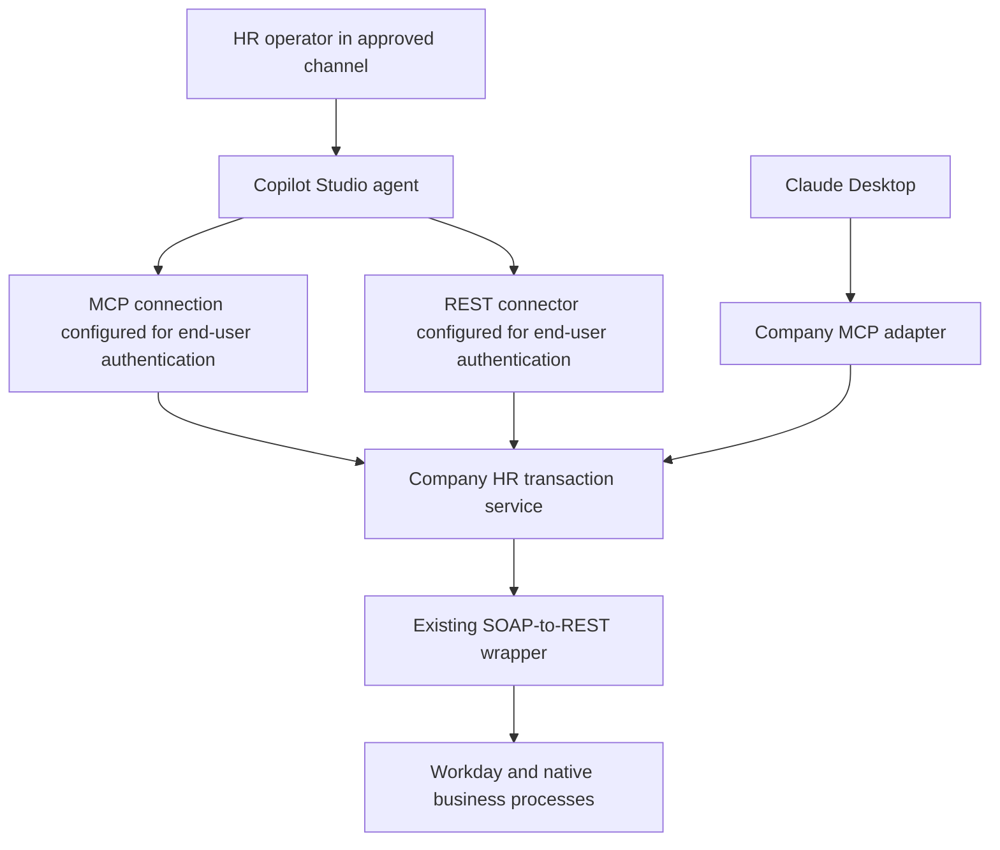
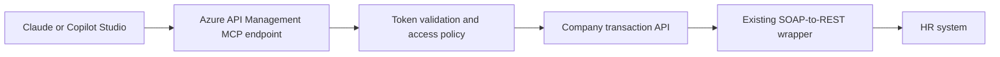

# HR Transaction Interfaces: Build, Buy, and Hybrid Options

**Research date:** 23 September 2026  
**Scope:** CData Workday MCP, Microsoft Copilot Studio, Workato, Workday-native tools, Boomi, MuleSoft, and Azure API Management  
**Related documents:** [Global HR plan](claude-desktop-global-hr-plan.md) · [Architecture and enforcement diagrams](hr-architecture-and-enforcement.md)

## 1. Recommendation

**We can build this, buy important parts of it, or combine the two. The existing SOAP-to-REST wrapper makes a hybrid approach particularly attractive.** It reduces the value of buying another basic transport adapter, while leaving substantial value in supported identity integration, managed distribution, operation coverage, monitoring, and vendor maintenance.

Compare three independent decisions:

| Layer | What is being selected? | Examples |
|---|---|---|
| User interface and agent platform | Where HR users interact, how tools are selected, and how the experience is distributed | Claude Desktop; Copilot Studio published into Teams/Microsoft 365; custom HR application |
| Connectivity and tool hosting | How approved business operations reach the HR system | Company MCP service; CData; Workato; Workday-native tools; Boomi; MuleSoft; Azure API Management |
| HR transaction controls | Who may change which records, what is approved, how changes execute, and how outcomes are reconciled | Company transaction service and/or demonstrated equivalent native/platform controls |

CData and Copilot Studio are therefore not simply competing replacements for the same component. Copilot Studio can consume a CData MCP service, a company MCP service, or an approved REST connector. Claude can consume an appropriate remote MCP implementation. Compatibility, authentication, and exact operation support still require testing.

### Proposed evaluation order

1. Establish a **build benchmark** using one controlled transaction over the existing wrapper.
2. Compare **Claude Desktop and Copilot Studio against that same transaction service**. This isolates the interface and distribution decision.
3. Evaluate **CData Connect AI and Workato** for how much supported connectivity and identity work they remove.
4. Ask Workday to demonstrate its **native Agent-Ready Tools** if the company's tenant is eligible.
5. Include **Boomi or MuleSoft** when the company already operates those platforms or their specific capabilities justify an additional platform.

This is a proposed shortlist based on public documentation, not a product certification or purchase recommendation independent of the company's requirements.

## 2. What CData offers—and what we should learn from it

### 2.1 Separate the products before evaluating them

| CData offering | Evidence found | Implication for this project |
|---|---|---|
| Public Workday MCP GitHub project | Explicitly a local, read-only server using CData's JDBC driver; README points to commercial alternatives for broader capabilities | Useful design reference or read prototype. It does not satisfy HR writes. Repository availability does not mean the underlying driver is free. [Repository][V01] |
| Commercial desktop Workday MCP | A public order page lists a desktop license; the repository describes the commercial local alternative as supporting writes/actions | A distinct candidate requiring confirmation of current SKU, supported operations, authentication, and deployment lifecycle. [Order page][V02], [repository][V01] |
| CData Connect AI | Managed connectivity and MCP platform; Workday landing page emphasizes live access and source permissions; pricing lists enterprise controls and custom tools | More relevant to centralized global distribution than a manually configured per-desktop prototype. [Workday offering][V03], [pricing][V04] |

Some URLs and documents represent different product generations. The Workday desktop marketing URL redirected to Connect AI during research, while a desktop order page remained public. Do not combine old driver documentation, a read-only GitHub project, and current cloud marketing into one assumed feature set.

Connect Cloud is the former name of Connect AI, not another current platform to count as a separate candidate. [Rename announcement][V34]

### 2.2 Does CData support transactions, or only queries?

The answer depends on **product, connection mode, operation, and version**.

Current Connect AI Workday setup distinguishes WQL, report, SOAP-view, and REST table/view modes; older MCP documentation describes the same broad modes. WQL is read-only. A successful natural-language query demonstration is insufficient evidence of write support. [Current setup][V32], [older MCP connection modes][V05]

There is stronger evidence than generic CRUD marketing: a legacy CData Cloud Workday catalog, labeled build 23.0.8839, documents operations including `SubmitJobChange`, `SubmitWorkContactInformationChange`, and time-off operations. Its contact-change documentation warns that the REST specification does not capture every business validation. These are real documented integration capabilities, but the legacy catalog does **not** prove they are currently exposed, supported, and licensed in the proposed MCP SKU. [Legacy Workday catalog][V06]

Require CData to demonstrate the selected operation in the current product, through the intended Claude/Copilot client, using the company's Workday configuration. Capture the exact tool/schema, connection mode, initiating identity, native approval result, and transaction reference.

### 2.3 Authentication and governance

CData's 2026 security guide describes OAuth with PKCE for MCP and a **User Credentials mode** that lists Workday as supported. This is materially different from sharing the connection creator's credentials. Validate that mode for the exact selected actions and account configuration. The same guide describes SSO, provisioning, and CRUD controls per user or connection; these are vendor-described capabilities to demonstrate rather than assumed defaults. [Security guide][V07]

Keep these questions separate:

- How does the HR operator authenticate to CData?
- Which credential and identity does CData use for the Workday operation?
- Which permissions can the individual operator exercise?
- Can broad query or raw execution tools be disabled while curated operations remain available?
- Who enforces approval of the exact change, duplicate protection, and reconciliation?

The term **identity passthrough** in vendor material should not be interpreted as permission to forward an MCP access token indiscriminately to another API. Ask for the actual supported source authorization flow.

Current Workday setup documents OAuth, OAuthISU, OAuthJWT, AzureAD, and Basic for SOAP only. OAuthISU uses an integration user's refresh token; it does not itself establish the human operator's backend permissions. The Workday-to-CData callback belongs to that source authorization flow and is different from the Claude-to-MCP callback. Configure each leg separately. [Workday authentication][V32]

### 2.4 What to borrow for our own design

Learn from the product pattern rather than copying its implementation:

1. A reusable connection layer isolates application-specific authentication and metadata.
2. Discovery helps describe fields and operations to the client.
3. Central connection and operation policies make rollout manageable.
4. A consistent interface can support multiple AI clients.
5. Commercial support can absorb some upstream API-change maintenance.

The wrapper already supplies part of the first item. We could add a schema/metadata catalog, curated tools, OAuth enforcement, and transaction handling above it. Buying becomes attractive if CData demonstrably saves more in source coverage, identity maintenance, governance, and support than it adds in licensing and integration constraints.

CData Toolkits document selected source tools, custom SQL tools, and dedicated MCP endpoints. These are useful patterns for a controlled catalog. Toolkit instructions guide model behavior; they are not authorization checks. Confirm which tool customization features are included in the quoted edition because documentation and pricing use different packaging descriptions. [Toolkits][V33]

**CData fit:** a serious connectivity candidate, particularly for broad data access. For trained HR operators performing writes, selection remains conditional on operation-level proof. Buying CData does not by itself buy a complete governed HR operating application.

## 3. Microsoft Copilot Studio: a platform alternative

### 3.1 How it could use the existing wrapper

There are three useful Microsoft paths:

| Path | What we configure or build | What remains our responsibility |
|---|---|---|
| Copilot Studio → company MCP | Agent, tool configuration, user authentication, channel deployment; reuse the same MCP service as Claude | HR authorization, proposals, approval binding, wrapper/backend execution, reconciliation |
| Copilot Studio → custom REST connector | Custom connector around the company transaction API; MCP is optional | Same HR controls; connector authentication and published-channel testing |
| Employee Self-Service with Workday extension | Configure Microsoft's packaged experience and supported Workday integration | Fit-gap analysis, Workday security setup, unsupported HR-operator actions, and operational validation |

Microsoft documents both MCP integration and custom connectors. Its separate REST API tools authoring feature is labeled preview; do not confuse that feature with the established custom-connector route. [MCP setup][V08], [custom connectors][V09], [REST API tools][V10]

**Proposed configuration:** End-user tool authentication must be supported and verified for the chosen connector and channel.

The diagram shows alternatives sharing a transaction service, not a requirement to duplicate each request through both connectors.

### 3.2 Enforce agent and tool identity separately

Agent authentication controls who may converse with the agent. Tool authentication controls whose connection is used to act. Copilot Studio supports both **User authentication** and **Agent author authentication**. Signing into Teams therefore does not prove that a Workday call runs as the employee. [Agent authentication][V11], [tool authentication][V12]

For this HR design, use end-user tool authentication where supported, and inspect every downstream connection. Administrators can disable maker-provided credentials in an environment. Apply that policy deliberately: packaged or background flows may depend on service connections and should be assessed before changing it. [Maker-credential control][V13]

MCP setup supports OAuth alongside other modes. Choose OAuth for protected HR services and register the callback supplied by Microsoft's setup, not Claude's callback. Verify compatibility with the current client's registration/discovery behavior. [MCP setup][V08]

Validate authentication in the **published target channel**, not only the authoring test pane. Channel support for end-user tool connections differs. For example, Microsoft documents support for Teams and custom websites but not the demo-website channel. [Tool authentication][V12]

### 3.3 Microsoft's Workday connectors are not interchangeable

| Connector or package | Documented capability | Material limitation |
|---|---|---|
| **Workday** (`workdaysoap`) | SOAP/RaaS plus several authentication options, including OAuth and Entra-integrated options | The REST request action and several higher-level actions are preview. The REST action explicitly leaves write retry/idempotency handling to the caller. [Connector][V14] |
| **Workday HCM** (`workdayhcm`) | Contact-information updates, retrieval operations, and SOAP invocation | Its documented connection uses endpoint, username, and password; do not assume equivalent OAuth delegation. [Connector][V15] |
| **Employee Self-Service Workday extension** | Documented employee information and personal email/phone update scenarios | A packaged employee-service experience, not demonstrated complete HR-administrator coverage. [ESS integration][V16] |

The two connectors are classified Premium for Copilot Studio and list exclusions including China operated by 21Vianet and US government clouds. Verify region and action availability for the company's actual environment. [Workday][V14], [Workday HCM][V15]

The ESS Workday setup includes both an OAuth user connection and generic/context integration-user connection references. Inspect each topic and action; the package should not be described as universally delegated to the employee. For specialists changing other workers' records, compare its capabilities against an explicit HR-operator requirements list. [ESS integration][V16]

### 3.4 Distribution and global governance

Copilot Studio can publish into Teams and Microsoft 365 through documented sharing and organizational approval paths. Power Platform data policies can constrain connectors, HTTP endpoints, authentication configurations, and channels. Those controls are valuable in a Microsoft-centered company but do not replace record-level HR authorization or transaction approval. [Distribution][V17], [data policies][V18]

Review environment storage location and generative processing separately. Microsoft's geography documentation has exceptions, and regional model processing can depend on data-movement settings and capacity. Third-party tools add their own data paths. Do not reduce the global assessment to the Power Platform environment's region. [Data locations][V19], [generative data movement][V20]

**Copilot Studio fit:** a strong interface/platform comparator if the company already uses Teams, Entra, and Power Platform. It can reuse the wrapper and company controls. It is not merely a prebuilt Workday MCP server or an automatic substitute for the transaction backend.

## 4. Other candidates

### 4.1 Workato Enterprise MCP

Workato provides unusually concrete Workday evidence: its End User MCP template lists time-off submission, cancellation, and direct-report approval/rejection. It distinguishes **User's connection** from the recipe builder's **Your connection**, and requires authorization-code OAuth for user connections. The template excludes API Clients for Integration despite also including generic integration-user setup guidance. Resolve that distinction with the vendor rather than assuming a shared account is delegated. [Workday End User MCP][V21]

This is strongest as a packaged self-service/manager comparator, not proof of all HR-specialist actions. Broader operations may require custom recipes.

The wrapper can remain behind recipes, but Workato's FAQ says **API collections do not support Verified User Access**. A quick REST-to-MCP publication is not automatically a per-user source authorization solution. [MCP FAQ][V22]

Workato's MCP documentation qualifies hosting regions and excludes CN. Validate runtime, token storage, logs, disaster recovery, and the specific workspace configuration. [MCP overview][V23]

**Fit:** prioritize a technical demonstration if buying managed integration and operational tooling is desirable. Require the same HR-admin transaction as the custom build benchmark.

### 4.2 Workday Agent-Ready Tools

Workday describes native MCP tools scoped to the end user with business rules, approvals, and audit retained in Workday. Current material inspected still labels Agent-Ready Tools **Early Availability**. Do not confuse these tools with the Developer Agent or other Workday agent products. [Native architecture][V24]

**Fit:** potentially the best source of native transaction semantics if the selected operations and tenant entitlements are available. Obtain the actual tool catalog, supported client connection flow, and commercial terms. Preserve the wrapper for gaps or other systems.

### 4.3 Boomi

Separate Boomi products during evaluation:

- **Boomi Connect Workday MCP connector listing:** establishes a catalog entry, not an enumerated guarantee of HR writes or user delegation. [Listing][V25]
- **API Control Plane:** can expose registered API operations as MCP, making the wrapper a relevant input. Verify authentication and exact client compatibility. [API-to-MCP documentation][V26]
- **Integration MCP Server runtime:** inspected documentation explicitly labels this particular connector **Early Access** and prohibits production environments/data. Do not generalize that restriction to every Boomi offering, or generalize other Boomi claims to this runtime. [Runtime status][V27]

**Fit:** conditional, particularly if Boomi is already part of the enterprise stack. Require a named product, supported production deployment, and exact Workday action demonstration.

### 4.4 MuleSoft

The MCP Connector can expose existing Mule applications, integrations, and APIs as tools. This is an enterprise build accelerator rather than a ready-made HR application. It could front the wrapper or existing HR integrations, but HR semantics, delegation, and approval must still be implemented or proven in the chosen flow. Do not confuse it with a platform-management MCP service. [MCP Connector][V28]

**Fit:** attractive where MuleSoft operations, licensing, and support already exist. Harder to justify as an entirely new platform solely for a small HR pilot without a broader integration strategy.

### 4.5 Azure API Management: a hybrid that directly uses the wrapper

Azure API Management can expose selected managed REST API operations as MCP tools. Its documentation also describes inbound token validation and separate backend credential handling. This offers a path to buy managed gateway capabilities while building the HR-specific transaction service. [REST-to-MCP][V29], [MCP security][V30]

Expose curated transaction endpoints, not every raw SOAP mapping. API Management is not an HR policy engine or a complete OAuth authorization server merely because it validates tokens. Supply compatible authorization discovery and issuance, then test the complete redirect flow with each client. Retain distinct downstream credentials and transaction approval state.

**Fit:** a strong build benchmark if the company already uses Azure. Verify supported service tier, deployment model, and MCP capabilities; the inspected documentation lists tool exposure but limits resources/prompts and workspace support. [REST-to-MCP limitations][V29]

## 5. Build versus buy: what actually changes

| Choice | We obtain | We still own |
|---|---|---|
| Build a focused MCP service | Exact catalog and full flexibility over the wrapper | Hosting, authorization integration, updates, security, support, and HR execution correctness |
| Buy connectivity, such as CData | Supported source access, metadata, connection management, and product-specific controls | Fit-gap assessment, safe workflow design, company policies, approval and recovery gaps |
| Buy managed integration, such as Workato | Managed workflows, connector operations, and platform tooling | Correct recipe design, credential selection, process ownership, scope and regional configuration |
| Use Copilot Studio | Agent authoring, channels, platform governance, and connector ecosystem | Safe tools, published-channel authentication, HR authorization, and backend reliability |
| Use Workday-native tools | Vendor-maintained business operations and native controls where supported | Entitlements, operation selection, client policy, unsupported gaps, and evidence of correct outcomes |
| Hybrid with an existing gateway/platform | Reuse of established operations plus a small custom business layer | Clear responsibility boundaries and tests across every component |

Buying moves implementation responsibilities; it does not eliminate accountability. A product that can write a record is not necessarily one that can enforce the company's review and execution rules. If direct vendor tools bypass the company transaction service, demonstrate equivalent controls on that path or do not enable those writes.

For this company, compare **incremental value beyond the wrapper**, not connector count. A narrow custom service may be economical if only a few operations are needed. A commercial platform can be worthwhile when supported identity, many systems, and operational maintenance dominate the work. Public research cannot establish the total cost without volumes, entitlements, and actual implementation effort.

## 6. Commercial signals and procurement questions

These are public observations on the research date, not quotes or complete deployment costs.

| Candidate | Public commercial signal | What to request |
|---|---|---|
| CData desktop Workday MCP | Public order page lists **US$999/year for one desktop and one Workday source**, with commercial support | Confirm current SKU, actual action coverage, upgrades, enterprise deployment, and driver/runtime licensing. [Order page][V02] |
| CData Connect AI | Business plans use an annual contract and list enterprise identity features and custom tools | Quote Workday tier, users, connections, tool calls, regions, support, and required identity mode. Do not price a global HR rollout from an entry plan. [Pricing][V04] |
| Copilot Studio | Public page lists **US$200/month per 25,000-credit capacity pack**, plus pay-as-you-go/prepurchase options | Scope channel, agent type, user licenses, premium connectors, capacity, test usage, and any additional services. Credits are not one-for-one completed HR transactions. [Pricing][V31] |
| Workato, Boomi, MuleSoft, Workday-native | No complete numeric price for the proposed configuration was established in this research | Obtain incremental licensing and usage terms against the same pilot workload |
| Custom build / Azure hybrid | Engineering plus cloud/platform operating cost | Estimate from a measured end-to-end slice and existing enterprise contracts |

Microsoft's pricing page describes included internal-agent use for certain Microsoft 365 Copilot scenarios and agent types; it should not be generalized to every harness, channel, user, or workflow. Verify the actual licensing path. [Pricing][V31]

Use a three-year cost comparison covering implementation, licenses, per-user/per-call consumption, test environments, identity work, vendor support, regional deployment, API-change maintenance, incident handling, and exit/migration cost. Ask vendors to disclose minimum commitments and how retries, failed calls, development, and nonproduction environments are billed.

## 7. Proof-of-capability evaluation

### Common scenario

Use the same synthetic Workday population and one approved contact-information change or other bounded HR-administrator transaction. Include **two HR operators with different population permissions**, not only an employee changing their own details. That distinction prevents a self-service demo from standing in for the actual requirement.

Test each front end against the company transaction API first. Test a vendor's native path separately if it replaces that API. Do not force an unchanged wrapper into a product whose value is its native connector; instead compare the control evidence and total work for each path.

### Mandatory gates

| Gate | Evidence required |
|---|---|
| Exact operation | Working current product/tool, service version, input schema, and final backend state |
| Operator identity | Two accounts produce different permitted populations/actions; backend and middleware audit show the correct identity semantics |
| Approval integrity | No write before approval; changed or expired proposals rejected; native approval steps preserved |
| Retry safety | Timeout after commit produces reconciliation rather than duplicate change |
| Distribution | Approved channel/client works; prohibited accounts and access paths are rejected by a demonstrated control |
| Regional suitability | Contractual/vendor evidence covers processing, credential, log, backup, and failover locations, supplemented by observable routing and tested failover; all meet the approved scope |
| Production support | Feature status, licensing, SLA, escalation owner, and upgrade obligations documented |
| Portability | Exportable tool contracts, policies, receipts, and feasible exit path |

Do not give high convenience or cost scores permission to offset a failed mandatory gate.

### Questions specifically for CData

1. Which currently sold product and build supports the chosen HR transaction through MCP?
2. Is the capability a native business tool, stored procedure, SQL mutation, or raw SOAP action?
3. Does Workday User Credentials mode apply to that exact operation and client?
4. Can we expose a small approved tool catalog and disable generic query/execution paths?
5. Can our wrapper or transaction API be connected without bypassing its controls, and what customization/license is required?
6. Where are credentials, results in transit, audit metadata, support data, and backups processed or stored?
7. What are the supported desktop versus remote deployment paths today, given the changing product URLs?
8. Which approval, idempotency, and recovery features are included, and which must we build?

### Decision after the evaluation

Select **build/hybrid** if the wrapper covers the key operations and commercial products leave most of the identity and governance work unchanged. Select **buy connectivity/integration** if a candidate proves it removes meaningful ongoing work while satisfying the same controls. Select **Copilot Studio as the interface** if its organizational distribution and user experience outperform Desktop for the intended HR users. These choices can be combined.

## Review record

Three specialist reviewers checked the CData claims, Microsoft authentication and connector distinctions, and other vendor/global deployment claims. Their corrections clarified configured end-user authentication, CData CRUD controls, Boomi product naming, and the evidence realistically available for regional hosting. No material research blockers remained. Markdown references and local document links were checked, and both Mermaid diagrams passed syntax validation. This was a documentation review, not a live product or transaction test.

## Source register

Sources are vendor documentation, official repositories, or commercial pages. They establish documented offerings, not independently tested production performance. Product pages and prices may change. Legacy versions and preview/early-access features are explicitly identified above.

[V01]: https://github.com/CDataSoftware/workday-mcp-server-by-cdata
[V02]: https://www.cdata.com/drivers/workday/order/mcp/
[V03]: https://www.cdata.com/ai/connect/workday/
[V04]: https://www.cdata.com/ai/pricing/
[V05]: https://cdn.cdata.com/help/JWK/mcp/RSBWorkday_p_ConnectionType.htm
[V06]: https://cdn.cdata.com/help/JWJ/cloud/default.htm
[V07]: https://www.cdata.com/media/jioaw0lw/cdatasecuritybestpracticesguide2026.pdf
[V08]: https://learn.microsoft.com/en-us/microsoft-copilot-studio/mcp-add-existing-server-to-agent
[V09]: https://learn.microsoft.com/en-us/connectors/custom-connectors/
[V10]: https://learn.microsoft.com/en-us/microsoft-copilot-studio/agent-extend-action-rest-api
[V11]: https://learn.microsoft.com/en-us/microsoft-copilot-studio/configuration-end-user-authentication
[V12]: https://learn.microsoft.com/en-us/microsoft-copilot-studio/configure-enduser-authentication
[V13]: https://learn.microsoft.com/en-us/microsoft-copilot-studio/configure-no-maker-authentication
[V14]: https://learn.microsoft.com/en-us/connectors/workdaysoap/
[V15]: https://learn.microsoft.com/en-us/connectors/workdayhcm/
[V16]: https://learn.microsoft.com/en-us/microsoft-365/copilot/employee-self-service/workday
[V17]: https://learn.microsoft.com/en-us/microsoft-copilot-studio/publication-add-bot-to-microsoft-teams
[V18]: https://learn.microsoft.com/en-us/microsoft-copilot-studio/admin-data-loss-prevention
[V19]: https://learn.microsoft.com/en-us/microsoft-copilot-studio/data-location
[V20]: https://learn.microsoft.com/en-us/power-platform/admin/geographical-availability-copilot
[V21]: https://docs.workato.com/en/mcp/prebuilt-mcps/workday-end-user-mcp-server
[V22]: https://docs.workato.com/en/mcp/faqs.html
[V23]: https://docs.workato.com/mcp
[V24]: https://blog.workday.com/en-us/workday-agentic-era-paths-build.html
[V25]: https://marketplace.boomi.com/mcp-connectors/workday
[V26]: https://help.boomi.com/docs/Atomsphere/API%20Management/Topics/cp-mcp
[V27]: https://help.boomi.com/docs/Atomsphere/Integration/Connectors/int-MCP_connector
[V28]: https://docs.mulesoft.com/mcp-connector/latest/
[V29]: https://learn.microsoft.com/en-us/azure/api-management/export-rest-mcp-server
[V30]: https://learn.microsoft.com/en-us/azure/api-management/secure-mcp-servers
[V31]: https://www.microsoft.com/en-us/microsoft-365-copilot/pricing/copilot-studio
[V32]: https://docs.cloud.cdata.com/en/Data-Sources/Workday
[V33]: https://docs.cloud.cdata.com/en/Toolkits
[V34]: https://www.cdata.com/blog/connect-cloud-is-connect-ai
