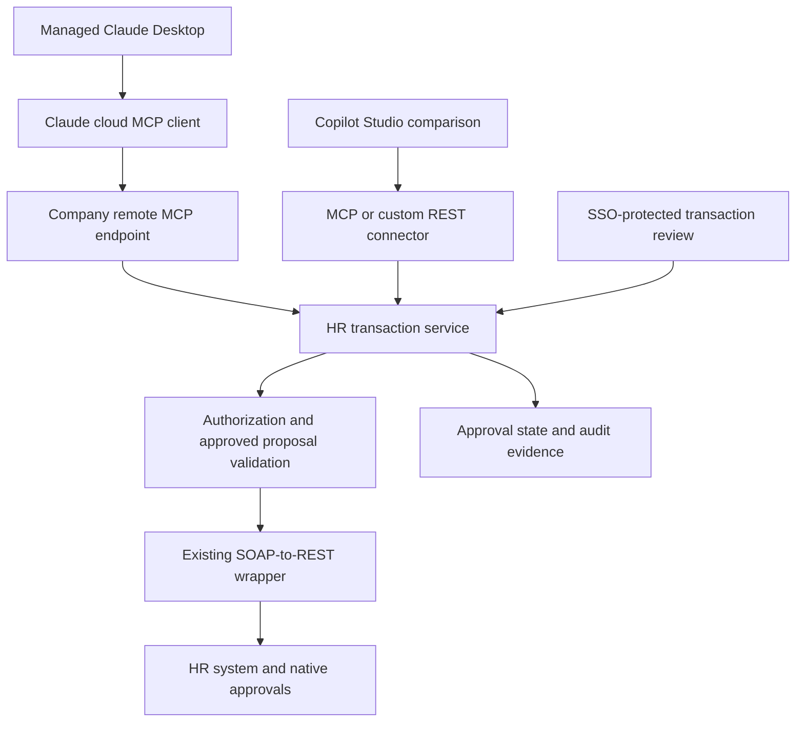

# Recommendation: A Governed HR Transaction Service with a Choice of Agent Interface

> **Scope update — 23 September 2026:** Claude is the proposed entry point for broader HR research, reporting, analysis, transactions, and apps. Copilot Studio is a future agent option rather than an immediate comparison gate. Read the [HR workspace, application platform, and SDLC plan](../../02-rapid-development/hr-workspace-app-platform-and-sdlc.md) for the current wider direction. This document retains the detailed transaction/vendor research.

**Date:** 23 September 2026  
**Status:** Recommended direction for a controlled evaluation; not authorization to deploy production HR writes  
**Audience:** HR leadership, HR technology, enterprise architecture, identity, security, and regional operations

**Additional clarification:** The user confirms the wrapper supports user, ISU, and OAuth authentication. Its implementation remains uninspected. See [the Microsoft ESS SOAP comparison](workday-soap-versus-rest-wrapper.md) for how this strengthens the reuse case and what still needs validation.

**Supporting research:** [Global HR plan](claude-desktop-global-hr-plan.md) · [Build-versus-buy vendor comparison](hr-build-buy-vendor-options.md) · [Architecture, OAuth, and distribution](hr-architecture-and-enforcement.md)

## 1. My recommendation

**Build a small, company-controlled HR transaction layer over the existing SOAP-to-REST wrapper. Use Claude Desktop as the first evaluation interface, compare Copilot Studio against the same business operation, and buy connectivity only where a vendor proves it removes meaningful ongoing work.**

Treat this as an incremental replacement of selected AskHR capabilities. Do not make complete AskHR retirement a prerequisite for the pilot. Inventory its current knowledge, case-management, escalation, administration, reporting, and transaction responsibilities before deciding which components can be retired.

The wrapper gives this company a useful starting advantage: SOAP accessibility is already partly addressed. The evaluation should focus next on trusted identity, permission boundaries, understandable business operations, exact-change approval, and dependable execution. A connector purchase should be justified against those remaining needs.

This recommendation is an architectural judgment based on the research, not a claim that any candidate has passed the company's requirements. The wrapper has not been inspected, and no live vendor or HR transaction tests have been performed. The company's IdP, HR-system configuration, regional requirements, existing contracts, and operating volumes remain unconfirmed. Workday is the focus of the vendor comparison; the same decision structure applies if other HR systems are in scope.

### Decisions I would make now

| Decision | Recommendation | Why |
|---|---|---|
| Business scope | Trained HR operations users performing one bounded transaction on another employee's record | Tests the actual HR-administrator requirement rather than substituting employee self-service |
| Transaction backend | Company-owned contracts and controls over the existing wrapper | Preserves reuse and makes the interface replaceable |
| First interface | Managed Claude Enterprise/Desktop evaluation | Directly tests the user's proposed replacement; purchase/rollout remains conditional on controls and regional suitability |
| Comparison interface | Copilot Studio if Microsoft channels and licensing are viable | Tests whether organizational distribution and review experience are better in the company's environment |
| Tool transport | Remote MCP for Claude; reuse MCP or a custom REST connector for Copilot Studio | Keeps business logic independent of client protocol |
| Vendor shortlist | CData and Workato; Workday-native tools if entitled | Each offers a different potential reduction in integration work |
| Expansion | Operation-by-operation and region-by-region | HR permissions and process meaning differ across countries and entities |

## 2. The architecture I would implement first

This is a logical architecture. The MCP adapter, policy checks, and transaction service can initially be modules in one deployable application; the diagram does not require a collection of microservices. Authorization and approval are mandatory execution gates, not optional asynchronous side effects.

Expose a small set of business tools, such as preparing an approved contact change, submitting an approved proposal, and checking its status. Keep raw SOAP service names, arbitrary endpoints, unrestricted SQL, and general-purpose mutation tools outside the HR-user catalog.

Use available WSDL/service metadata and any discovery capabilities the wrapper provides to generate candidate schemas and mappings during development. Promote an operation into production only after its business meaning, permissions, field rules, effective dates, retry behavior, and region support have been reviewed. Pin and version the approved contract; newly discovered SOAP services must not automatically become tools.

### A concrete transaction sequence

1. Resolve the employee using stable identifiers and only the population the operator may access.
2. Prepare a proposal with current values, requested values, effective date, affected worker, and relevant warnings.
3. Save the proposal on the server with a version, expiry, and binding to the operator and exact proposed change.
4. Have the operator review it in a company SSO-protected page. Verify that the signed-in reviewer is authorized to approve this specific proposal; possessing its URL and being signed in are insufficient. For the first pilot, this provides a clear confirmation record independent of conversational wording.
5. Submit only a proposal with valid server-recorded approval. Recheck permissions and relevant source-state changes immediately before execution.
6. Preserve the HR system's native approval processes. Return a receipt that distinguishes submitted, awaiting approval, completed, rejected, and uncertain outcomes.
7. Reconcile ambiguous outcomes against the backend before retrying.

A chat message saying “yes” or a client's tool confirmation should not be the sole authorization to write. The review page can later be replaced or complemented by an interactive client surface if the same identity and exact-payload binding are demonstrated. Business-process approvals and the operator's confirmation serve different purposes and both may be required. Protect the review session against cross-site request forgery, bind approval to an immutable proposal, prevent approval replay, and make approval and submission transitions atomic against the proposal version and execution state to stop races and concurrent duplicate submissions.

Do not promise exactly-once execution merely because the service stores an idempotency key. Deduplicate submissions at the service, use source-system idempotency where supported, and reconcile timeout-after-commit cases. Some completed HR changes need a compensating business process rather than technical rollback.

## 3. Authentication and safe distribution are release gates

### Recommended identity design

Use per-user OAuth for the protected remote MCP service. The client discovers the authorization configuration, opens the supported browser authorization flow, the user authenticates through the corporate identity arrangement, and the authorization response returns to the client's registered callback. Use authorization code flow with PKCE and the supported client-registration mechanism. Verify the actual redirect and discovery behavior separately in Claude and Copilot Studio. The precise flow is documented in the [architecture companion](hr-architecture-and-enforcement.md).

The HR gateway must validate access-token signature or introspection, trusted issuer, intended audience, expiry, and required scope. Authentication alone is insufficient: apply operation-appropriate authorization on every protected request, including current HR role, employee population, permitted fields, region, and operation. Require valid approval for every write submission.

The MCP token authorizes access to our service. It is not automatically a Workday token. Prefer supported backend user delegation where the chosen operation provides it. Where a service identity is necessary, constrain its permissions and enforce human-operator authorization in the transaction service; retain both identities in the audit record. Document that the backend may identify the service account as the initiating actor. This is a different control model, not equivalent to native end-user delegation.

Keep access tokens, refresh tokens, and source credentials outside model-visible tool arguments and results. Centralize revocation and write-disable controls so they do not depend only on token expiry or client refresh.

### Recommended distribution model

Prefer a centrally hosted remote service over a custom executable on every HR desktop. This reduces package distribution and update work and lets the company disable an operation centrally. It does not eliminate network, identity, or client-governance work.

For Claude, remote connector requests originate from Anthropic infrastructure; desktop VPN access alone does not make an internal service reachable. Approve a protected reachable endpoint or another supported network arrangement after security review. [Claude remote connector documentation](https://support.claude.com/en/articles/11175166-get-started-with-custom-connectors-using-remote-mcp) Use an approved enterprise organization, managed devices where required, centrally controlled connector availability, and narrowly scoped tool access.

Corporate OAuth proves an allowed corporate identity; it does **not** by itself prove that the conversation belongs to the approved Claude organization. Enterprise account, device, network, and connector controls have different coverage. Test personal Claude accounts, other-company organizations, off-network access, unmanaged devices, and existing tokens after revocation. If the company requires those paths to be blocked and cannot demonstrate an enforceable control, Desktop must not receive production write access. A controlled application or another validated channel is the fallback.

For Copilot Studio, separately configure agent sign-in and end-user tool authentication. Teams sign-in does not establish whose backend connection executes an action. Test the published channel and inspect every downstream connection for maker or service credentials. [Microsoft tool authentication](https://learn.microsoft.com/en-us/microsoft-copilot-studio/configure-enduser-authentication)

Do not use skills, prompts, training, connector visibility, or model instructions as permission enforcement. Restrict write-capable modes, including Research, where the client provides an enforceable administrative control. Do not assume the gateway can determine the active client mode. Server approval remains mandatory regardless of mode; never trust a model-supplied mode flag.

## 4. What I would build, reuse, and consider buying

| Component | Recommended treatment |
|---|---|
| Existing SOAP-to-REST wrapper | Reuse after inspecting authentication, error mapping, schema behavior, logging, retries, and backend coverage |
| HR business-tool contracts | Own and version them; these define the company's intended operations |
| Policy and transaction state | Implement in the company service or accept a vendor equivalent only after it passes the same control tests |
| OAuth and secrets infrastructure | Reuse approved identity, gateway, and secret-management services rather than creating an identity system from scratch |
| MCP hosting | Build a small adapter or use an existing supported gateway/platform where it meets client and policy requirements |
| Review page | Build a focused SSO-protected surface for exact transaction approval |
| Monitoring and audit | Reuse enterprise operations tooling with HR-specific event correlation and access/retention rules |
| Commercial connectivity | Buy only after demonstrating value beyond the existing wrapper |

### My vendor position

**CData:** Evaluate as a connectivity purchase, not the default transaction architecture. Its public Workday MCP repository explicitly provides read-only access, while commercial offerings differ. Current products need to demonstrate the chosen write operation, source identity, curated-tool restrictions, and recovery behavior. Its documented Workday User Credentials mode is promising, but the exact operation and configuration must be verified. [Public repository](https://github.com/CDataSoftware/workday-mcp-server-by-cdata), [security guide](https://www.cdata.com/media/jioaw0lw/cdatasecuritybestpracticesguide2026.pdf)

**Workato:** Include in the shortlist if managed integration support is valuable. Its Workday End User MCP template documents actual time-off writes and manager actions. Those examples are stronger evidence than a generic connector listing, but do not establish the full HR-administrator scope. Also, API collections do not support Verified User Access, so publishing our wrapper through that route cannot be assumed to preserve per-user source authorization. [Workday template](https://docs.workato.com/en/mcp/prebuilt-mcps/workday-end-user-mcp-server), [FAQ](https://docs.workato.com/en/mcp/faqs.html)

**Workday-native tools:** Request an entitlement and operation-catalog review early. Native security and business-process semantics may make these preferable for supported operations. The inspected material labels Agent-Ready Tools Early Availability; do not schedule the pilot around unconfirmed tenant access or projected availability. [Workday architecture](https://blog.workday.com/en-us/workday-agentic-era-paths-build.html)

**Copilot Studio:** Treat this as an interface/platform decision. It can consume a company MCP service or custom REST connector and therefore can reuse the investment. If existing Microsoft governance, licensing, channels, and HR adoption make distribution materially easier, it may become the preferred interface. Its packaged employee-service options must be assessed separately from HR-specialist requirements. [MCP integration](https://learn.microsoft.com/en-us/microsoft-copilot-studio/mcp-add-existing-server-to-agent), [custom connectors](https://learn.microsoft.com/en-us/connectors/custom-connectors/)

**Azure API Management, Boomi, and MuleSoft:** Prefer an already-operated platform when it removes hosting and operational work without weakening controls. Azure API Management can expose selected REST operations as MCP tools, making it a relevant wrapper-based option. Avoid adding an entire integration platform solely to get a small MCP endpoint unless its broader value is demonstrated. Check each product's exact production status and limitations; vendor brands cover multiple distinct offerings. [Azure REST-to-MCP](https://learn.microsoft.com/en-us/azure/api-management/export-rest-mcp-server), [detailed vendor comparison](hr-build-buy-vendor-options.md)

## 5. Where I would start in HR

Select one operation with a willing process owner, clear permissions, available test data, an existing manual fallback, and bounded consequences. **My preferred first candidate is an approved business contact-information correction**, provided HR confirms that the selected field does not drive identity, payroll, emergency communications, or another material downstream process. Even a simple contact field is not universally low risk.

Pair it with authorized employee lookup and transaction-status retrieval. Use two HR operators with different employee-population permissions; at least one must be denied access to the target population. The target scenario should involve an HR specialist acting on another worker, not only an employee updating themselves.

If contact updates have complex downstream effects in the company's configuration, select a different bounded administrative operation. The selection criterion matters more than the example.

Initially exclude banking, payroll, compensation, termination, bulk changes, and automated employment decisions. Time-off requests are useful connectivity demonstrations but should not substitute for the HR-operator test if they primarily demonstrate self-service.

## 6. Global rollout and governance

Use shared tool contracts and release controls, with region-specific authorization, fields, business rules, approved data routes, and operating procedures. Do not assume every country needs its own deployment, or that one global deployment meets every requirement. Decide from the actual data-flow and contractual assessment.

Assess conversation content, model processing, tool requests/results, backend data, credentials, logs, support access, backups, and failover separately. A regional HR database or middleware instance does not establish end-to-end regional processing. Obtain vendor/contractual evidence for locations that cannot be observed directly, and supplement it with routing and failover tests.

Assign a global process owner, regional acceptance owners, a platform owner, an identity owner, and a production support/reconciliation owner. Every enabled tool should have an approved purpose, supported jurisdictions, role/population rules, versioned schema, change history, audit contract, and recovery procedure.

The pilot should support disabling one tool, one region, one operator, or all writes. Privileged writes should fail closed when authorization or required audit evidence cannot be established. Keep status and reconciliation available when safe so stopping writes does not leave support teams blind.

Have regional specialists validate local fields, effective dates, language, worker identifiers, and native approval routing. Legal/privacy review should assess the actual deployment and use case; this recommendation does not declare regulatory compliance.

## 7. Delivery sequence and decision criteria

These are milestones, not delivery-time promises. Identity access, procurement, source configuration, and regional review can determine the schedule.

| Milestone | Deliverable | Decision gate |
|---|---|---|
| 1. Validate assumptions | AskHR inventory, wrapper assessment, operation contract, owners, and pilot region | A bounded operation and feasible identity/data path are agreed |
| 2. Prove identity and reads | Synthetic test tenant; OAuth; scoped lookup; revocation and denial tests | Unauthorized populations and clients are rejected as required |
| 3. Prove one write | Prepare/review/submit/status; native approval; audit; timeout reconciliation | Approved payload matches execution; copied proposal links cannot grant approval rights; concurrency and all defined control tests pass |
| 4. Compare options | Same scenario through Claude, viable Copilot channel, and shortlisted vendor paths | Document differences in controls, operator effort, support, and total cost |
| 5. Run a bounded production pilot | Trained cohort, transaction caps, named monitoring, fallback, stop conditions | Process and operating owners accept measured outcomes |
| 6. Expand deliberately | Another materially different region/language, then more operations | Each added scope passes its own acceptance criteria |

Vendor paths may replace the company transaction service only where equivalent controls are demonstrated. The shared-backend comparison isolates interface differences; it is not a requirement to force native vendor tools through the wrapper.

Before milestone 5, the process owner must set the cohort size, per-user and total transaction caps, named monitoring coverage, and a formal pilot review date.

For the comparison, separate mandatory controls from preferences. A cheaper or more convenient product cannot compensate for a failed authorization, approval, regional, or recovery requirement.

Measure correct backend completion, operator handling time, clarification/correction rate, support effort, and cost per completed transaction. Set improvement targets against today's measured process before evaluating results. Require complete correlated audit evidence for attempted writes and rejection of every defined negative case. Passing a finite test set supports the tested scope; it is not proof of zero production risk.

Suspend affected writes after an unauthorized change, an unapproved data-routing event, or an unexplained mismatch between approval and execution. Reconcile backend state before resuming. Retain AskHR or the native HR interface as the fallback until each replacement capability is operationally accepted.

## 8. What would change my recommendation?

| Finding | Change in direction |
|---|---|
| Wrapper lacks reliable source coverage or requires substantial maintenance | Give commercial connectivity or native tools greater weight |
| Workday-native tools support the required operation and demonstrate stronger identity/control integration | Prefer the native path for that operation; preserve company-owned contracts and evidence where feasible |
| CData or Workato satisfies the same gates and materially lowers ongoing effort | Buy the proven capabilities; remove custom components that genuinely become redundant |
| Copilot Studio provides better approved distribution and user outcomes at acceptable cost | Use Copilot Studio as the primary interface over the same transaction service |
| Desktop cannot enforce required account/channel or regional restrictions | Keep production writes in a controlled application or another validated channel |
| Conversational interaction increases ambiguity or slows structured high-volume work | Use forms or batch workflow interfaces for those tasks, retaining conversational support where useful |
| Pilot benefits do not justify operational complexity | Stop expansion and keep the existing workflow |

## 9. Next decision to authorize

Authorize a **bounded technical evaluation**, with a named HR process owner and test tenant, to compare one end-to-end HR transaction across the build benchmark and feasible shortlisted products. The immediate deliverable should be an executable operation contract and evidence of identity, approval, execution, and recovery—not a broad catalog of automatically exposed SOAP services.

Rapid development can then focus on that complete slice. Its implementation specification should name the exact HR operation, actor model, scopes, callback configuration, schemas, policy rules, review payload, backend mapping, audit events, and acceptance tests. Broader rollout and AskHR retirement should follow demonstrated results.

## 10. Accuracy and review record

Three specialist subagents independently reviewed vendor claims and build/buy reasoning; OAuth, identity, and distribution; and global HR governance and execution controls. Their feedback clarified the cloud network boundary, per-operation authorization, approval identity and concurrency, unverified wrapper metadata capabilities, and equivalent-control requirements for vendor paths. No material factual blockers remained after these revisions.

The recommendation draws on the linked research and primary sources. Local document links and Markdown references were checked, and the architecture diagram passed Mermaid syntax validation. These checks do not certify vendor behavior or the company's deployment: backend delegation, account restrictions, regional suitability, and transaction reliability remain pilot gates.
