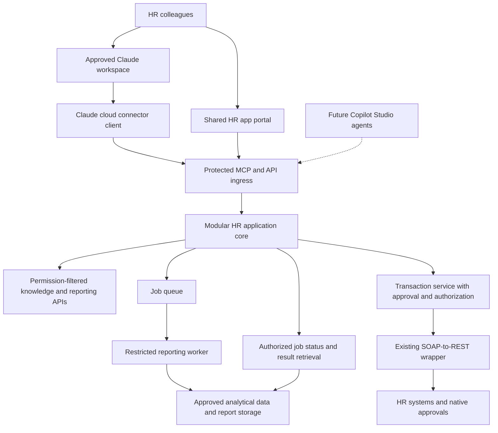

# HR Workspace and Rapid Application Delivery

**Research date:** 23 September 2026  
**Status:** Architecture and delivery recommendation; no infrastructure or CI/CD has been provisioned.

## 1. Revised vision: Claude is the HR entry point

The objective is broader than replacing AskHR transactions. Give trained HR colleagues a governed workspace for research, policy interpretation, reporting, analysis, drafting, transactions, and access to purpose-built applications. Transaction execution is one capability within that workspace.

Claude is the initial entry point. Copilot Studio remains a future option for managed agents and Microsoft channels; an immediate head-to-head interface comparison is no longer a prerequisite. Earlier documents contain that comparison as research, rather than the current delivery priority.

Three separate activities need different controls:

| Activity | Example | Recommended delivery |
|---|---|---|
| Use AI to do work | Research policy, summarize documents, draft a report | Approved Claude configuration, sources, data permissions, and human validation |
| Use an existing business capability | Retrieve a headcount metric or submit an approved change | Curated tools backed by authorized services |
| Use AI to build software | Create a dashboard, reconciliation screen, or intake app | Sandbox prototype followed by normal source control, review, tests, and deployment |

An app built using AI does not necessarily need a model at runtime. A deterministic dashboard or form can be cheaper and easier to validate. Nor does every useful artifact need deployment: a one-off analysis can remain a controlled document. A reusable app needs an owner, supported users, data classification, maintenance plan, and retirement date or review cadence.

Claude can discover tools and link users into approved apps. Do not assume every arbitrary web app can run inside Desktop or inherit its login. Browser apps establish their own corporate SSO session. Any interactive MCP surface requires client-specific support and testing.

## 2. Recommended architecture

**Start with a modular application core on shared infrastructure, a restricted transaction execution service, and a background worker where needed. Do not turn each HR screen into a microservice.**

A module is a code and ownership boundary. A service is a separately operated runtime boundary. A monorepo is a source-code organization choice. These are independent decisions.

This is a logical design, not a promise that one OAuth client works for every interface. Remote Claude connector traffic is cloud-originated. Tool access and browser API access need appropriate token audiences, client configuration, and network controls.

Keep the portal's routes, shared UI components, ordinary read APIs, and catalog in one deployable application initially. Organize reporting, case preparation, policy utilities, and transaction proposals as modules with explicit interfaces and owners. Enforce module boundaries in review and automated dependency checks. Modules in one process are not security sandboxes.

Place production HR write credentials in a restricted execution boundary from the beginning. General research tools and reporting workers should not inherit those credentials. Use a distinct workload identity, scoped backend permissions, authenticated service-to-service calls, and restricted ingress. Execution independently validates the human actor and approved proposal; a trusted core caller cannot supply arbitrary authority. The existing wrapper can remain separately operated; avoid creating a new wrapper instance for each app. Its user, ISU, and OAuth support is a confirmed capability reported by the user, not yet verified by inspection.

Microsoft describes single deployments as suitable for many internal apps and distinguishes logical layers from physical deployment tiers. This supports a modular starting point, not a prohibition on services. [Application architecture guidance](https://learn.microsoft.com/en-us/dotnet/architecture/modern-web-apps-azure/common-web-application-architectures)

### When to split a module into a service

Split when evidence shows a separate privilege boundary, data jurisdiction, scaling profile, availability requirement, independent team/release lifecycle, or incompatible runtime. High-volume exports and payroll-sensitive execution are stronger reasons than the fact that two screens were generated separately.

The tradeoff is explicit: one application simplifies deployment and shared behavior but shares release cadence and process failures. Services improve independent operation at the cost of network failures, distributed tracing, API compatibility, more releases, and support overhead.

## 3. Azure hosting choice

My initial preference is **Azure Container Apps if container operations are already supported**, with App Service an equally credible simpler choice for a web-centric estate. Do not adopt both solely to demonstrate flexibility. Benchmark representative interactive, report, and integration workloads before committing.

| Option | Use it for | Do not assume |
|---|---|---|
| Container Apps | Containerized portal/API, MCP adapter, independently scaled worker | Every feature requires its own container app or environment |
| App Service | Conventional internal web portal and APIs, especially an existing enterprise platform | Each web app needs its own App Service plan |
| Functions | Queue handlers, schedules, callbacks, reconciliation, small event-driven integrations | Each function is a microservice, or every plan has identical scaling and timeout behavior |
| Container Apps Jobs | Finite container tasks, scheduled exports, batch transformations | A job should host the always-available web portal |
| AKS | Requirements that justify Kubernetes control and existing platform ownership | Kubernetes is required for a collection of internal apps |

Microsoft distinguishes general container hosting, web-app hosting, and event-driven functions. The execution model should determine the choice. [Azure comparison](https://learn.microsoft.com/en-us/azure/container-apps/compare-options)

**Sharing infrastructure is normal.** Several Container Apps and jobs can share an environment. Compatible App Service applications can share a paid plan and its compute. These remain separate app resources, but need not be separate infrastructure stacks. Shared resources introduce contention and shared operational boundaries. A shared Container Apps environment is not a strong network/hardware isolation boundary between mutually untrusted workloads; separate environments or stronger isolation may be necessary. A resource group is management organization, not runtime isolation. [Container Apps environments](https://learn.microsoft.com/en-us/azure/container-apps/environment), [App Service plans](https://learn.microsoft.com/en-us/azure/app-service/overview-hosting-plans)

Functions are grouped into function apps for deployment/configuration. Avoid mixing functions requiring materially different secrets or permissions in the same app. Scaling behavior depends on the hosting plan. [Functions practices](https://learn.microsoft.com/en-us/azure/azure-functions/functions-best-practices)

### Illustrative first deployment

Use separate production and nonproduction boundaries. Within each approved production region/trust domain, start with a core web/API deployment, restricted transaction execution, and a worker only if needed. Reuse established identity, registry, secrets, monitoring, gateway, queue, and data services. The exact resource count follows existing assets and security boundaries; this is not a fixed bill of materials.

A dozen HR utilities could be routes/modules within the core application rather than a dozen independent stacks. An isolated app can still share appropriate platform services. Arbitrary generated code or experimental uploads must not run inside the shared production process or receive its managed identity.

Run long reports asynchronously: submit, receive a job ID, check status, retrieve an authorized result. Apply job ownership, data entitlements, TTL, export size limits, and cancellation. Container Apps supports finite manual, scheduled, and event-triggered jobs. [Jobs documentation](https://learn.microsoft.com/en-us/azure/container-apps/jobs)

Measure cold-start latency, concurrency, memory, report volume, logging/storage costs, and minimum replicas. Scale-to-zero and shared compute do not establish that a design is cheapest. Assess networking, gateway, monitoring, egress, licensing, and operational costs as well as CPU charges.

## 4. Central authentication, specific authorization

Use the corporate IdP and shared identity libraries/policies. Prefer managed identities for Azure workload access and supported delegated user credentials for user-scoped backend operations. Keep environment-specific and privilege-specific workload identities. Do not create a custom password system or one all-powerful shared application credential.

Central authentication can provide a consistent sign-in experience; each protected API still validates tokens and enforces its audience, scopes, and current permissions. An authenticated HR employee is not entitled to every report, worker, country, or transaction. Enforce row/population, field, role, regional, and purpose restrictions server-side, including direct API calls that bypass Claude or the portal.

Read-only reporting is sensitive too. Apply access filtering before data reaches the model; authorize downloads separately; prevent broad exports and small-cohort disclosure where policy requires it. Audit report parameters, source freshness, metric definitions, and recipients. Use approved reporting datasets/semantic APIs for broad analytics rather than unbounded SOAP calls against operational HR services. Reserve live lookups for freshness requirements that justify them.

Skills and connector descriptions guide behavior; they do not grant permissions. Avoid putting unrestricted web research and powerful HR writes in one broadly privileged tool catalog. Retrieved content and uploaded files remain untrusted inputs.

An ISU authenticated using OAuth is still a service identity. When it executes, audit both the initiating human and service actor; enforce human authorization independently. Corporate IdP identity also does not prove which Claude organization hosts the conversation. The earlier account/channel and regional release gates remain applicable.

## 5. A practical SDLC for AI-assisted apps

Offer a supported starter template so makers spend time on the HR problem rather than inventing authentication, logging, error handling, and deployment. It should include standard UI, API contracts, synthetic fixtures, authorization middleware, telemetry redaction, dependency policy, tests, and a reusable pipeline.

| Stage | Required outcome | Accountable owner |
|---|---|---|
| Intake | Named users, problem, data classification, access rules, success criteria, owner | HR product/process owner |
| Prototype | Synthetic data, constrained development environment, no production credentials | Maker with engineering support |
| Engineering handoff | Code understood, business rules documented, dependencies reviewed | Named engineering maintainer |
| Pull request | Tests and security gates pass; independent review | Code owner and relevant specialists |
| Staging | Identity, integration, abuse, accessibility, and process tests | Engineering + HR acceptance owner |
| Release | Approved immutable artifact, rollback/recovery plan, support coverage | Release owner |
| Operate/retire | Monitoring, vulnerability remediation, entitlement review, expiry/retirement | Service owner |

Let HR makers create prototypes and submit changes. Production ownership must remain explicit. AI can draft code and fixes, but it must not approve its own privilege changes or production release. A functioning demo is not evidence that access controls, error paths, or migrations are correct.

Use lightweight risk tiers: approved productivity use; configured integrations; reusable applications; privileged HR writes. Ordinary research should not require the same review as a new integration or write capability. Reuse an approved control set and require review of material changes rather than restarting every approval for every cosmetic change.

## 6. CI/CD and security scanning

The following is a proposed pipeline, not a configuration already enabled in ResearchExamples.

```mermaid
flowchart LR
    Change[AI-assisted change] --> PR[Pull request]
    PR --> Checks[Tests and security checks]
    Checks --> Review[Required independent review]
    Review --> Build[Build immutable artifact and provenance]
    Build --> Stage[Deploy staging and run acceptance tests]
    Stage --> Release[Protected release approval]
    Release --> Prod[Progressive production rollout]
    Prod --> Monitor[Monitor and remediate or roll back]
```

| Check | What to implement | What it does not prove |
|---|---|---|
| Build, lint, types | Supported language/toolchain checks, locked dependencies | Correct business behavior |
| Functional and authorization tests | Worker/population denials, role revocation, direct API bypass, report ownership, approval tampering, duplicate writes | Every possible authorization edge case |
| SAST | CodeQL or an approved language-appropriate analyzer | Correct HR policy or absence of vulnerabilities |
| Dependencies | Dependency review, vulnerability and license policy, update automation | That an unflagged package is trustworthy |
| Secrets | Secret scanning/push protection plus CI scanning suited to the repository | That every unknown credential format is detected |
| IaC | Scan infrastructure changes and enforce network/identity policies | Actual deployed state remains compliant without drift checks |
| Container image | Scan the built image/base layers; produce an SBOM and provenance | Runtime behavior is safe merely because the image is signed |
| Authenticated DAST | Exercise the staged app with appropriate roles and approved test targets | Correct row-level/business authorization without targeted tests |
| AI evaluations | Prompt injection, source attribution, tool selection, data leakage, ambiguous requests and abstention | Deterministic behavior on every future input |

Make relevant checks required through branch rules/rulesets. Merely displaying scanner findings does not block merging. Protect the rules themselves, restrict routine administrator/bot bypass, and require renewed review after material changes. Use an explicit aggregate gate to verify every required scan actually ran and passed: skipped/neutral GitHub checks can otherwise count as successful. Fail that gate on missing/skipped required scans and apply an agreed severity policy. Exceptions need a named risk owner, reason, compensating control, and expiry; never silently turn off the gate to ship.

Code scanning supports automated vulnerability analysis, with language and plan prerequisites to verify. SCA and secret scanning require their own coverage checks; revoke exposed credentials rather than only deleting them from code. [Dependency review](https://docs.github.com/en/code-security/concepts/supply-chain-security/dependency-review), [secret alerts](https://docs.github.com/en/code-security/concepts/secret-security/about-alerts). [GitHub code scanning](https://docs.github.com/en/code-security/concepts/code-scanning/code-scanning)

Protect pipeline files, authorization code, tool manifests, infrastructure, and shared libraries with designated reviewers. Keep PR jobs unprivileged; do not run untrusted contributed code with production credentials. Pin external actions to reviewed immutable revisions, minimize job token permissions, and use isolated/ephemeral runners where appropriate. Do not give exploratory coding agents deployment credentials. In particular, never execute untrusted PR code through a privileged `pull_request_target` job. [Actions hardening](https://docs.github.com/en/actions/reference/security/secure-use)

For GitHub Actions to Azure, use OIDC federation instead of stored long-lived deployment secrets. Bind trust to the intended repository and protected environment/ref, and scope Azure permissions to deployment targets. OIDC changes credential issuance; it does not replace release authorization. [GitHub Azure OIDC](https://docs.github.com/en/actions/how-tos/secure-your-work/security-harden-deployments/oidc-in-azure)

Build once from reviewed source and promote the same artifact digest through staging and production. Authenticate artifact provenance, scan that artifact, and preserve the record of source commit, checks, approvals, environment, and deployed digest. Use infrastructure as code and detect drift.

Required environment reviewers and other protections depend on GitHub plan and repository visibility. For private/internal repositories, required environment reviewers need the appropriate Enterprise entitlement; listing several reviewers normally requires one of them, not multiple independent approvals. If policy demands two distinct approvals, explicitly implement and test that requirement. Verify Code Security and Secret Protection entitlements as well. Bind Azure trust so another workflow cannot bypass the protected environment. [Deployment protections](https://docs.github.com/en/actions/reference/workflows-and-actions/deployments-and-environments). Confirm the company's entitlements before treating the pipeline design as enforceable. The existing private research repository is a document store, not proof of an enterprise software-delivery control plane.

## 7. Deployment, operations, and global scope

Use staged releases, readiness checks, health metrics, and feature flags. Container Apps revisions or supported App Service deployment slots can assist rollout, but configure their behavior deliberately. Revisions and deployment slots are release mechanisms, not sufficient production/nonproduction isolation boundaries; isolate test data and credentials in separate staging resources as required. Keep database changes backward-compatible during mixed-version operation; rolling back an image does not undo a migration or an HR transaction.

Assign an owner and cost center to every reusable app/module. Record supported regions, users, data sources, permissions, deployed version, lifecycle, SLO, and recovery procedure in a catalog. New modules should inherit tested platform defaults. Changes to shared identity or policy require broader regression tests because their impact crosses modules.

Use regional deployment boundaries where data-flow requirements justify them. Shared platform means shared standards and tooling, not necessarily one worldwide runtime or database. Consider model processing, developer prompts, logs, backups, support access, and failover separately. A European app host does not make a Claude conversation Europe-only.

Separate production from prototypes. Sandbox generated code with denied-by-default secrets/network access and explicit data handling. Never dynamically load unreviewed generated server code into the HR production application.

## 8. What other companies actually demonstrate

| Company | Public evidence | Transferable lesson and limitation |
|---|---|---|
| Jamf | Anthropic's case study describes Claude Enterprise for broad employee work, Bedrock for developer-controlled workflows, and three review paths for ordinary tools, configured skills/MCP, and custom APIs. It includes HR use cases and employee-built dashboards. | Closest match to this broader vision: enable users while separating delivery paths. Vendor-reported outcomes; AWS rather than Azure; not an independently verified HR-write control design. [Case study](https://claude.com/customers/jamf) |
| Zapier | Anthropic describes cross-functional Claude use, rapid prototypes, and a Slack-triggered coding flow that creates a merge request for team review. | Fast creation can feed an established review process. Its internal agent count is not a count of microservices, HR apps, or independently audited deployments. [Case study](https://claude.com/customers/zapier) |
| Block | Anthropic describes its goose agent serving multiple job profiles, with natural-language analytics, prototypes, and operations tasks connected through MCP. | Evidence for a broad agent-and-tools workspace. The interface is goose, not Claude Desktop; the case does not prove a single delegated identity across all systems. [Case study](https://claude.com/customers/block) |
| Shopify | Its engineering team documented modularizing its large Rails monolith, with explicit components, interfaces, and ownership. | Modularity does not require a service per feature. This is historical 2020 architecture evidence, not a claim about current Shopify topology or AI-built HR apps. [Engineering article](https://shopify.engineering/shopify-monolith) |

These sources support broad employee enablement, controlled paths from prototype to production, and deliberate module boundaries. They do not establish one universal architecture, exact cost savings for this company, or that all companies deploy AI-built apps on Azure Functions. The proposed Azure design is our recommendation informed by platform capabilities.

## 9. What to do first

1. Adopt the expanded HR workspace vision and move Copilot Studio to the future-agent track.
2. Inventory existing Azure hosting, corporate identity, CI/CD, security tooling, and licenses before introducing new infrastructure.
3. Build one supported application template and reusable pipeline with engineering/security ownership.
4. Pilot three outputs: a sourced HR research workflow, an authorized report/dashboard, and one bounded transaction. Measure accuracy, access enforcement, operator effort, cost, and support burden separately.
5. Host initial related app modules together; separate write execution and any heavy reporting worker by their actual requirements.
6. Prove two operators with different access get different permitted results through Claude, browser, direct API, and export paths.
7. Add a second region only after validating its data flow and HR semantics. Expand modules based on evidence, not number of generated prototypes.

The goal is a small, reusable delivery platform that turns useful prototypes into maintained capabilities. It should make the approved path faster than building a disconnected application from scratch.

## Review record

Specialist research covered company precedents, Azure hosting, and SDLC/identity controls. Two follow-up reviewers checked the draft and requested clearer report retrieval, independent write-execution authorization, release-versus-environment isolation, and explicit verification that scans ran. These corrections are incorporated. Mermaid syntax and local document links were checked. No runtime, pipeline, licensing, or live HR integration was tested.
