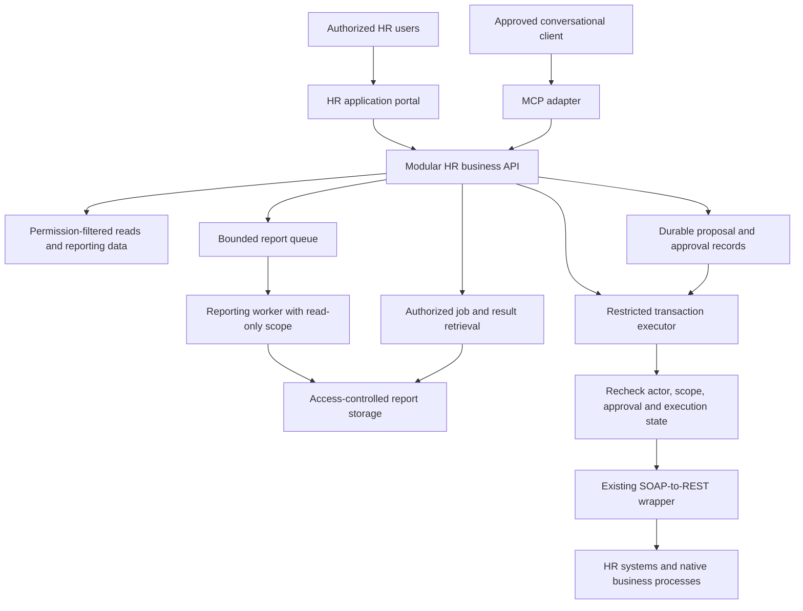

# HR Rapid Application Delivery — Proposed Platform and GitLab SDLC

**Date:** 25 September 2026

**Status:** Proposal for review. Platform choice, GitLab capabilities, release thresholds and owners remain to be agreed.

## 1. Recommended approach

We propose a small shared application platform that lets us turn useful HR prototypes into supported applications quickly. The starting point is a modular web/API application, a restricted transaction executor, and a reporting worker when workload requires it. Related forms and dashboards can share deployment and infrastructure. Separate services should follow a real privilege, regional, scaling or release need.

GitLab would manage source, review, pipelines and release evidence. A supported application template and reusable CI components would provide authentication, authorization, telemetry, tests and deployment defaults. AI-assisted changes would follow this same path. Applications that use a model at runtime would also require behavioral evaluations.

For deployment, we recommend controlled feature exposure to a small authorized cohort, combined with a compatible rolling update or blue-green application release. Canary traffic shifting is useful when we have enough traffic, reliable routing and measurable outcomes. It should not be the automatic choice for every HR utility.

This platform could serve a potential population of 45,000 employees plus contractors; initial access would be narrower. Capacity should follow measured concurrency and backend demand. The [integration design](../../implementation-design.md) covers MCP, OAuth and transaction execution; this document covers how we build and release reusable applications.

## 2. Delivery options and when to use them

| Option | Suitable use | Tradeoff | Recommendation |
|---|---|---|---|
| **Module in a shared HR application** | Related forms, dashboards, report views and case-preparation utilities | Shared release cadence and process failure; module boundaries require discipline | Default for related applications with compatible trust and operational needs |
| **Separate application on shared managed infrastructure** | Distinct permissions, regional boundary, heavy workload or independent lifecycle | More deployments and API contracts to operate | Use when the separation has a documented benefit |
| **Existing approved low-code platform** | Standard intake and workflow patterns well supported by its connectors | Platform constraints, licensing and identity behavior; production controls still need to be demonstrated | Compare against custom development for simple workflows; avoid custom code where the platform already fits |
| **Controlled report or analysis artifact** | One-time research, analysis or a limited report | Less interactive; sharing and retention still matter | Prefer when there is no recurring application need |

A generated screen is not a reason to create a microservice. Conversely, unrelated or untrusted code should not share the HR production process merely to reduce resource count. A reusable application needs a maintainer, supported users, data scope and retirement/review date before production release.

## 3. Proposed architecture and hosting

The core would contain modules with explicit interfaces, tests and ownership. Shared identity, UI, error handling and telemetry belong in supported libraries. Automated dependency checks should prevent circular dependencies and access to module internals. Repository structure and runtime structure are separate choices: a monorepo can contain several deployables.

The executor would have its own workload identity and credential access. It must independently validate the human actor and approved proposal. The reporting worker would not inherit write permissions. The existing wrapper would remain a shared integration capability; new apps should not create their own SOAP conversion or privileged credential store.

| Hosting candidate | Fit | Selection criterion |
|---|---|---|
| **AWS ECS/Fargate** | Managed container services for the application and workers | Prefer if our supported AWS application platform and wrapper connectivity fit |
| **Azure Container Apps** | Managed container applications, workers and finite jobs | Prefer if our supported Azure platform and scaling/network requirements fit |
| **Azure App Service** | Conventional web/API applications | Strong alternative where it is already the supported hosting standard |
| **Functions/Lambda** | Scheduled reconciliation, queue handlers and bounded event-driven work | Use for the execution pattern, not as a compulsory host for every app/tool |
| **Existing Kubernetes platform** | Requirements already served by a supported cluster | Reuse where justified; this initiative does not by itself justify building cluster operations |

The recommendation is to select **one supported application platform** for the first implementation. Managed containers provide a useful default for the API and worker pattern; App Service may be simpler in an established web-app estate. [Azure hosting comparison](https://learn.microsoft.com/en-us/azure/container-apps/compare-options), [ECS service scaling](https://docs.aws.amazon.com/AmazonECS/latest/developerguide/service-auto-scaling.html)

Keep production and nonproduction identities/data separate. Persist approvals, execution records and report state outside application replicas. Scale interactive requests separately from workers, and apply backend-wide concurrency limits across all replicas. Long reports should return a job reference with authorized status/download operations. Queues need bounded retries, backlog monitoring and controlled replay. Replica growth must not overwhelm Workday or multiply retries across layers.

Regional deployments should follow processing requirements and measured latency, with approved failover and one authoritative execution record per transaction. Contractor entitlements and identity mapping require explicit support. Sharing standards does not require one worldwide database.

## 4. Make rapid development repeatable

A supported starter template should include corporate sign-in, server-side authorization, standard UI/accessibility components, typed API contracts, synthetic fixtures, structured errors, redacted telemetry and a tested pipeline. It should make the normal delivery path faster than building those controls from scratch.

| Change class | Proposed path |
|---|---|
| Prototype with synthetic data | Isolated development environment, short-lived preview, no production credentials |
| Existing module change within its approved scope | Automated checks, maintainer review and normal deployment; no repeat architecture review for cosmetic changes |
| New data source, permission, backend write or regional processing | Explicit operation/data-flow review plus targeted security, integration and recovery tests |
| Runtime AI feature | Normal application controls plus versioned prompts/tools/knowledge configuration, behavioral evaluations and monitored outcomes |

AI can propose code, tests and fixes. A named maintainer must understand and own the result. Generation should produce small reviewable changes, not a large unexamined application. Review should focus on business rules, permissions, dependencies and failure behavior rather than whether code was written by a person or a model.

Preview environments should expire automatically and use synthetic data. A prototype graduating to production needs an operating owner and support path. Experimental server code must not be dynamically loaded into the shared production application.

## 5. GitLab repository and control model

### Proposed organization

Start with one product repository for the related application modules and deployables, plus separately controlled CI components and a production release project. Security policies can use the supported policy repository mechanism. Keep infrastructure code with the service or in an existing platform repository according to ownership. Split repositories when access or independent lifecycle requires it, not for every screen.

Use short-lived branches and merge requests into a protected default branch. Disable ordinary direct pushes to that branch. Required reviewers should cover authorization, credential handling, database migrations, infrastructure and pipeline changes. Prevent author/committer self-approval and per-MR rule overrides, and reset approvals after relevant changes. Review overlapping branch rules and privileged roles so direct-push permissions cannot bypass the MR path. [Merge request approvals](https://docs.gitlab.com/user/project/merge_requests/approvals/), [protected branches](https://docs.gitlab.com/user/project/repository/branches/protected/)

Reusable pipeline components should be pinned to reviewed versions, with explicit inputs. Path-based child pipelines can shorten feedback for a monorepo, but shared identity/policy/library changes must trigger every affected consumer’s tests. Required checks must not disappear because of a path filter. Configure child-pipeline status propagation, such as `strategy: mirror` where supported, so a successful trigger cannot hide a failed child pipeline. [CI/CD components](https://docs.gitlab.com/ci/components/), [downstream pipelines](https://docs.gitlab.com/ci/pipelines/downstream_pipelines/)

### Enforcement, not only configuration

| Control | Proposed GitLab implementation |
|---|---|
| Reviewed source | Protected branches, successful MR pipeline and required approval rules; protect ownership and pipeline configuration |
| Mandatory checks | Centrally maintained pipeline components; pipeline execution policies where licensed, or an independently controlled promotion gate that checks required evidence |
| Production release | Protected production environment and deployment approvals where available; tightly limited deployers |
| Cloud authentication | Job ID tokens exchanged through OIDC for short-lived, narrowly scoped cloud credentials |
| Concurrent releases | `resource_group` for each deployment target and outdated-deployment prevention; one coordinated deployment path per shared target |
| Auditability | Record source commit, artifact digest, test/eval results, approvals, configuration version and deployed environment |

Reusable includes alone are not enforcement: someone able to change application CI configuration may remove them. If native enforcement is unavailable, a protected release project/job can validate evidence for the exact artifact and hold the only production deployment identity. Its permissions and trigger inputs need review so application jobs cannot bypass it.

GitLab capabilities depend on the installed version and tier. Required approval rules, Code Owner enforcement and deployment approvals require applicable Premium/Ultimate features; pipeline execution policies are Ultimate. Scanner availability and native security reporting also vary. Confirm these capabilities against our version/tier and retest after material upgrades. Deployment approval and starting the approved deployment job are separate GitLab steps; the release runbook should identify who may perform each. [Deployment approvals](https://docs.gitlab.com/ci/environments/deployment_approvals/), [pipeline execution policies](https://docs.gitlab.com/user/application_security/policies/pipeline_execution_policies/)

Production and test runners should have separate trust boundaries. Untrusted MR code must not run with production credentials or on a runner retaining production access. Use isolated ephemeral build execution where practical, restrict job-token access, pin CI dependencies, and prevent secrets leaking through logs or artifacts. A masked variable alone does not protect a secret from malicious job code.

GitLab ID tokens can authenticate to supported cloud services. Trust should constrain issuer, audience, project and permitted ref/environment claims supported by the provider; scope the resulting role to the deployment target. Test the actual token claims from our GitLab installation. [GitLab cloud authentication](https://docs.gitlab.com/ci/cloud_services/)

Production identity must be available only through the controlled deployment path, including when native policies and approvals are enabled. The recommended release project would hold reviewed deployment configuration, accept an allowlisted artifact reference, verify its evidence, and avoid executing application-supplied deployment scripts. Cloud trust should be constrained to that project and its approved ref. Test that an unrelated job cannot obtain the production role by omitting the protected environment or changing its name. OIDC issues credentials; it does not itself prove release approval. [GitLab AWS OIDC](https://docs.gitlab.com/ci/cloud_services/aws/), [protected environments](https://docs.gitlab.com/ci/environments/protected_environments/)

## 6. Proposed pipeline and AI lifecycle

```mermaid
flowchart LR
    MR[Merge request] --> Checks[Fast tests and applicable security checks]
    Checks --> Review[Required review and protected merge]
    Review --> Build[Build and scan release artifact]
    Build --> Stage[Deploy same digest to staging]
    Stage --> Accept[Integration, recovery and runtime AI evaluations]
    Accept --> Gate[Protected production release gate]
    Gate --> Deploy[Deploy candidate and enable pilot cohort]
    Deploy --> Observe[Check technical and business outcomes]
    Observe --> Decision{Release criteria met?}
    Decision -->|Yes| Expand[Expand exposure]
    Decision -->|No| Stop[Disable feature or route back and reconcile]
```

The release artifact should be built from the reviewed merge commit, with required checks rerun for that exact revision. Scan and test that artifact, then promote the same digest through staging and production. Environment settings and secret references remain separate controlled inputs. A pre-merge preview is useful feedback, not the production release artifact.

| Check | Proposed coverage |
|---|---|
| Fast engineering checks | Build/types/lint, module dependency rules, unit and API contract tests |
| Business/security tests | Wrong worker and population, field restrictions, revoked access, direct API bypass, report ownership, tampered approval, replay and timeout after commit |
| Static/dependency/secret checks | Language-appropriate SAST, dependency vulnerabilities/licenses, repository and pipeline secret detection |
| Infrastructure and image checks | IaC identity/network rules, built image and base layers, software bill of materials and provenance |
| Staging checks | Authenticated dynamic testing, integration, accessibility, performance, migration compatibility and recovery |
| Runtime AI evaluations | Tool selection, ambiguous requests, source support, injection resistance, regional policy, repeated trials and safe escalation |

Explicitly enable the required checks for merge-request pipelines and for the release revision. Require successful pipelines and do not treat skipped pipelines as successful. Central policy pipelines and child pipelines must contribute their failures to the release gate.

A successful scan job may still report vulnerabilities. The release gate should check both **execution evidence** and the agreed findings policy. Missing, canceled, skipped or failed required checks must block promotion; `allow_failure` must not neutralize a required gate. Exceptions need a named owner, reason, mitigation and expiry. Verify provenance against the expected build identity; a signed artifact is not evidence of correct business behavior.

For AI features, version prompts, tool schemas, model configuration, knowledge references and evaluation cases with the application. Evaluate actual backend outcomes for writes and calibrate answer-quality graders against human review. A generated deterministic app needs conventional tests; a runtime model adds behavioral tests. The [evaluation plan](../../evaluation-and-success-plan.md) defines the global scorecard and test coverage.

## 7. Blue-green, canary and feature exposure

These techniques solve different problems. Blue-green provides two application versions and a traffic switch. Canary exposes a candidate to a limited share of traffic. Feature flags control which capabilities users can access. We can combine them, but should add only the mechanisms we can operate and test.

| Strategy | Best use here | Main constraint |
|---|---|---|
| **Rolling deployment** | Small backward-compatible changes to the core or workers | Old/new versions coexist; request and job draining must work |
| **Blue-green deployment** | Core releases where validating an idle candidate and switching routing provides useful recovery | Temporary extra capacity; both versions must tolerate the same live schema and compatible sessions |
| **Traffic canary** | Read APIs or sufficiently busy services with useful error/latency signals | Random request percentages are not stable user cohorts; small traffic can produce weak evidence |
| **Cohort feature flags** | New HR utilities, region-specific behavior and controlled activation of write operations | Server-enforced eligibility and current authorization still apply; flag changes are production changes |

**Recommended starting combination:** deploy compatible code with new features disabled; validate it; enable a small named authorized cohort; compare outcomes and expand. Use blue-green for the application/API if our chosen host makes the extra capacity and routing manageable. Otherwise use a rolling deployment. Add percentage canaries for appropriate services after we have baseline metrics and tested routing.

For HR writes, a pilot should be tied to authorized users and operations, with transaction caps and an immediate server-side disable control. Do not mirror or replay production writes to compare versions. Approval records must bind the operation/policy version; upgrades cannot silently change the meaning of an outstanding approval.

GitLab orchestrates deployment and records the environment, but the host/load balancer controls traffic. Azure Container Apps supports revision traffic splitting; App Service supports deployment slots on eligible plans. ECS supports native canary deployment for compatible service configurations. Select and test the actual mechanism instead of assuming a GitLab environment name implements blue-green. [Container Apps traffic splitting](https://learn.microsoft.com/en-us/azure/container-apps/traffic-splitting), [App Service slots](https://learn.microsoft.com/en-us/azure/app-service/deploy-staging-slots), [ECS canary deployment](https://docs.aws.amazon.com/AmazonECS/latest/developerguide/deploy-canary-service.html)

For Container Apps, weighted multi-revision routing should not be treated as a stable user cohort; its documented session affinity is limited to single-revision mode. Keep multistep approval state external and compatible across versions. [Session affinity](https://learn.microsoft.com/en-us/azure/container-apps/sticky-sessions)

A proposed rollout would check the candidate with non-mutating probes, keep schedulers and write consumers inactive until their ownership is established, enable the pilot, then expand only after sufficient observations. Set observation windows, minimum volume and abort thresholds before release. Low-traffic or delayed-approval scenarios need explicit acceptance evidence, not a short green dashboard.

Abort conditions should include any wrong-user disclosure, unauthorized write, duplicate transaction or missing approval evidence; material error/latency regressions; and growing uncertain-execution or queue backlogs. Automated traffic rollback can help with technical failures. Transaction incidents may require disabling writes and reconciliation rather than simply moving traffic.

## 8. Recovery and controls against failure

We cannot make the platform failure-proof. We can make changes bounded, detect failures quickly and demonstrate recovery before release.

| Failure | Proposed protection and recovery |
|---|---|
| A pipeline omits checks or changes their rules | Independently enforced release policy validates required evidence for the artifact |
| An older pipeline deploys after a newer one | Serialize deployment targets and prevent outdated jobs; use an explicit reviewed recovery release for rollback |
| A new version misbehaves | Disable the affected capability or route to the prior compatible version; preserve incident evidence |
| Old/new versions see different schemas | Expand-and-contract migrations, compatible readers/writers and a tested compatibility window |
| Both blue/green workers consume jobs or schedules | Exclusive schedule ownership where required, durable execution claims and idempotency; planned draining and handover |
| Workday accepts a write but the response is lost | Mark the outcome uncertain, query authoritative status, reconcile before resubmission |
| Restoring our database loses a recent execution record | Pause affected writes and reconcile against backend outcomes before resuming |
| A region fails | Approved failover with preserved execution ownership and deduplication; otherwise pause affected work |

Queue delivery may repeat. A durable claim helps coordinate workers, but cannot alone guarantee exactly-once writes to another system. Version job payloads, reauthorize at execution, and send references rather than credentials in queue messages. Database restoration and code rollback cannot reverse an accepted HR transaction; some corrections require a compensating business process.

A feature flag should have an owner, audit trail, expiry/removal plan and a safe default if evaluation fails. UI-only flags do not protect APIs. Routine rollback should not require turning off authorization or granting emergency broad credentials.

GitLab provides deployment serialization and outdated-job controls; these must be configured together with the chosen recovery procedure. A project-local `resource_group` is not a cross-project global lock. [Resource groups](https://docs.gitlab.com/ci/resource_groups/), [deployment safety](https://docs.gitlab.com/ci/environments/deployment_safety/)

## 9. What other companies show

| Organization | Documented practice | Useful lesson |
|---|---|---|
| **Jamf** | Anthropic’s case study describes employee-built dashboards and different governance paths for ordinary use, configured integrations and custom API applications. [Case study](https://claude.com/customers/jamf) | Match review depth to the change; give reusable app development a supported path. Vendor-reported evidence, not an audit of its delivery controls. |
| **Shopify** | Its engineering account describes modularizing a large application with component contracts and automated dependency checks, including lessons from overly connected modules. [Engineering article](https://shopify.engineering/shopify-monolith) | Use enforced boundaries within a shared application before creating independent services. Historical architecture evidence, not a claim about its current topology. |
| **monday.com** | Its engineering guest post describes version-controlled evaluators, CI/CD synchronization and multi-turn monitoring for service agents. [Engineering account](https://www.langchain.com/blog/customers-monday) | Treat evaluation logic as maintained code and feed observed failures back into testing. The published system uses LangSmith; it is not a GitLab implementation blueprint. |

These examples inform the proposed approach. Our GitLab controls and HR transaction guarantees still need their own implementation and tests.

## 10. First implementation and decision points

1. Select one representative read/report utility and one bounded write workflow. Define users, jurisdictions, contractor support, backend identities, outcomes and recovery.
2. Confirm the supported hosting platform, GitLab version/tier, runner boundaries and available security tools. Choose enforceable controls, not aspirational configuration.
3. Build one starter template and versioned pipeline component. Test direct-push and self-approval denial, a removed scanner, a failed child pipeline, an unapproved deployment, an unauthorized OIDC ref, a job bypassing the protected environment, and overlapping releases. Missing evidence must block promotion.
4. Implement the pilot as modules, with independent write execution and a worker only where needed. Measure concurrency, backend calls and report demand before sizing production.
5. Rehearse release and recovery: old/new compatibility, worker handover, failed rollout, token revocation, duplicate delivery and timeout after commit.
6. Pilot one approved population, measure effort and verified outcomes, and expand by operation and region after acceptance. Keep a named maintainer and support route for every deployed capability.

The initial decisions are hosting, repository/control ownership, required GitLab entitlements or equivalent gates, the release strategy, and the first pilot’s scope and thresholds. Architecture review should revisit changes to these boundaries; routine work within them should use the established pipeline.
